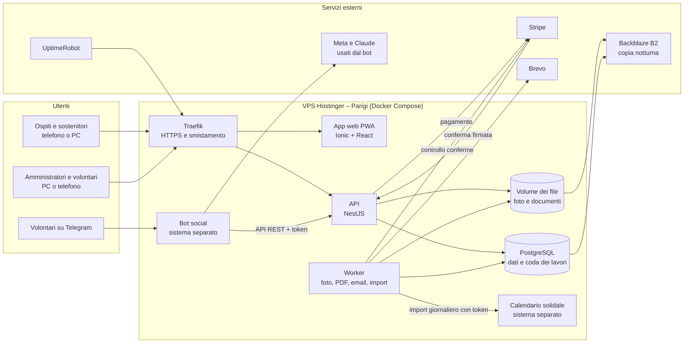
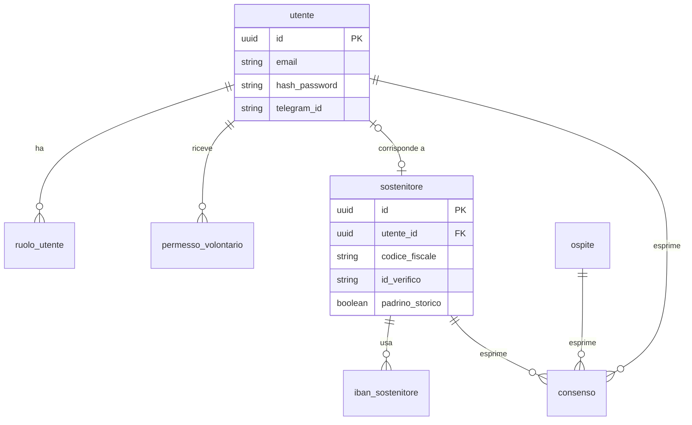
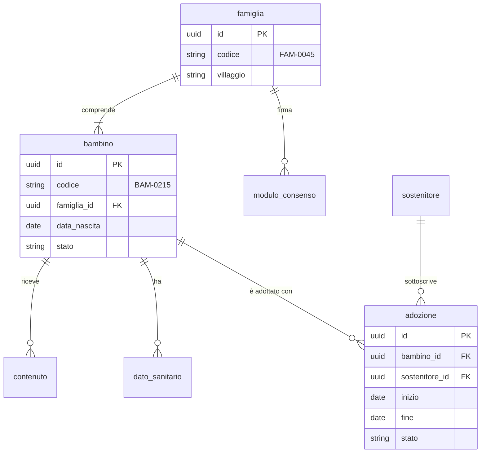
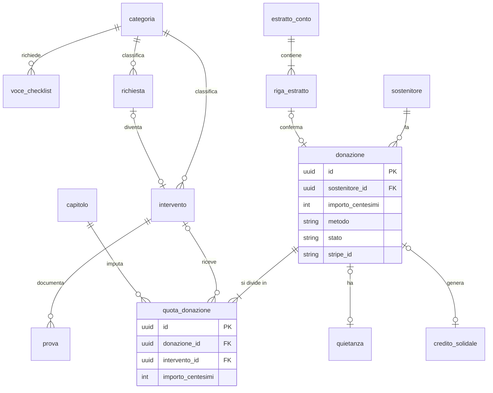

**Product Requirements Document**

**PRD del Gestionale Effatà**

Piattaforma Sostenitori e Automazione Contabile

*Versione 2.0 – struttura del PRD Template del docente*

# Indice

- [Informazioni sul documento](#informazioni-sul-documento)
    - [Storico delle versioni](#storico-delle-versioni)
    - [Legenda delle sigle](#legenda-delle-sigle)

**[PRIMA PARTE · IL COSA](#prima-parte--il-cosa)**

- [1. Scopo e perimetro](#1-scopo-e-perimetro)
    - [1.1 Perché esiste il Gestionale Effatà](#11-perché-esiste-il-gestionale-effatà)
    - [1.2 Cosa è incluso](#12-cosa-è-incluso)
    - [1.3 Cosa non è incluso](#13-cosa-non-è-incluso)
- [2. Stakeholder](#2-stakeholder)
- [3. Destinatari e contesto d'uso](#3-destinatari-e-contesto-duso)
    - [3.1 L'associazione](#31-lassociazione)
    - [3.2 Gli archetipi](#32-gli-archetipi)
    - [3.3 Come si lavora oggi e come si lavorerà](#33-come-si-lavora-oggi-e-come-si-lavorerà)
- [4. Panoramica e casi d’uso](#4-panoramica-e-casi-duso)
    - [4.1 Il Gestionale Effatà in poche righe](#41-il-gestionale-effatà-in-poche-righe)
    - [4.2 User flow e scenari](#42-user-flow-e-scenari)
- [5. Requisiti funzionali](#5-requisiti-funzionali)
    - [5.1 Riepilogo delle user story](#51-riepilogo-delle-user-story)
    - [5.2 Amministratore](#52-amministratore)
    - [5.3 Volontario](#53-volontario)
    - [5.4 Simpatizzante e sostenitore](#54-simpatizzante-e-sostenitore)
    - [5.5 Socio (fase 2)](#55-socio-fase-2)
    - [5.6 Decisioni](#56-decisioni)
- [6. Requisiti non funzionali](#6-requisiti-non-funzionali)
    - [6.1 Requisiti con soglia](#61-requisiti-con-soglia)
    - [6.2 Requisiti impliciti](#62-requisiti-impliciti)
- [7. Assunzioni, vincoli e dipendenze](#7-assunzioni-vincoli-e-dipendenze)
    - [7.1 Assunzioni](#71-assunzioni)
    - [7.2 Vincoli](#72-vincoli)
    - [7.3 Dipendenze](#73-dipendenze)

**[SECONDA PARTE · IL COME](#seconda-parte--il-come)**

- [8. Stima del carico](#8-stima-del-carico)
    - [8.1 Utenti concorrenti](#81-utenti-concorrenti)
    - [8.2 Profilo di carico](#82-profilo-di-carico)
    - [8.3 Stima dello storage](#83-stima-dello-storage)
- [9. Scelte tecnologiche](#9-scelte-tecnologiche)
- [10. Architettura](#10-architettura)
    - [10.1 Diagramma dei componenti](#101-diagramma-dei-componenti)
    - [10.2 I livelli](#102-i-livelli)
    - [10.3 Le dipendenze fra i livelli](#103-le-dipendenze-fra-i-livelli)
- [11. Le API](#11-le-api)
    - [11.1 Le risorse](#111-le-risorse)
    - [11.2 Il contratto delle API principali](#112-il-contratto-delle-api-principali)
    - [11.3 Errori, validazione e paginazione](#113-errori-validazione-e-paginazione)
    - [11.4 Documentazione e verifica](#114-documentazione-e-verifica)
    - [11.5 Contratto di integrazione con il bot (fase 1)](#115-contratto-di-integrazione-con-il-bot-fase-1)
- [12. Persistenza e modello dei dati](#12-persistenza-e-modello-dei-dati)
    - [12.1 Entità](#121-entità)
    - [12.2 Diagramma ER](#122-diagramma-er)
    - [12.3 Identificatori](#123-identificatori)
    - [12.4 Tre modelli diversi](#124-tre-modelli-diversi)
    - [12.5 Normalizzazione e letture aggregate](#125-normalizzazione-e-letture-aggregate)
    - [12.6 Accesso ai dati](#126-accesso-ai-dati)
- [13. Sicurezza e integrazione](#13-sicurezza-e-integrazione)
    - [13.1 Autenticazione e token](#131-autenticazione-e-token)
    - [13.2 Chi può fare cosa](#132-chi-può-fare-cosa)
    - [13.3 L’API esterna](#133-lapi-esterna)
    - [13.4 Privacy e dati di minori](#134-privacy-e-dati-di-minori)
    - [13.5 Configurazione e segreti](#135-configurazione-e-segreti)
- [14. Qualità architetturale](#14-qualità-architetturale)
    - [14.1 Organizzazione del codice](#141-organizzazione-del-codice)
    - [14.2 Dependency inversion e IoC](#142-dependency-inversion-e-ioc)
    - [14.3 Testabilità](#143-testabilità)
    - [14.4 Development e Production](#144-development-e-production)
- [15. Dimensionamento e costi](#15-dimensionamento-e-costi)
- [16. Piano di deployment](#16-piano-di-deployment)

**[TERZA PARTE · TEMPI E VALUTAZIONE](#terza-parte--tempi-e-valutazione)**

- [17. Milestone](#17-milestone)
    - [17.1 Milestone](#171-milestone)
    - [17.2 Priorità e tagli](#172-priorità-e-tagli)
- [18. Piano di valutazione](#18-piano-di-valutazione)
- [19. Acceptance Criteria di questa PRD](#19-acceptance-criteria-di-questa-prd)

**ALLEGATI** (file separato [`PRD_allegati.md`](PRD_allegati.md)): A Gestione delle modifiche · B Schede informative · C Rischi · D Domande di verifica · E Storico completo delle versioni · F Domande da fare all’associazione · G Ricerca: link e fonti · H Brain dump iniziale · I Modulo di consenso della famiglia


# Informazioni sul documento


| Campo | Valore |
| --- | --- |
| Prodotto | Gestionale Effatà – Piattaforma Sostenitori e Automazione Contabile |
| Team | Andrea Pavan (progetto individuale) |
| Autori | Andrea Pavan |
| Cliente reale | Effatà Italia ODV |
| Contesto | Progetto ITS – 2° anno. Progetto personale che segue la metodologia della traccia “ScuolaChill”. |
| Versione | 2.0 |
| Data | 09/10/2026 |
| Stato | Consegnato per la validazione |

## Storico delle versioni

| Versione | Data | Autore | Cosa è cambiato |
| --- | --- | --- | --- |
| 0.x | 23–24/09/2026 | Andrea Pavan | Bozze di lavoro: struttura sul template del docente, brain dump, prime decisioni, perimetro in tre fasi, bot esistente |
| 1.0 | 24/09/2026 | Andrea Pavan | Prima versione condivisa: capitolo 1 definitivo, flusso rovesciato (prima la registrazione, poi la donazione), rapporto con VERIF!CO |
| 1.1 | 29/09/2026 | Andrea Pavan | Capitoli 2 e 3 definitivi |
| 1.2 | 30/09/2026 | Andrea Pavan | Capitolo 4.1; carrello solidale, pagamenti, credito solidale |
| 1.3 | 01/10/2026 | Andrea Pavan | Capitolo 5 definitivo: 23 user story con acceptance criteria e decisioni per area; requisiti impliciti |
| 1.4 | 01/10/2026 | Andrea Pavan | Il bot social diventa la porta d’ingresso del materiale; vetrina con richieste personali e voci fisse; recupero dei padrini da VERIF!CO |
| 1.5 | 02/10/2026 | Andrea Pavan | Capitolo 4.2 definitivo; accesso ospite; voci fisse senza conteggio; anno scolastico; caricamento in VERIF!CO |
| 1.6 | 02/10/2026 | Andrea Pavan | Capitoli 6–9 definitivi: requisiti non funzionali, vincoli, carico, tecnologie |
| 1.7 | 03/10/2026 | Andrea Pavan | Capitoli 10–11 definitivi: architettura e API |
| 1.8 | 03/10/2026 | Andrea Pavan | Capitoli 12–13 definitivi: modello dei dati e sicurezza |
| 1.9 | 03/10/2026 | Andrea Pavan | Capitoli 14–16 definitivi: qualità, costi, deployment |
| 1.10 | 03/10/2026 | Andrea Pavan | Capitoli 17–18 definitivi: milestone e valutazione; rischi |
| 1.11 | 03/10/2026 | Andrea Pavan | Documento diviso in due file: il PRD segue l’indice del template del docente; tutto il resto passa nel file degli allegati. Capitolo 19 (Acceptance Criteria) compilato |
| 1.12 | 03/10/2026 | Andrea Pavan | Rilettura dei capitoli 1–5: numeri e fasi allineati alle ultime decisioni, perimetro più asciutto, doppioni fra storie e decisioni sostituiti da rimandi; legenda delle sigle |
| 1.13 | 04/10/2026 | Andrea Pavan | Intervista a una sostenitrice (cap. 6.2): totale dell’anno nell’area riservata (SOS-08 AC-07); avanzamento degli obiettivi e contatori di impatto in vetrina in fase 2 (FR-DASH-03) |
| 1.14 | 04/10/2026 | Andrea Pavan | Rilettura dei capitoli 6–19: permessi del simpatizzante, numeri del picco, backup, modello dei dati e route allineati fra i capitoli; dipendenze collegate alle milestone; intestazione compilata |
| 1.15 | 04/10/2026 | Andrea Pavan | Consenso della famiglia con una casella per ogni scopo (foto al padrino, pubblicazione, compleanno, salute) e modulo bilingue italiano-inglese (Allegato I); raccolta graduale per le famiglie già seguite; senza consenso alla pubblicazione la richiesta resta in vetrina senza foto; notizie e newsletter nella vetrina in fase 1, visibili dall’ospite in poi (FR-INF-01) |
| 2.0 | 09/10/2026 | Andrea Pavan | Versione consegnata al docente per la validazione: contenuto della v1.15, senza nuove decisioni |

Lo storico completo, con il dettaglio di ogni versione, è nell’Allegato E; la regola di gestione delle modifiche nell’Allegato A.


## Legenda delle sigle

Ogni elemento del PRD ha un codice, così si può citare in un altro punto senza ripeterlo e ogni requisito resta tracciabile fino ai test.

| Sigla | Cosa indica | Dove |
| --- | --- | --- |
| AMM-, VOL-, SOS-, SOC- | User story dell’amministratore, del volontario, di simpatizzante e sostenitore, del socio, nel formato “Come… voglio… così da…” | Cap. 5 |
| AC-01, AC-02… | Acceptance criteria di una storia, nel formato “Dato che / Quando / Allora”: le condizioni che la rendono realizzata, e i futuri test | Cap. 5 |
| FR-[AREA]-[NN] | Decisione su una regola che le storie lasciano aperta (es. FR-CAR-02, credito solidale) | Cap. 5.6 |
| NFR-01…20 | Requisito non funzionale con soglia | Cap. 6 |
| ARC-001…004 | Archetipo di utente | Cap. 3.2 |
| ASS-, VIN-, DIP- | Assunzione, vincolo, dipendenza | Cap. 7 |
| M0…M8 | Milestone | Cap. 17 |
| RIS-01…21 | Rischio | Allegato C |

Le aree delle decisioni: ACC accessi, ADO adozioni, BOT bot social, CAN canali di entrata, CAR carrello, CAT catalogo della vetrina, COD codici, COM comunicazioni, CON consenso della famiglia, DASH vista d’insieme, DON donazioni, FIS dati fiscali, FOTO foto, IMP impostazioni, INF spazio informativo, INT interventi, PAG pagamenti, REG registrazione, REP report e ricerca, RIC certificazioni, RING ringraziamenti, RUO ruoli, SEC sicurezza, SOC soci, SOS vetrina e causale, STO dati storici, VER VERIF!CO, VIS visibilità.

BAM-0215, FAM-0045 e RIC-0042 non sono sigle del documento: sono i codici che il gestionale assegna a bambini, famiglie e richieste (FR-COD-01).

# Prima parte · Il cosa

Cosa fa il Gestionale Effatà, per chi e con quali regole, senza scelte tecniche.


# 1. Scopo e perimetro

## 1.1 Perché esiste il Gestionale Effatà

**Dal lato business.** Oggi Effatà Italia gestisce con strumenti separati e molto lavoro manuale il rapporto con i propri sostenitori: gli estratti conto vengono inseriti riga per riga in VERIF!CO, i dati dei sostenitori sono spesso incompleti, molti bonifici arrivano senza una registrazione a monte e le foto dall’Uganda passano a mano da WhatsApp al bot. Per questo è difficile collegare ogni donazione al suo beneficiario e dimostrare a chi dona che l’aiuto è arrivato. Il Gestionale Effatà serve agli amministratori e ai volontari, ai circa 700 padrini e oltre 1.000 donatori, ai soci, e indirettamente ai circa 1.200 bambini e alle loro famiglie in Uganda: meno lavoro manuale, dati completi e trasparenza verso chi dona. L’obiettivo di fondo è rovesciare il flusso di oggi: prima la persona si registra, con i suoi dati, i consensi e le informazioni per la detrazione, poi parte l’adozione o la donazione, già corretta e tracciabile fin dal primo bonifico.

**Dal lato tecnico.** Il sistema accompagna la persona dalla registrazione in poi: raccolta dei dati e del consenso privacy, spazio riservato con lo storico delle proprie donazioni e dei beneficiari, carrello solidale con richieste di sostegno precise e pagamento con carta o bonifico. Riunisce in un unico punto di accesso, per i sostenitori e per l’associazione, informazioni oggi sparse fra il bot e il gestionale contabile, e le smista verso chi deve riceverle. I dati verso VERIF!CO passano con caricamenti massivi invece dell’inserimento a mano, e i dati storici vengono completati. La comunicazione diretta con i beneficiari è prevista in futuro.

## 1.2 Cosa è incluso

**Fase 1 – online entro aprile 2027**

- **Gestione dell’associazione:** ruoli e permessi dei volontari; visibilità dei dati non sensibili decisa dall’amministratore; vista d’insieme con numeri, anomalie, andamento e obiettivi annuali; ricerca; elenchi filtrabili ed esportabili; Scadenze; “Cose da fare” per i volontari.
- **Beneficiari:** famiglie e bambini con codice, adozioni con riaffido e storico, modulo di consenso della famiglia applicato in automatico.
- **Vetrina e carrello solidale:** richieste personali (adozioni, operazioni, carrozzine, case, terreni) e voci fisse (materassi, scarpe, animali, casa famiglia), aperte agli utenti registrati e agli ospiti; preferiti e condivisione su WhatsApp; credito solidale quando una richiesta è già sostenuta; notizie dell’associazione e ultime newsletter visibili a tutti, ospiti compresi.
- **Pagamenti e comunicazioni:** carta e Satispay, oppure bonifico con quietanza; conferma con ringraziamento, promemoria, email del credito solidale.
- **Area riservata:** accesso ospite di 7 giorni con la sola email; registrazione; dati per la detrazione; preferenze e consensi; storico delle donazioni con la rendicontazione; riepilogo annuale.
- **Rendicontazione e bot:** un solo caricamento nel bot pubblica sui social e porta foto e prove nel gestionale; checklist delle prove per ogni intervento.
- **Contabilità:** importazione dell’estratto conto e del calendario solidale, conferma delle donazioni, quadrature, file mensili per VERIF!CO, chiusura annuale per le certificazioni.
- **Recupero dei dati esistenti:** padrini importati da VERIF!CO, bambini censiti poco alla volta, abbinamenti confermati dalla referente.

**Fase 2 – dopo l’apertura**

- PayPal e pagamento ricorrente con carta; rinnovo delle adozioni con promemoria.
- Area soci: adesione, quota associativa, convocazioni, verbali e bilanci.
- Scadenza degli accessi inattivi; avvisi di novità e di compleanno al sostenitore; pulsante “Scrivi un messaggio”.
- Proposta di imputazione delle causali libere con l’AI, sempre confermata dall’amministratore.
- Inviti ai padrini storici e ritorno delle anagrafiche complete verso VERIF!CO; inviti ai donatori delle campagne esterne.
- Avanzamento degli obiettivi e contatori di impatto in vetrina (FR-DASH-03).

## 1.3 Cosa non è incluso

- **Contabilità ufficiale e certificazioni fiscali:** restano in VERIF!CO, comprese uscite, fornitori e bilancio. Il gestionale prepara i dati delle entrate e delle anagrafiche, ma non produce documenti fiscali: le certificazioni per la detrazione sono inviate da VERIF!CO una volta l’anno.
- **Newsletter:** creazione e invio restano in VERIF!CO.
- **Pubblicazione sui social:** resta al bot esistente, che il gestionale integra senza sostituirlo.
- **Pubblicazione di contenuti informativi:** resta sul sito dell’associazione; il gestionale vi rimanda con collegamenti.
- **Spese effettive dei progetti:** la spesa di un intervento coincide con il costo dichiarato nel listino; non si registrano fatture di spesa.
- **Lettura automatica (OCR) degli estratti conto in PDF:** non prevista, perché la banca fornisce gli estratti conto in formato CSV/Excel, leggibili in modo esatto.
- **Chat** fra sostenitori, famiglie e associazione, e integrazione del **gruppo WhatsApp**.
- **App sugli store** (Apple, Google): il sistema è una web app installabile dal browser.
- **Accesso diretto dall’Uganda** per Silvia e i volontari locali, e interfaccia in **inglese**.

*Gli obiettivi misurabili del progetto sono nel capitolo 18, Piano di valutazione.*

# 2. Stakeholder

| Stakeholder | Cosa fa | Cosa gli interessa | Come lo coinvolgiamo |
| --- | --- | --- | --- |
| **Presidente e amministratore** (i due soci fondatori di Effatà Italia ODV; l'amministratore può coincidere con il tesoriere registrato in VERIF!CO, da verificare) | Decidono le priorità, approvano il progetto e i costi, gestiscono anagrafiche e contabilità | Trasparenza verso i donatori, sostenibilità economica, meno lavoro manuale, dati corretti | Presentazione del PRD, approvazione del perimetro, verifica dei formati VERIF!CO, collaudo della fase 1 |
| **Volontari in Italia** (circa 12) | Caricano dati e foto secondo i permessi ricevuti; oggi pubblicano le storie con il bot | Strumenti semplici e compiti chiari | Configurazione dei permessi, collaudo |
| **Silvia, referente in Uganda** | Ogni sera invia foto e notizie via WhatsApp; è il primo contatto di molti sostenitori; è tutore dei bambini della casa famiglia; custodisce negli appunti cartacei il collegamento fra padrini e bambini | Continuare a usare WhatsApp; meno richieste di dati mancanti | Consultata sul nuovo flusso: indirizza i padrini alla vetrina invece di gestire le donazioni; compila gli elenchi dei bambini per villaggio; conferma gli abbinamenti; in futuro accesso diretto |
| **Sostenitori** (circa 700 padrini, oltre 1.000 donatori in archivio) **e simpatizzanti** | Donano, adottano, seguono i beneficiari | Vedere dove va la propria donazione, detrazione fiscale, riservatezza | Intervista per i requisiti impliciti; collaudo con alcuni sostenitori reali |
| **Soci** (10) | Gli associati registrati dal 23/05/2023: presidente, tesoriere e 8 volontari; l'associazione intende aprire l'adesione, con quota associativa, a chi vorrà partecipare | Quote, assemblee, documenti | Area soci in fase 2 |
| **Bambini e famiglie in Uganda** (circa 1.200 bambini) | Ricevono adozioni e interventi; non usano il sistema | Tutela della privacy e uso corretto di foto e dati | Consensi raccolti dal genitore o tutore tramite la referente; minimizzazione dei dati |
| **Donatori delle campagne esterne** | Donano tramite piattaforme come GoFundMe | Semplicità e fiducia | Invito alla registrazione (fase 2) |
| **Commercialista** | Usa VERIF!CO per contabilità e bilancio | Dati corretti e conformi (detrazioni, commissioni) | Verifica del formato di importazione e delle regole fiscali |
| **Docente del corso** | Valida il PRD | Rispetto della traccia e del metodo, scelte motivate | Presentazione e domande; repository condivisa |
| **Collaudatori reali** | Usano il sistema durante il collaudo | Facilità d'uso | Collaudo della fase 1 |
| **Chi manterrà il sistema** | Andrea Pavan, come volontario; con la possibilità di affidarlo ad altri sviluppatori | Codice comprensibile, documentazione aggiornata, costi contenuti | README, documentazione nel codice (OpenAPI, test), account di servizio intestati all'associazione |

VERIF!CO, UniCredit, Brevo e Hostinger non sono stakeholder ma **fornitori**: compaiono fra le dipendenze del capitolo 7.

# 3. Destinatari e contesto d'uso

## 3.1 L'associazione

Effatà Italia Charity Organisation ODV è un'organizzazione di volontariato con sede in Italia che sostiene bambini e famiglie in condizioni di estrema povertà in Uganda: adozioni a distanza, costruzione di casette, affitto di terreni, animali da cortile, materassi, scarpe, sedie a rotelle, operazioni chirurgiche. È guidata dai due soci fondatori (presidente e amministratore); gli associati sono 10 e i volontari in Italia circa dodici; in Uganda l'attività è seguita da una referente locale, Silvia. La contabilità, le anagrafiche e la newsletter sono gestite con VERIF!CO; la comunicazione con i sostenitori passa oggi da un gruppo WhatsApp; le storie dei beneficiari vengono pubblicate sui social tramite un bot sviluppato internamente.

| | Valore | Fonte |
| --- | --- | --- |
| Sostenitori | Circa 700 padrini con un’adozione (690 nel 2025); 1.067 anagrafiche in VERIF!CO (1.021 persone, 46 enti) | VERIF!CO, ottobre 2026 |
| Donazioni | 2025: circa 567.000 € di erogazioni liberali in circa 1.850 movimenti; 2026, fino a settembre: circa 208.000 € | VERIF!CO, ottobre 2026 |
| Quota di adozione | 180 € per anno scolastico, senza rate | Associazione, ottobre 2026 |
| Dati delle anagrafiche | Codice fiscale 99,6%, email 71%, cellulare 31%, indirizzo 3%; nessun IBAN | VERIF!CO, ottobre 2026 |
| Bambini adottati | circa 1.200 (1,5–1,7 per sostenitore; un solo sostenitore attivo per bambino) | Associazione, settembre 2026 |
| Famiglie seguite | *da verificare* (domanda nell’Allegato F) | |
| Interventi non di adozione all'anno | *da verificare* (domanda nell’Allegato F) | |
| Soci | 10 associati (presidente, tesoriere e 8 volontari, dal 23/05/2023); adesione con quota da aprire ad altri in futuro | VERIF!CO, ottobre 2026 |
| Amministratori | 2 (presidente e amministratore, soci fondatori; l'amministratore può coincidere con il tesoriere) | Associazione, settembre 2026 |
| Volontari in Italia | circa 12 | Associazione, settembre 2026 |
| Referente in Uganda | 1 (Silvia); oggi invia il materiale via WhatsApp | Associazione |
| Iscritti alla newsletter | *da verificare in VERIF!CO* (domanda nell’Allegato F) | |
| Canali delle donazioni | Conto UniCredit; campagne esterne (es. GoFundMe); calendario solidale (sito calendario.effataitalia.it, carta e Satispay tramite Stripe, dal 2026) | Associazione, ottobre 2026 |
| Archivio dei bambini | Non esiste un elenco digitale né un codice dei bambini: in VERIF!CO ci sono i padrini e, nelle note di 248 anagrafiche, il nome del bambino; il collegamento padrino–bambino è negli appunti cartacei della referente | Associazione, ottobre 2026 |
| Gestionale contabile | VERIF!CO Maxi (contabilità per competenza; piano dei conti attuale dal 2025) | Associazione, settembre 2026 |
| Estratto conto | Esportazione CSV/Excel, caricata ogni mese | Associazione, ottobre 2026 |
| Orari d'uso | Amministratori e volontari soprattutto la sera; sostenitori in qualsiasi momento, con picchi dopo l'invio della newsletter e a inizio anno (detrazioni) | Stima |
| Connettività | Buona in Italia; debole e costosa in Uganda (rilevante solo per l'accesso futuro dall'Uganda) | Associazione |

## 3.2 Gli archetipi

| ID | Archetipo | Contesto d'uso | Competenze digitali | Dispositivo principale | Frequenza d'uso |
| --- | --- | --- | --- | --- | --- |
| ARC-001 | **Amministratore** (presidente e amministratore) | Imputa le entrate, abbina le donazioni, rendiconta, prepara i dati per VERIF!CO, configura regole e permessi | Medio-alte: usa VERIF!CO e i fogli di calcolo | PC | Settimanale, più intensa a ogni importazione mensile e nella chiusura annuale (gennaio–febbraio) |
| ARC-002 | **Volontario** (circa 12) | Carica foto e dati dei beneficiari secondo i permessi ricevuti; spesso la sera, a partire dal materiale inviato da Silvia | Base o intermedie: usa WhatsApp e Telegram | PC la sera, smartphone | Settimanale o quotidiana |
| ARC-003 | **Sostenitore, simpatizzante e ospite** | Entra come ospite dal link della referente, si registra, dona o adotta, carica la quietanza, guarda foto e aggiornamenti; arriva spesso da un link nell'email o su WhatsApp | Base; molti sostenitori non sono giovani | Smartphone | Sporadica: 1–2 volte al mese, di più dopo una newsletter o una nuova foto |
| ARC-004 | **Socio** | Oltre a quanto fa il sostenitore, consulta quote e documenti associativi (fase 2) | Base | Smartphone o PC | Occasionale |

Una persona può avere più ruoli insieme (per esempio sostenitore e socio, oppure volontario e socio). La referente in Uganda non è per ora un utente del sistema: il suo accesso diretto è previsto in futuro (cap. 1.3).

## 3.3 Come si lavora oggi e come si lavorerà

**Oggi.** Molti sostenitori contattano Silvia, l'adozione parte, e il bonifico arriva spesso senza una registrazione a monte: i dati vanno ricostruiti dopo. Silvia invia ogni sera foto e notizie nel gruppo WhatsApp; un volontario le seleziona e le passa al bot, che genera i contenuti social e manda il ringraziamento al padrino. Gli estratti conto vengono inseriti a mano, riga per riga, in VERIF!CO, che invia poi le certificazioni per la detrazione. Le offerte del calendario solidale arrivano su un sito separato.

**Domani.**

1. Silvia manda nel gruppo WhatsApp foto e storia di un bisogno; il volontario le trascina nel bot, che pubblica sui social e crea la richiesta in bozza nel gestionale; l'amministratore la approva e la richiesta va in vetrina.
2. Silvia non gestisce più la donazione: manda al padrino interessato il collegamento della richiesta, oppure il link promozionale che per 7 giorni apre tutta la vetrina con la sola email.
3. Per donare la persona si registra come simpatizzante (nome, cognome, email, password) e alla prima donazione indica il codice fiscale ed eventualmente l'avente diritto alla detrazione.
4. Sceglie la richiesta o la voce fissa dal carrello e paga con carta o Satispay, oppure con bonifico e causale standard caricando la quietanza: parte la conferma di donazione con il ringraziamento.
5. Quando Silvia manda le foto dell'aiuto consegnato, il volontario le carica nel bot: escono sui social e diventano la rendicontazione che il sostenitore vede nella sua area.
6. All'importazione mensile dell'estratto conto la donazione viene confermata e passa a VERIF!CO; a inizio anno VERIF!CO invia a tutti la certificazione per la detrazione.

Il bot social resta lo strumento con cui i volontari pubblicano; il suo collegamento con il gestionale è descritto nel capitolo 5.6 (FR-BOT) e nel capitolo 11.5, la sua struttura attuale nel documento `docs/bot/TECHNICAL-INTEGRATION.md`.

# 4. Panoramica e casi d’uso

## 4.1 Il Gestionale Effatà in poche righe

Il Gestionale Effatà è lo spazio online dell’associazione, raggiungibile dall’area riservata del sito o installabile sul telefono come un’app. Chi riceve dalla referente il link della vetrina può guardarla per una settimana lasciando solo l’email; chi vuole donare si registra come simpatizzante e, con la prima donazione, diventa sostenitore.

Il cuore è un “carrello solidale”, come nei negozi online, ma al posto dei prodotti ci sono richieste di sostegno vere: l’adozione scolastica di un bambino preciso, l’accoglienza di un bambino con disabilità nella casa famiglia Effatà, una carrozzina, una capretta o delle galline per una famiglia, un terreno, una casetta, delle scarpe. Ogni richiesta ha le foto e la storia che Silvia ci manda dall’Uganda, le stesse che pubblichiamo sui social e sul blog, e il suo costo. Il sostenitore sceglie, paga con la carta o con Satispay, oppure con un bonifico caricando la ricevuta della banca, e riceve subito la lettera di ringraziamento. Se nel frattempo qualcun altro ha già sostenuto la stessa richiesta, la sua donazione diventa un credito da usare per un’altra.

Da quel momento, nella sua area, segue ciò che ha sostenuto: l’iscrizione a scuola, le foto della consegna, i documenti, lo storico delle sue donazioni. Ognuno vede solo ciò che ha donato lui.

Per l’associazione, amministratori e volontari lavorano sugli stessi dati, ciascuno con i permessi che gli spettano; i volontari continuano a caricare dal bot le foto della referente, che arrivano anche nel gestionale. In una seconda fase i soci troveranno qui i documenti della vita associativa. I dati arrivano completi fin dall’inizio e passano a VERIF!CO in un’unica operazione, senza essere ricopiati a mano.

## 4.2 User flow e scenari

Per ogni storia principale (★ nel capitolo 5) sono descritti il percorso passo per passo, uno scenario concreto e gli scenari alternativi. Nomi, codici e importi sono di fantasia. Le storie del volontario VOL-01 e VOL-02 si svolgono nel bot; tutte le altre nel gestionale web.

### Amministratore (ARC-001)

| Voce | Contenuto |
| --- | --- |
| **Storia** | AMM-01 · Pubblicare una richiesta di sostegno |
| **User flow** | 1. Silvia manda nel gruppo WhatsApp foto e testi di un bisogno. 2. Il volontario trascina tutto nel bot e sceglie 🆘 Richiesta di aiuto, poi la categoria (es. adozione scolastica). 3. Il bot legge dal messaggio di Silvia il nome del bambino e chiede al gestionale i candidati, solo fra i bambini senza sostenitore: se ne resta uno chiede la conferma, altrimenti li mostra con codice, età, villaggio e foto profilo e il volontario tocca quello giusto; “Cerca fra tutti” allarga la ricerca, “Nessuno: è nuovo” lo propone come nuovo. 4. Il bot propone il costo di listino; il volontario lo conferma o indica l’importo scritto da Silvia. 5. Il bot chiede al gestionale se la famiglia ha il modulo di consenso. 6. Nel foglio provini, l’anteprima numerata delle foto, il volontario tocca le foto per i social nell’ordine della storia. 7. Il bot pubblica i post e invia al gestionale tutte le foto (le scelte come pubbliche, le altre come riservate al padrino), i testi agganciati e il testo proposto per la vetrina. 8. Il gestionale crea la richiesta in bozza; l’amministratore la trova nell’email riassuntiva del giorno. 9. L’amministratore corregge se serve testo, foto, copertina, costo, oppure la rimanda al volontario con una nota, e la approva. 10. La richiesta compare in vetrina come “aperta” con il suo codice (RIC-0042); Silvia ne manda il collegamento ai padrini interessati. |
| **Scenario principale** | Martedì sera Silvia scrive nel gruppo: “Grace, 7 anni, vorrebbe andare a scuola”, con venti foto. Marta, volontaria, le trascina nel bot; delle tre Grace in archivio solo una non ha un sostenitore, BAM-0215, e Marta conferma guardando la foto profilo. Sceglie otto foto per i social, nell’ordine del racconto. Il post esce, la bozza arriva nel gestionale. Mercoledì mattina l’amministratore riceve l’email “1 bozza da approvare”, cambia la foto di copertina e approva. Giovedì una sostenitrice apre il collegamento ricevuto da Silvia e sostiene Grace con la carta. |
| **Scenari alternativi** | **Più candidati:** il bot li mostra con età, villaggio e foto profilo, il volontario sceglie. **Bambino non in archivio:** il volontario lo propone come nuovo (nome, età, famiglia, villaggio); l’amministratore conferma la scheda insieme alla richiesta e il gestionale assegna il codice. **Famiglia senza modulo di consenso:** il bot non pubblica sui social, le foto arrivano comunque al gestionale ma restano non visibili e la bozza non si può approvare finché il modulo non è caricato. **Bozza da correggere:** l’amministratore la corregge o la rimanda al volontario con una nota. **Gestionale non raggiungibile:** il post esce, il bot mette l’invio in coda, ritenta ogni 10 minuti e avvisa il volontario quando è arrivato. **Volontario senza permesso:** il bot non mostra il bottone 🆘. **Costo da cambiare dopo un pagamento:** non si può più; storia e foto restano modificabili. **Nessun sostenitore dopo 30 giorni:** la richiesta compare fra le segnalazioni. |

| Voce | Contenuto |
| --- | --- |
| **Storia** | AMM-04 · Importare l’estratto conto e confermare le donazioni |
| **User flow** | 1. All’inizio del mese l’amministratore scarica da UniCredit l’estratto del mese precedente (CSV o Excel); la sezione Scadenze glielo ricorda entro il giorno 10. 2. Nel gestionale apre “Contabilità → Importa estratto conto” e carica il file. 3. Il gestionale ignora le uscite e scarta i movimenti già importati. 4. Per ogni entrata cerca la corrispondenza: una donazione dichiarata con quietanza (stesso importo, data vicina, causale standard) passa a “confermata”; un versamento di Stripe viene collegato ai pagamenti con carta e Satispay già registrati, compresi quelli del calendario solidale; un IBAN già noto viene abbinato al suo sostenitore; un nome nella causale che corrisponde a un sostenitore diventa una proposta di abbinamento. 5. Il gestionale mostra il riepilogo, per esempio “58 confermate · 3 versamenti Stripe quadrati · 6 da abbinare · 1 anomalia”. 6. Per ogni entrata da abbinare l’amministratore conferma la proposta con un clic, oppure collega l’entrata a un sostenitore esistente (e l’IBAN viene ricordato), crea un’anagrafica da completare o la mette nella Cassa sostegno. 7. Le anomalie restano nella vista d’insieme finché l’amministratore non le risolve. 8. Le donazioni confermate sono pronte per i file di VERIF!CO (AMM-06). |
| **Scenario principale** | Il 5 novembre l’amministratore carica l’estratto di ottobre: 72 righe. In un minuto il gestionale conferma 58 donazioni dichiarate e quadra i 3 versamenti di Stripe. Restano 6 bonifici da IBAN sconosciuti: 4 sono di padrini storici, riconosciuti dal nome nella causale, e li collega con un clic; 1 è di una persona nuova, di cui crea l’anagrafica da completare; 1 ha la causale “offerta” e va nella Cassa sostegno. In un quarto d’ora ottobre è chiuso. |
| **Scenari alternativi** | **File già caricato** o periodo che si sovrappone: le righe già presenti vengono riconosciute e non si duplicano. **Formato del file sbagliato** (non CSV/Excel, o colonne diverse da quelle attese): errore chiaro, nulla viene importato. **Quietanza senza bonifico:** la donazione dichiarata non si trova nel mese e diventa un’anomalia; l’amministratore aspetta il mese successivo oppure annulla la donazione e riapre la richiesta. **Versamento di Stripe che non torna** (es. un rimborso o una commissione diversa): anomalia, con la differenza indicata. **Importo diverso dalla quietanza:** se è maggiore, la differenza va nella Cassa sostegno; se è minore, l’amministratore riceve una segnalazione. **Estratto non importato entro il giorno 10:** il promemoria resta in Scadenze. **Volontario** che prova a importare: operazione negata. |

| Voce | Contenuto |
| --- | --- |
| **Storia** | AMM-06 · Preparare il caricamento in VERIF!CO |
| **User flow** | 1. Chiuso l’estratto del mese (AMM-04), l’amministratore apre “Contabilità → Prepara VERIF!CO” e sceglie il mese. 2. Il gestionale controlla le quadrature: esclude le donazioni ancora “dichiarate” o con anomalie aperte e dice quante sono; se i totali non tornano, blocca e mostra la differenza. 3. File 1, anagrafiche: i sostenitori nuovi o modificati nel mese, con il codice fiscale e un’email uguale a quella usata nei pagamenti. 4. File 2, bonifici: il tracciato master, una riga per ogni bonifico confermato, con importo, data, causale, IBAN del mittente e progetto. 5. File 3, pagamenti con carta e Satispay: il tracciato Stripe, una riga per ogni pagamento (calendario compreso), con l’email del donatore e il progetto. 6. Il gestionale indica l’ordine di caricamento, prima le anagrafiche e poi i movimenti, e ricorda che i versamenti di Stripe sull’estratto si registrano come giroconto, non come donazioni. 7. L’amministratore carica i file in VERIF!CO da “Contabilità → Importazione movimenti” e segna nel gestionale il mese come “caricato”. 8. Da quel momento ogni correzione su quel mese resta tracciata, e il gestionale avvisa che va riportata anche in VERIF!CO. |
| **Scenario principale** | Il 6 novembre, chiuso ottobre, l’amministratore prepara i file: 4 anagrafiche nuove, 61 bonifici, 9 pagamenti con carta. I totali tornano. Carica le anagrafiche in VERIF!CO, poi i due file dei movimenti, e segna ottobre come caricato. In tutto dieci minuti, senza ricopiare nulla. |
| **Scenari alternativi** | **Totali che non tornano:** l’esportazione resta bloccata finché la differenza non viene risolta (NFR-17). **Mese già caricato:** il gestionale avvisa prima di rigenerare i file, per evitare doppi caricamenti. **Email usata da più anagrafiche:** il gestionale la segnala prima di generare il file Stripe, perché VERIF!CO collegherebbe il pagamento alla persona sbagliata. **Donatore senza codice fiscale:** la donazione entra nei file, ma il donatore finisce nell’elenco di chi non riceverà la certificazione (FR-VER-03). **Volontario:** operazione negata. |

### Volontario (ARC-002)

| Voce | Contenuto |
| --- | --- |
| **Storia** | VOL-01 · Caricare le prove di realizzazione |
| **User flow** | 1. Silvia manda nel gruppo WhatsApp le foto di un aiuto consegnato, per esempio l’iscrizione a scuola di Grace. 2. Il volontario le trascina tutte nel bot, con i testi di Silvia agganciati come didascalia o con “Rispondi”. 3. Il bot chiede il tipo, ✅ Aiuto consegnato, poi la categoria: adozione scolastica. 4. Il bot legge “Grace” dal messaggio e chiede al gestionale i candidati solo fra i bambini con un intervento pagato e prove mancanti: ne resta uno, BAM-0215, e il volontario conferma. 5. Il gestionale manda le voci mancanti della checklist dell’anno scolastico (iscrizione, foto con la divisa, prova di fine anno); l’AI del bot propone “Iscrizione”, il volontario conferma con un tocco. 6. Il bot controlla il consenso della famiglia. 7. Il volontario sceglie nel foglio provini le foto per i social, nell’ordine della storia; il bot pubblica il post, con il nome della madrina solo se ha acconsentito. 8. Il gestionale riceve tutte le foto: la voce “Iscrizione” risulta completata e la madrina vede subito le foto nella sua area. 9. Con la prova di fine anno (pagella, lavori di fine anno o quaderni) l’anno scolastico diventa “rendicontato”; l’adozione resta attiva. |
| **Scenario principale** | Giovedì sera Silvia manda sei foto di Grace a scuola con il quaderno nuovo. Luca, volontario, le trascina nel bot e sceglie ✅ Aiuto consegnato → Adozione scolastica. Il bot propone una sola bambina, Grace (BAM-0215, adozione pagata, manca l’iscrizione), e Luca conferma; poi conferma la voce “Iscrizione” proposta dall’AI e sceglie tre foto per i social. Il post esce con “Grazie a Maria R. di Treviso”; pochi minuti dopo la madrina trova nella sua area le sei foto con le parole di Silvia. |
| **Scenari alternativi** | **Voce fissa:** per una consegna di materassi il volontario sceglie ✅ Aiuto consegnato → Materassi e, se vuole, la famiglia; tutte le donazioni per i materassi ancora da rendicontare ricevono le foto di quella consegna, senza contare i pezzi (FR-INT-08). **Nessun intervento pagato per quel bambino:** con “Cerca fra tutti” il volontario lo trova, le foto vanno nella scheda come aggiornamento e l’amministratore riceve una segnalazione. **Famiglia senza modulo di consenso:** foto archiviate, nessun post; il sostenitore vede solo “consegna avvenuta” con la data. **Foto di bambini diversi nello stesso messaggio:** invii separati. **Gestionale non raggiungibile:** coda e nuovo tentativo ogni 10 minuti. **Prova caricata per errore:** l’amministratore la nasconde. **Volontario senza permesso:** il bot non mostra ✅. |

| Voce | Contenuto |
| --- | --- |
| **Storia** | VOL-02 · Aggiornare la scheda di un bambino |
| **User flow** | 1. Silvia manda nel gruppo foto o notizie di un bambino adottato: Grace che gioca, la pagella del primo trimestre, “Grace sta bene, ha imparato a leggere”. 2. Il volontario trascina tutto nel bot e sceglie ✅ Aiuto consegnato, categoria adozione scolastica. 3. Il bot cerca solo fra i bambini con un’adozione attiva e propone Grace (BAM-0215); il volontario conferma. 4. Fra le voci della checklist il volontario tocca “Nessuna: solo aggiornamento”. 5. Se c’è un testo, il bot chiede “Contiene informazioni sulla salute?”. 6. Nel foglio provini il volontario sceglie le foto per i social, se vuole pubblicarne; se non ne sceglie nessuna, il bot non pubblica nulla. 7. Il gestionale aggiunge foto, pagella e notizie alla scheda di Grace, con i testi di Silvia agganciati; le foto non scelte per i social sono riservate alla madrina, che vede tutto subito. |
| **Scenario principale** | Domenica sera Silvia manda tre foto di Grace che gioca con le compagne e scrive “Ha imparato a leggere”. Marta le carica dal bot come aggiornamento, risponde “No” alla domanda sulla salute e sceglie una foto per i social. La madrina trova nella sua area le tre foto con la frase di Silvia. |
| **Scenari alternativi** | **Notizia sulla salute** (es. “Grace è stata in ospedale”): con “Sì” il testo va nel campo sanitario, visibile solo all’amministratore, e non esce sui social; senza il consenso della famiglia alle informazioni sulla salute il testo non viene registrato (FR-CON-01). **Bambino senza padrino:** il contenuto resta nella scheda e lo vedrà il prossimo padrino (FR-ADO-02). **Famiglia senza modulo di consenso:** foto archiviate ma non visibili, nessun post. **Volontario senza permesso di aggiornare le schede:** il bot non gli mostra l’opzione. **Gestionale non raggiungibile:** coda e nuovo tentativo. |

| Voce | Contenuto |
| --- | --- |
| **Storia** | VOL-03 · Consultare le cose da fare (gestionale web) |
| **User flow** | 1. Il volontario apre il gestionale dal PC o dal telefono e va su “Cose da fare”. 2. Vede solo le voci consentite dai suoi permessi, dalla più vecchia: anni scolastici senza prova di fine anno; interventi pagati con prove mancanti (es. casa senza le foto della costruzione); richieste in bozza da completare; bambini senza aggiornamenti da 6 mesi. 3. Tocca “Prendo in carico” su una voce: gli altri volontari vedono il suo nome accanto. 4. Chiede a Silvia il materiale mancante e lo carica dal bot; quando arriva, la voce sparisce da sola dall’elenco. |
| **Scenario principale** | Lunedì sera Marta apre “Cose da fare”: 7 voci. La più vecchia è l’anno scolastico di Joseph, senza prova di fine anno da due mesi. La prende in carico e scrive a Silvia su WhatsApp; giovedì arrivano le foto dei quaderni di Joseph, Marta le carica dal bot e la voce scompare. |
| **Scenari alternativi** | **Voce già presa** da un altro volontario: la vede, ma non la può prendere; l’amministratore può riassegnarla. **Elenco lungo:** filtri per tipo e per villaggio, e pagine. **Presa in carico senza novità da 30 giorni:** la voce torna libera e l’amministratore riceve una segnalazione. **Voce fuori dai propri permessi:** il volontario non la vede. |

### Simpatizzante e sostenitore (ARC-003)

| Voce | Contenuto |
| --- | --- |
| **Storia** | SOS-03 · Scegliere una richiesta di sostegno |
| **User flow** | 1. Una persona scrive a Silvia che vorrebbe aiutare; Silvia le manda il link promozionale della vetrina, oppure il collegamento di una richiesta precisa. 2. Chi non ha un account lascia solo l’email, prende visione dell’informativa privacy e riceve un link per entrare: per 7 giorni è ospite e vede tutta la vetrina, con le sole foto pubbliche e senza poterle scaricare. Chi è registrato accede come sempre. 3. Nella vetrina trova le richieste personali aperte (foto, storia, costo), le voci fisse e la card “Adotta un giorno” del calendario solidale, e filtra per tipo e costo. 4. Mette nel carrello una richiesta, oppure una voce fissa indicando “quanti” (es. 3 materassi × 10 € = 30 €) solo per calcolare l’importo. 5. Può salvare una richiesta nei preferiti o condividerla su WhatsApp. 6. Al 5° giorno l’ospite riceve un promemoria; per donare si registra (nome, cognome, email, password) e ritrova il carrello. |
| **Scenario principale** | Sabato Paolo scrive a Silvia che vorrebbe dare una mano, ma non sa come. Silvia gli manda il link promozionale. Paolo lascia l’email, entra e gira la vetrina: le adozioni, poi i materassi e gli animali. Mette nel carrello due galline e l’affitto di un terreno per la famiglia di Moses, e condivide la richiesta del terreno con la moglie. Lunedì si registra e passa al pagamento (SOS-04). |
| **Scenari alternativi** | **Richiesta già sostenuta:** mostra “Sostenuto ✓”, non è più acquistabile e vengono proposte richieste simili. **Carrello lasciato a metà:** alla chiusura della sessione il contenuto passa nei preferiti. **Famiglia senza modulo di consenso:** la richiesta non compare nella vetrina. **Accesso ospite scaduto:** la persona può chiedere un nuovo link con la stessa email. **Ospite che prova a donare o a scaricare una foto:** gli viene chiesto di registrarsi; le foto non si scaricano. |

| Voce | Contenuto |
| --- | --- |
| **Storia** | SOS-04 · Donare con carta |
| **User flow** | 1. La sostenitrice, o l’ospite che ha appena completato la registrazione, apre il carrello: per esempio l’adozione di Grace, 180 €. 2. Sceglie “Paga con carta”. Il gestionale chiede solo i dati mancanti per la certificazione (codice fiscale ed eventuale avente diritto diverso), spiegando a cosa servono. 3. Legge e accetta la regola “Come funziona la tua donazione”: la donazione si conclude solo con il pagamento, e se un altro paga prima nasce un credito solidale. 4. Paga sulla pagina sicura di Stripe, con carta o Satispay; i dati della carta non passano mai dal gestionale. 5. Torna al gestionale: la donazione è confermata e la richiesta passa a “Sostenuto ✓”. 6. Riceve subito l’email di conferma con il ringraziamento, con l’indicazione che non vale ai fini fiscali e che la certificazione arriverà dall’associazione entro marzo. 7. Nella sua area trova Grace con lo stato “pagato”. |
| **Scenario principale** | Martedì sera Laura riceve da Silvia il link promozionale, lascia l’email e gira la vetrina. Si innamora della storia di Grace, la mette nel carrello, si registra, inserisce il codice fiscale e paga con la carta. Dopo un minuto riceve l’email di ringraziamento, e nella sua area vede Grace con la scritta “Pagato”. |
| **Scenari alternativi** | **Carta rifiutata o pagamento abbandonato:** nulla viene registrato, la richiesta resta disponibile e si può riprovare. **Un altro ha pagato la stessa richiesta un attimo prima:** la donazione diventa un credito solidale di 180 € per un’altra adozione, e Laura riceve un messaggio che lo spiega. **Conferma di Stripe che non arriva al gestionale:** il controllo periodico con Stripe la recupera e la registra una sola volta. **Codice fiscale non valido:** errore chiaro prima del pagamento. **Codice fiscale non indicato:** si può donare lo stesso, con l’avviso che non arriverà la certificazione. **Voce fissa** (3 materassi, 30 €): stesso percorso, senza “Sostenuto ✓”, perché le voci fisse restano sempre disponibili. |

| Voce | Contenuto |
| --- | --- |
| **Storia** | SOS-07 · Seguire ciò che ho sostenuto |
| **User flow** | 1. La madrina entra nella sua area quando vuole, dal link nell’email di conferma, oppure dall’avviso “Ci sono novità per Grace” (fase 2). 2. Vede Grace con l’anno scolastico 2026 e la sua checklist: ✓ iscrizione · ✓ foto con la divisa · ☐ prova di fine anno. 3. Apre la sequenza di foto, pubbliche e riservate, ognuna con il testo di Silvia, più le notizie e le pagelle intermedie, dalla più recente. 4. Può scaricare una foto per sé, con l’avviso che ritrae una minore e non va pubblicata né condivisa. 5. Quando arriva la prova di fine anno vede “Anno scolastico 2026 completato”; con il rinnovo comincia l’anno successivo. 6. Per una voce fissa (es. 3 materassi) vede “In attesa di consegna” e poi, alla consegna, le foto con “Consegnato”. |
| **Scenario principale** | A novembre Laura riceve l’email “Grace ha ricevuto la divisa”. Apre il link, vede le tre foto con le parole di Silvia (“È felicissima, l’ha indossata subito”) e ne scarica una da tenere sul telefono. |
| **Scenari alternativi** | **Famiglia senza modulo di consenso:** Laura vede stati e date (“divisa consegnata il 12/11”), ma non le foto. **Adozione chiusa:** vede i contenuti fino alla data di chiusura, nulla dopo. **Bambino non suo**, aperto da un altro collegamento: accesso negato. **Padrino storico non ancora abbinato:** vede le proprie donazioni e il messaggio “Stiamo ritrovando il tuo bambino: presto vedrai le sue foto”. |

# 5. Requisiti funzionali

Le user story descrivono ciò che ogni ruolo deve poter fare, nel formato **Come** [ruolo] **voglio** [azione] **così da** [beneficio]. Ogni storia ha i suoi acceptance criteria nel formato **Dato che / Quando / Allora**, uno per condizione, e almeno uno riguarda ciò che **viene negato**. Le regole che le storie lasciano aperte sono decise nel capitolo 5.6 con un identificativo **FR-[AREA]-[NN]**.

Le storie segnate con ★ sono le principali di ogni ruolo: per ciascuna il capitolo 4.2 descrive user flow, scenario principale e scenari alternativi.

Il materiale che la referente manda dall’Uganda entra nel gestionale soprattutto dal bot social, che i volontari già usano: un solo caricamento pubblica sui social e alimenta richieste, schede e rendicontazione (FR-BOT-01…08). Le stesse operazioni si possono fare anche dalle schermate del gestionale.

## 5.1 Riepilogo delle user story

| ID | Ruolo | Storia | Fase | AC |
| --- | --- | --- | --- | --- |
| AMM-01 ★ | Amministratore | Pubblicare una richiesta di sostegno | 1 | 6 |
| AMM-02 | Amministratore | Gestire famiglie e bambini | 1 | 7 |
| AMM-03 | Amministratore | Chiudere e riaffidare un’adozione | 1 | 5 |
| AMM-04 ★ | Amministratore | Importare l’estratto conto e confermare le donazioni | 1 | 9 |
| AMM-05 | Amministratore | Imputare le entrate | 1 | 5 |
| AMM-06 ★ | Amministratore | Preparare il caricamento in VERIF!CO | 1 | 9 |
| AMM-07 | Amministratore | Vedere tutto: numeri, andamento, anomalie | 1 | 6 |
| AMM-08 | Amministratore | Configurare permessi e impostazioni | 1 | 6 |
| AMM-09 | Amministratore | Recuperare padrini e bambini già seguiti | 1 | 6 |
| VOL-01 ★ | Volontario | Caricare le prove di realizzazione | 1 | 8 |
| VOL-02 ★ | Volontario | Aggiornare la scheda di un bambino | 1 | 8 |
| VOL-03 ★ | Volontario | Consultare le cose da fare | 1 | 6 |
| VOL-04 | Volontario | Usare il bot collegato al gestionale | 1 | 6 |
| SOS-01 | Ospite e simpatizzante | Entrare e registrarsi | 1 | 8 |
| SOS-02 | Sostenitore | Completare i miei dati | 1 | 5 |
| SOS-03 ★ | Ospite, simpatizzante e sostenitore | Scegliere una richiesta di sostegno | 1 | 9 |
| SOS-04 ★ | Sostenitore | Donare con carta | 1 | 5 |
| SOS-05 | Sostenitore | Donare con bonifico | 1 | 7 |
| SOS-06 | Sostenitore | Usare il credito solidale | 1 | 6 |
| SOS-07 ★ | Sostenitore | Seguire ciò che ho sostenuto | 1 | 9 |
| SOS-08 | Sostenitore | Storico e riepilogo annuale | 1 | 7 |
| SOS-09 | Sostenitore | Preferenze e dati sensibili | 1 | 6 |
| SOC-01 | Socio | Aderire e gestire la mia quota | 2 | 7 |
| SOC-02 | Socio | Consultare convocazioni e verbali | 2 | 4 |
| SOC-03 | Socio | Consultare i bilanci | 2 | 2 |

## 5.2 Amministratore

### AMM-01 · Pubblicare una richiesta di sostegno ★

**Come** Amministratore **voglio** pubblicare nel carrello solidale una richiesta con foto, storia e costo **così da** trovare un sostenitore per quel bambino o quel progetto.

- **AC-01** · **Dato che** un volontario abilitato ha preparato una richiesta in bozza, dal bot o dal gestionale, **Quando** la approvo, **Allora** la richiesta riceve il suo codice (es. RIC-0042) e compare nella vetrina con stato “aperta”, con le sole foto pubbliche. (FR-COD-01, FR-FOTO-01)
- **AC-02** · **Dato che** la famiglia del beneficiario non ha il modulo di consenso caricato, **Quando** provo ad approvare la richiesta, **Allora** il sistema lo impedisce e me lo segnala. (FR-CON-01)
- **AC-03** · **Dato che** sono un Volontario o un Sostenitore, **Quando** provo a pubblicare una richiesta, **Allora** l’operazione viene negata.
- **AC-04** · **Dato che** una richiesta ha già ricevuto un pagamento, **Quando** provo a modificarne il costo, **Allora** l’operazione viene negata; storia e foto restano modificabili. (FR-INT-04)
- **AC-05** · **Dato che** una richiesta è aperta da più di 30 giorni senza sostenitori, **Quando** apro la vista d’insieme, **Allora** la trovo fra le segnalazioni. (FR-IMP-01)
- **AC-06** · **Dato che** apro una bozza, **Quando** la controllo, **Allora** posso correggere testo, foto, copertina, ordine e costo proposto dal volontario, oppure rimandarla al volontario con una nota.

**Regole collegate.** Pubblicare significa rendere visibile la richiesta nella vetrina del gestionale; la pubblicazione sui social resta al bot. Le bozze da approvare arrivano all’amministratore anche con un’email riassuntiva giornaliera, disattivabile (FR-IMP-01). Il flusso dal bot è descritto nel capitolo 4.2.

### AMM-02 · Gestire famiglie e bambini

**Come** Amministratore **voglio** creare e aggiornare famiglie e bambini con i loro consensi **così da** avere un archivio completo e conforme.

- **AC-01** · **Dato che** sono autenticato come Amministratore, **Quando** creo una famiglia con i suoi bambini, **Allora** ogni bambino riceve automaticamente un codice univoco (es. BAM-0102) ed è collegato alla famiglia. (FR-COD-01)
- **AC-02** · **Dato che** invio dati incompleti o non validi, **Quando** confermo, **Allora** ricevo l’indicazione puntuale dei campi errati e nulla viene salvato.
- **AC-03** · **Dato che** esiste già un bambino con lo stesso nome e la stessa data di nascita, **Quando** ne creo uno nuovo, **Allora** il sistema mi avvisa del possibile doppione e decido io se proseguire.
- **AC-04** · **Dato che** un bambino esce dal programma, **Quando** lo segnalo con data e motivo, **Allora** non viene cancellato, passa allo stato “uscito dal programma” e il suo storico resta consultabile.
- **AC-05** · **Dato che** sono un Volontario, **Quando** consulto una scheda, **Allora** non vedo i dati sensibili (dati sanitari, modulo di consenso) e non posso creare famiglie o bambini. (FR-RUO-02)
- **AC-06** · **Dato che** sono un Sostenitore, **Quando** consulto la scheda del bambino che sostengo, **Allora** vedo nome, età, scuola, distretto e foto, ma non il cognome né il luogo esatto in cui vive. (FR-RUO-04)
- **AC-07** · **Dato che** la famiglia ha dato il consenso al compleanno, **Quando** il sostenitore consulta la scheda, **Allora** vede giorno e mese del compleanno, senza l’anno; senza consenso non lo vede. (FR-ADO-05)

**Regole collegate.** Solo l’amministratore crea famiglie e bambini; il volontario può proporre un bambino nuovo dal bot, e l’amministratore lo conferma (VOL-04). Il volontario aggiorna foto, pagelle e notizie (VOL-02). I codici li genera il gestionale: non esiste un codice precedente da conservare (FR-COD-01). La casa famiglia è registrata come una famiglia, con la referente come tutore. Nessun bambino viene cancellato: si archivia. Dati obbligatori: nome, data di nascita, famiglia, villaggio; facoltativi: cognome, scuola e classe (Allegato B).

### AMM-03 · Chiudere e riaffidare un’adozione

**Come** Amministratore **voglio** chiudere un’adozione e affidare il bambino a un nuovo sostenitore **così da** garantirgli continuità.

- **AC-01** · **Dato che** un bambino ha un’adozione attiva, **Quando** la chiudo indicando data e motivo, **Allora** il bambino torna disponibile e posso preparare per lui una nuova richiesta di sostegno.
- **AC-02** · **Dato che** un bambino ha già un’adozione attiva, **Quando** provo ad aprirne una seconda, **Allora** il sistema lo impedisce con un errore esplicito. (FR-ADO-01)
- **AC-03** · **Dato che** il bambino è stato riaffidato, **Quando** il nuovo sostenitore apre la sua scheda, **Allora** vede tutto lo storico del bambino e nessun dato del sostenitore precedente. (FR-ADO-02)
- **AC-04** · **Dato che** la mia adozione è stata chiusa, **Quando** accedo all’area riservata, **Allora** vedo le informazioni del bambino fino alla data di chiusura e nulla di successivo. (FR-ADO-03)
- **AC-05** · **Dato che** chiudo un’adozione, **Quando** confermo, **Allora** il sostenitore riceve un’email di ringraziamento per il sostegno dato, con l’invito a scoprire un’altra richiesta. (FR-RING-01)

### AMM-04 · Importare l’estratto conto e confermare le donazioni ★

**Come** Amministratore **voglio** caricare ogni mese l’estratto conto della banca e confermare le donazioni **così da** verificare ciò che è stato dichiarato.

- **AC-01** · **Dato che** carico il file CSV/Excel dell’estratto conto, **Quando** l’importazione termina, **Allora** le donazioni dichiarate ritrovate passano a “confermate” e le altre entrate compaiono nell’elenco “da abbinare”. (FR-DON-02)
- **AC-02** · **Dato che** un’entrata proviene da un IBAN sconosciuto, **Quando** la collego a un sostenitore, **Allora** il sistema salva quell’IBAN nella sua scheda e lo riconosce automaticamente nelle importazioni successive.
- **AC-03** · **Dato che** una donazione dichiarata con quietanza non compare nell’estratto del periodo, **Quando** l’importazione termina, **Allora** viene segnalata come anomalia nella vista d’insieme.
- **AC-04** · **Dato che** nell’estratto c’è un versamento cumulativo del fornitore dei pagamenti con carta, **Quando** lo importo, **Allora** viene collegato ai pagamenti con carta e Satispay già registrati e non genera nuove donazioni; per VERIF!CO è un giroconto (FR-VER-02).
- **AC-05** · **Dato che** ricarico un estratto conto già importato, oppure due file con periodi sovrapposti, **Quando** confermo, **Allora** i movimenti già presenti non vengono duplicati.
- **AC-06** · **Dato che** sono un Volontario, **Quando** provo a caricare un estratto conto, **Allora** l’operazione viene negata.
- **AC-07** · **Dato che** ogni giorno il gestionale importa le donazioni del calendario solidale, **Quando** l’importazione termina, **Allora** ogni giorno adottato compare come donazione confermata, imputata al sostegno della casa famiglia, con l’anagrafica del donatore, e i versamenti del fornitore delle carte tornano con le quadrature. (FR-CAN-03)
- **AC-08** · **Dato che** un’entrata proviene da un IBAN sconosciuto ma la causale contiene il nome di un sostenitore, **Quando** l’importazione termina, **Allora** il gestionale mi propone l’abbinamento e io lo confermo con un clic; senza conferma l’entrata resta da abbinare.
- **AC-09** · **Dato che** è il giorno 10 del mese e l’estratto del mese precedente non è stato importato, **Quando** apro la sezione Scadenze, **Allora** trovo il promemoria dell’importazione. (FR-REP-01, FR-IMP-01)

**Regole collegate.** Un’entrata da IBAN sconosciuto si collega a un sostenitore esistente, a una nuova anagrafica da completare oppure alla Cassa sostegno Effatà. Il nome nella causale produce solo una proposta, mai un abbinamento automatico. Le uscite presenti nell’estratto vengono ignorate: la contabilità resta in VERIF!CO (cap. 1.3). Il formato del file UniCredit va verificato su una copia anonimizzata (DIP-01).

### AMM-05 · Imputare le entrate

**Come** Amministratore **voglio** imputare ogni entrata a un intervento, a una raccolta fondi o alla Cassa sostegno **così da** sapere a cosa serve ogni euro.

- **AC-01** · **Dato che** un’entrata ha una causale standard o proviene dal carrello, **Quando** viene confermata, **Allora** è imputata automaticamente alla richiesta corrispondente.
- **AC-02** · **Dato che** un’entrata ha una causale libera, **Quando** la imputo a mano a uno o più interventi, **Allora** la parte che non corrisponde a nessun intervento va nella Cassa sostegno Effatà. (FR-INT-05, FR-INT-06)
- **AC-03** · **Dato che** un’entrata proviene da una campagna esterna, **Quando** la imputo, **Allora** viene collegata alla raccolta fondi corrispondente. (FR-CAN-01)
- **AC-04** · **Dato che** un’imputazione è già stata esportata verso VERIF!CO, **Quando** la correggo, **Allora** la modifica resta registrata con chi e quando, e il sistema segnala che va riportata anche in VERIF!CO. (NFR-17)
- **AC-05** · **Dato che** sono un Volontario, **Quando** provo a imputare un’entrata, **Allora** l’operazione viene negata.

**Regole collegate.** In fase 1 l’imputazione automatica avviene solo con la causale standard o con il pagamento dal carrello; le causali libere si imputano a mano. La proposta automatica dell’imputazione con l’AI è in fase 2. Prima dell’esportazione le correzioni sono libere, dopo sono tracciate.

### AMM-06 · Preparare il caricamento in VERIF!CO ★

**Come** Amministratore **voglio** generare ogni mese i file per il caricamento massivo in VERIF!CO **così da** non ricopiare più movimenti e anagrafiche a mano.

- **AC-01** · **Dato che** esistono donazioni confermate nel periodo scelto, **Quando** genero i file, **Allora** ottengo i bonifici nel tracciato master e i pagamenti con carta e Satispay nel tracciato Stripe, una riga per pagamento, con solo importi positivi e il progetto o la raccolta fondi. (FR-VER-01, FR-VER-02)
- **AC-02** · **Dato che** nel periodo si sono registrati nuovi sostenitori o qualcuno ha modificato i propri dati, **Quando** genero i file, **Allora** ottengo anche il file delle anagrafiche da creare o aggiornare in VERIF!CO, con codice fiscale ed email uguale a quella usata nei pagamenti, e l’indicazione di caricarlo prima dei movimenti.
- **AC-03** · **Dato che** alcune donazioni sono ancora “dichiarate” o hanno anomalie aperte, **Quando** genero i file, **Allora** sono escluse e me ne viene indicato il numero.
- **AC-04** · **Dato che** un movimento è già stato esportato, **Quando** genero di nuovo i file dello stesso periodo, **Allora** il sistema me lo segnala per evitare doppi caricamenti.
- **AC-05** · **Dato che** i totali dei file non coincidono con le donazioni confermate del periodo, **Quando** li genero, **Allora** il sistema blocca l’esportazione e segnala la differenza. (NFR-17)
- **AC-06** · **Dato che** sono un Volontario, **Quando** provo a generare i file, **Allora** l’operazione viene negata.
- **AC-07** · **Dato che** un sostenitore riceve la conferma di donazione dal gestionale, **Quando** la legge, **Allora** vi trova l’indicazione che non è valida ai fini fiscali e che la certificazione per la detrazione arriverà dall’associazione entro marzo dell’anno successivo. (FR-RIC-01)
- **AC-08** · **Dato che** siamo fra il 1° gennaio e il 15 febbraio, **Quando** apro la sezione Scadenze, **Allora** trovo la checklist di chiusura dell’anno precedente con l’elenco di ciò che manca per le certificazioni. (FR-VER-03)
- **AC-09** · **Dato che** ho caricato i file in VERIF!CO, **Quando** segno il mese come “caricato”, **Allora** ogni correzione successiva su quel mese resta registrata e il sistema mi avvisa che va riportata anche in VERIF!CO. (NFR-17)

**Regole collegate.** Ordine dei file, giroconti di Stripe e destinazione contabile sono in FR-VER-01/02 e FR-INT-02. Gli inviti ai padrini e il ritorno delle anagrafiche complete restano in fase 2 (FR-STO-02/03).

### AMM-07 · Vedere tutto: numeri, andamento, anomalie

**Come** Amministratore **voglio** una vista d’insieme con numeri, andamento e anomalie **così da** tenere sotto controllo l’associazione e intervenire in tempo.

- **AC-01** · **Dato che** sono autenticato come Amministratore, **Quando** apro la vista d’insieme, **Allora** vedo sostenitori, bambini con e senza sostenitore, donazioni del periodo (dichiarate e confermate separatamente), Cassa sostegno, crediti solidali attivi, interventi per stato e segnalazioni. (FR-DASH-01)
- **AC-02** · **Dato che** ho fissato un obiettivo annuale per un capitolo, **Quando** apro la vista d’insieme, **Allora** vedo raccolto contro obiettivo, con la percentuale raggiunta. (FR-DASH-02)
- **AC-03** · **Dato che** scelgo un periodo, **Quando** consulto l’andamento, **Allora** vedo donazioni e interventi mese per mese, confrontati con lo stesso periodo dell’anno precedente. (FR-DASH-02)
- **AC-04** · **Dato che** le quadrature fra estratto conto, imputazioni e file per VERIF!CO non tornano, **Quando** apro la vista d’insieme, **Allora** vedo un’anomalia al posto di un totale sbagliato. (NFR-17)
- **AC-05** · **Dato che** un elenco supera la dimensione di una pagina, **Quando** lo consulto, **Allora** i risultati sono paginati, filtrabili per categoria e periodo, ed esportabili in Excel. (FR-REP-01)
- **AC-06** · **Dato che** sono un Volontario, **Quando** apro la vista d’insieme, **Allora** vedo solo i numeri operativi, senza importi; **dato che** sono un Sostenitore, l’accesso viene negato.

**Regole collegate.** Dalla vista d’insieme l’amministratore cerca una persona o un beneficiario e ne apre la situazione completa (FR-REP-02). I requisiti nascono dalle interviste del 01/10/2026 (cap. 6.2).

### AMM-08 · Configurare permessi e impostazioni

**Come** Amministratore **voglio** stabilire cosa può fare ogni volontario, il listino, le scadenze e i testi delle comunicazioni **così da** adattare il sistema senza interventi tecnici.

- **AC-01** · **Dato che** sono autenticato come Amministratore, **Quando** abilito a un volontario un’azione (es. preparare richieste o caricare prove), **Allora** il volontario può eseguirla da quel momento. (FR-RUO-01)
- **AC-02** · **Dato che** tento di concedere a un volontario l’accesso ai dati sensibili, o di rendere visibile al sostenitore un dato protetto, **Quando** salvo, **Allora** il sistema non lo permette. (FR-RUO-02, FR-RUO-04)
- **AC-03** · **Dato che** modifico il costo di un tipo di intervento o la sua checklist, **Quando** salvo, **Allora** la modifica vale solo per le nuove richieste; quelle già pagate restano invariate. (FR-INT-04)
- **AC-04** · **Dato che** resterebbe nel sistema un solo amministratore, **Quando** provo a togliergli il ruolo, **Allora** l’operazione viene negata.
- **AC-05** · **Dato che** modifico un’impostazione, **Quando** salvo, **Allora** la modifica resta registrata con chi, quando, valore precedente e nuovo valore.
- **AC-06** · **Dato che** sono un Volontario, **Quando** provo ad aprire le impostazioni, **Allora** l’operazione viene negata.

**Regole collegate.** L’elenco delle impostazioni e dei valori predefiniti è in FR-IMP-01. Un amministratore può nominarne altri.

### AMM-09 · Recuperare padrini e bambini già seguiti

**Come** Amministratore **voglio** importare i padrini da VERIF!CO e abbinarli ai bambini che sostengono **così da** portare nel gestionale le adozioni già in corso senza perdere nessuno.

- **AC-01** · **Dato che** carico l’esportazione delle anagrafiche e dei movimenti di VERIF!CO dal 2025, **Quando** l’importazione termina, **Allora** ogni anagrafica con almeno un versamento di 180 € (o multipli) nel conto delle adozioni scolastiche entra come “padrino storico” con il suo storico delle donazioni, senza account, e ricevo un rapporto con doppioni e dati mancanti da controllare prima di confermare. (FR-STO-01)
- **AC-02** · **Dato che** nelle note di VERIF!CO o nelle storie del bot c’è il nome di un bambino collegato a un padrino, **Quando** l’importazione termina, **Allora** quel nome compare come indizio nella scheda del padrino, non come bambino.
- **AC-03** · **Dato che** la referente ha compilato l’elenco dei bambini di un villaggio, **Quando** lo carico, **Allora** i bambini nuovi ricevono il loro codice e quelli già presenti mi vengono segnalati come possibili doppioni.
- **AC-04** · **Dato che** apro le liste “padrini senza bambino” e “bambini senza padrino”, **Quando** collego un padrino a un bambino con la conferma della referente, **Allora** nasce l’adozione attiva e da quel momento il padrino, una volta registrato, vede le foto del bambino.
- **AC-05** · **Dato che** un’adozione storica non ha ancora un bambino identificato, **Quando** il padrino accede, **Allora** vede le proprie donazioni ma nessuna foto, e l’adozione resta nelle liste da abbinare.
- **AC-06** · **Dato che** sono un Volontario, **Quando** provo a importare o abbinare, **Allora** l’operazione viene negata.

**Regole collegate.** Le regole dell’importazione e del censimento sono in FR-STO-01. La referente compila gli elenchi dal telefono con un modello semplice (nome, età, famiglia, villaggio, nome del padrino). Gli inviti ai padrini storici sono in fase 2 (FR-STO-02).

## 5.3 Volontario

### VOL-01 · Caricare le prove di realizzazione ★

**Come** Volontario **voglio** caricare foto e documenti su un intervento **così da** rendicontarlo al sostenitore.

- **AC-01** · **Dato che** ho il permesso di caricare prove e carico dal bot le foto di un aiuto consegnato, **Quando** confermo il beneficiario, scelto fra quelli con un intervento pagato e prove mancanti (FR-BOT-05), e la voce della checklist proposta, **Allora** la voce risulta completata e le foto sono visibili ai sostenitori di quell’intervento. (FR-INT-03)
- **AC-02** · **Dato che** tutte le voci della checklist hanno la loro prova, **Quando** carico l’ultima, **Allora** l’intervento passa allo stato “rendicontato”. (FR-INT-03)
- **AC-03** · **Dato che** la famiglia non ha dato il consenso alle foto per il padrino né alla pubblicazione, **Quando** carico una foto, **Allora** la foto viene archiviata ma il sostenitore vede solo “consegna avvenuta” con la data, e il bot non la pubblica sui social. (FR-CON-01)
- **AC-04** · **Dato che** carico le foto della consegna di una voce fissa (es. materassi alla famiglia FAM-0045), **Quando** confermo la categoria, **Allora** tutte le donazioni per quella voce ancora da rendicontare ricevono le foto e passano a “rendicontate”, senza contare le unità; la famiglia è facoltativa. (FR-INT-08)
- **AC-05** · **Dato che** carico un file che non è un’immagine o un PDF, o supera la dimensione massima, **Quando** confermo, **Allora** ricevo un errore chiaro e nulla viene salvato.
- **AC-06** · **Dato che** non ho il permesso di caricare prove, **Quando** provo a farlo, **Allora** il bot non mi mostra l’opzione e il gestionale nega l’operazione. (FR-RUO-01)
- **AC-07** · **Dato che** una prova è stata caricata per errore, **Quando** l’amministratore la nasconde o la elimina, **Allora** il sostenitore non la vede più e resta registrato chi l’ha caricata e chi l’ha rimossa.
- **AC-08** · **Dato che** carico la prova di fine anno di un’adozione scolastica (pagella, lavori di fine anno o quaderni), **Quando** la confermo, **Allora** l’anno scolastico passa a “rendicontato” e l’adozione resta attiva. (FR-ADO-06)

**Regole collegate.** Le prove sono visibili subito, senza approvazione preventiva. Le risposte date al bot valgono per tutte le foto dello stesso invio; foto di interventi diversi si caricano con invii diversi. Se le foto non corrispondono a nessuna voce, il volontario sceglie “solo aggiornamento” e finiscono nella scheda (VOL-02). Si possono caricare più foto insieme anche dal gestionale (NFR-19).

### VOL-02 · Aggiornare la scheda di un bambino ★

**Come** Volontario **voglio** aggiungere foto, pagelle e notizie alla scheda di un bambino **così da** tenere aggiornato chi lo sostiene.

- **AC-01** · **Dato che** ho il permesso di aggiornare le schede, **Quando** aggiungo dal bot o dal gestionale una foto, una pagella o una notizia, **Allora** il contenuto compare nella scheda e il sostenitore attivo lo vede (per le foto vale FR-CON-01).
- **AC-02** · **Dato che** sono un Volontario, **Quando** provo a modificare nome, data di nascita o famiglia del bambino, **Allora** l’operazione viene negata. (AMM-02)
- **AC-03** · **Dato che** il bambino non ha un sostenitore attivo, **Quando** aggiungo un contenuto, **Allora** resta nello storico del bambino e lo vedrà il prossimo sostenitore. (FR-ADO-02)
- **AC-04** · **Dato che** scrivo una notizia, **Quando** la salvo, **Allora** il sistema mi ricorda che è visibile al sostenitore e che le informazioni sanitarie vanno nell’apposito campo riservato.
- **AC-05** · **Dato che** non ho il permesso di aggiornare le schede, **Quando** provo a farlo, **Allora** l’operazione viene negata.
- **AC-06** · **Dato che** la referente ha scritto un testo per una foto, **Quando** lo carico come didascalia o con “Rispondi” sulla foto, **Allora** il testo resta legato a quella foto anche nella scheda del bambino. (FR-BOT-04)
- **AC-07** · **Dato che** carico dal bot un testo per la scheda, **Quando** il bot mi chiede “Contiene informazioni sulla salute?” e rispondo “Sì”, **Allora** il testo va nel campo sanitario, visibile solo all’amministratore, e non viene pubblicato sui social; se la famiglia non ha dato il consenso alle informazioni sulla salute, il bot avvisa che il testo non può essere registrato. (FR-BOT-04, FR-CON-01)
- **AC-08** · **Dato che** carico un aggiornamento, **Quando** nel foglio provini non scelgo nessuna foto per i social, **Allora** il bot non pubblica nulla e tutte le foto arrivano nella scheda come riservate al padrino. (FR-FOTO-01)

**Regole collegate.** Il volontario aggiorna foto, pagelle, notizie e storia, non l’anagrafica; il campo notizie è separato dal campo sanitario. Ricerca del bambino, foto e testi: FR-BOT-04, FR-BOT-05, FR-FOTO-01. In fase 2 il sostenitore riceve un avviso per ogni novità.

### VOL-03 · Consultare le cose da fare ★

**Come** Volontario **voglio** vedere l’elenco delle cose su cui posso lavorare **così da** sapere da dove cominciare.

- **AC-01** · **Dato che** ho il permesso di caricare prove, **Quando** apro “Cose da fare”, **Allora** vedo gli interventi pagati ma non ancora rendicontati, con le prove mancanti, compresi gli anni scolastici senza prova di fine anno, ordinati dal più vecchio. (FR-ADO-06)
- **AC-02** · **Dato che** ho il permesso di aggiornare le schede, **Quando** apro “Cose da fare”, **Allora** vedo anche i bambini senza aggiornamenti da più di 6 mesi. (FR-IMP-01)
- **AC-03** · **Dato che** prendo in carico una voce, **Quando** un altro volontario apre la sua lista, **Allora** vede il mio nome accanto alla voce e non può prenderla; l’amministratore può riassegnarla.
- **AC-04** · **Dato che** una voce non rientra nei miei permessi, **Quando** apro “Cose da fare”, **Allora** non la vedo.
- **AC-05** · **Dato che** l’elenco supera la dimensione di una pagina, **Quando** lo consulto, **Allora** i risultati sono paginati e filtrabili per tipo e per villaggio.
- **AC-06** · **Dato che** ho preso in carico una voce, **Quando** passano 30 giorni senza novità, **Allora** la voce torna libera e l’amministratore riceve una segnalazione. (FR-IMP-01)

**Regole collegate.** “Cose da fare” si usa nel gestionale web, non nel bot. L’elenco comprende anche le richieste in bozza da completare. Una voce sparisce da sola quando arriva la prova mancante.

### VOL-04 · Usare il bot collegato al gestionale

**Come** Volontario **voglio** caricare nel bot il materiale della referente una sola volta **così da** pubblicarlo sui social e allo stesso tempo portarlo nel gestionale.

- **AC-01** · **Dato che** dal mio profilo nel gestionale genero il codice “Collega Telegram”, **Quando** scrivo nel bot `/collega` seguito dal codice entro 10 minuti, **Allora** il mio account Telegram viene collegato al mio profilo. (FR-BOT-02)
- **AC-02** · **Dato che** il mio account Telegram non è collegato, oppure sono stato disattivato, **Quando** scrivo al bot, **Allora** il bot non esegue nessuna azione e mi dice di rivolgermi all’amministratore.
- **AC-03** · **Dato che** sono collegato, **Quando** avvio un caricamento, **Allora** il bot mi chiede prima il tipo (🆘 Richiesta di aiuto, ✅ Aiuto consegnato, 📣 Solo social), poi la categoria, e mi mostra solo le opzioni che i miei permessi consentono. (FR-BOT-01, FR-BOT-03)
- **AC-04** · **Dato che** ho caricato tutte le foto di un invio, **Quando** tocco nel foglio provini le foto per i social nell’ordine della storia, **Allora** il bot pubblica quelle foto in quell’ordine e invia al gestionale tutte le foto, con le scelte come pubbliche e le altre come riservate al padrino. (FR-BOT-04, FR-FOTO-01)
- **AC-05** · **Dato che** il gestionale non è raggiungibile, **Quando** il bot ha già pubblicato, **Allora** conserva l’invio, ritenta ogni 10 minuti e mi avvisa quando è arrivato; se il gestionale lo rifiuta, mi spiega il motivo. (FR-BOT-06)
- **AC-06** · **Dato che** pubblico un contenuto 📣 Solo social, **Quando** confermo, **Allora** il bot mi chiede di confermare che nelle foto non ci sono minori riconoscibili senza consenso. (FR-CON-01)

**Regole collegate.** Le regole complete del collegamento sono in FR-BOT-01…08; il contratto delle API è nel capitolo 11.5.

## 5.4 Simpatizzante e sostenitore

### SOS-01 · Entrare e registrarsi

**Come** Simpatizzante **voglio** conoscere la vetrina e registrarmi in modo semplice **così da** entrare nell’area riservata di Effatà e poter donare.

- **AC-01** · **Dato che** inserisco nome, cognome, email, password e spunto la presa visione dell’informativa privacy, **Quando** confermo, **Allora** ricevo un’email con il link di conferma. (FR-REG-01)
- **AC-02** · **Dato che** apro il link di conferma, **Quando** l’account viene attivato, **Allora** entro nell’area riservata come simpatizzante; se ero partito da una richiesta, torno a quella richiesta.
- **AC-03** · **Dato che** non spunto la presa visione dell’informativa privacy, **Quando** provo a registrarmi o a entrare come ospite, **Allora** la registrazione non viene completata.
- **AC-04** · **Dato che** scelgo una password troppo corta o presente negli elenchi di password violate, **Quando** confermo, **Allora** ricevo un errore chiaro e la password viene rifiutata. (FR-SEC-01)
- **AC-05** · **Dato che** l’email è già registrata, **Quando** provo a registrarmi, **Allora** ricevo lo stesso messaggio di una registrazione nuova (“controlla la tua email”), e il titolare dell’indirizzo riceve un avviso con il link per accedere o recuperare la password.
- **AC-06** · **Dato che** il link di conferma è scaduto, **Quando** lo apro, **Allora** posso richiederne uno nuovo.
- **AC-07** · **Dato che** apro il link promozionale ricevuto dalla referente, **Quando** lascio la mia email e spunto la presa visione dell’informativa, **Allora** ricevo un link per entrare come ospite e vedo tutta la vetrina per 7 giorni, con un promemoria al 5° giorno. (FR-REG-05)
- **AC-08** · **Dato che** sono ospite, **Quando** mi registro, **Allora** non devo prendere di nuovo visione dell’informativa (salvo una nuova versione) e ritrovo il mio carrello.

**Regole collegate.** I dati si chiedono per fasi (FR-REG-01). La pagina di accesso offre “Non hai un account? Registrati” e “Password dimenticata?”; l’accesso con Google o Apple e quello senza password per tutti sono in fase 2.

### SOS-02 · Completare i miei dati

**Come** Sostenitore **voglio** indicare i miei dati e quelli dell’avente diritto alla detrazione **così da** ottenere la certificazione per la detrazione fiscale.

- **AC-01** · **Dato che** faccio la mia prima donazione e non ho indicato il codice fiscale, **Quando** arrivo al pagamento, **Allora** il sistema me lo chiede spiegando che serve per la certificazione; posso proseguire anche senza, con l’avviso “Senza codice fiscale la donazione è valida ma non riceverai la certificazione per la detrazione”. (FR-FIS-01)
- **AC-02** · **Dato che** la detrazione spetta a un’altra persona, **Quando** lo indico, **Allora** inserisco nome, cognome e codice fiscale dell’avente diritto, che compaiono nella causale standard. (FR-FIS-01)
- **AC-03** · **Dato che** inserisco un codice fiscale formalmente errato o non coerente con nome e cognome, **Quando** confermo, **Allora** ricevo un errore chiaro e il dato non viene salvato.
- **AC-04** · **Dato che** non voglio che i miei dati siano inviati all’Agenzia delle Entrate, **Quando** lo indico, **Allora** la scelta viene registrata e trasmessa a VERIF!CO con l’anagrafica. (FR-FIS-01)
- **AC-05** · **Dato che** sono un altro sostenitore o un volontario, **Quando** provo a vedere o modificare questi dati, **Allora** l’operazione viene negata. (FR-RUO-02)

**Regole collegate.** I dati si possono compilare anche prima, dal profilo. L’avente diritto è il sostenitore stesso, salvo indicazione diversa. L’indirizzo non serve alla certificazione e non viene chiesto; il telefono è facoltativo.

### SOS-03 · Scegliere una richiesta di sostegno ★

**Come** Ospite, Simpatizzante o Sostenitore **voglio** consultare, salvare e condividere le richieste di sostegno **così da** scegliere chi aiutare.

- **AC-01** · **Dato che** ho fatto l’accesso, come utente registrato o come ospite, **Quando** apro la vetrina, **Allora** vedo le richieste personali aperte con foto, storia e costo, le voci fisse sempre disponibili e il collegamento “Adotta un giorno” al calendario solidale, e posso filtrare per tipo e costo. (FR-SOS-02)
- **AC-02** · **Dato che** non ho fatto l’accesso, **Quando** provo ad aprire la vetrina o il collegamento di una richiesta, **Allora** posso entrare come ospite con la sola email oppure accedere, e poi arrivo alla richiesta. (SOS-01, FR-REG-05)
- **AC-03** · **Dato che** apro la vetrina, **Quando** scorro le richieste, **Allora** vedo anche quelle sostenute negli ultimi 30 giorni con l’etichetta “Sostenuto ✓”, senza l’identità di chi le ha sostenute né gli aggiornamenti successivi. (FR-VIS-01, FR-IMP-01)
- **AC-04** · **Dato che** la famiglia del bambino non ha dato il consenso alla pubblicazione, **Quando** la richiesta è pubblicata, **Allora** compare nella vetrina senza foto, con solo nome ed età. (FR-CON-01)
- **AC-05** · **Dato che** una richiesta unica viene pagata da un altro sostenitore, **Quando** aggiorno la pagina o apro il carrello, **Allora** passa a “Sostenuto ✓”, non è più acquistabile e mi vengono proposte richieste simili. (FR-CAR-01)
- **AC-06** · **Dato che** chiudo la sessione con qualcosa nel carrello, **Quando** accedo di nuovo, **Allora** lo ritrovo nei preferiti. (FR-SOS-02)
- **AC-07** · **Dato che** una richiesta mi colpisce, **Quando** tocco “Condividi”, **Allora** posso inviarne il collegamento su WhatsApp; chi lo riceve entra come ospite o accede per vederla.
- **AC-08** · **Dato che** scelgo una voce fissa (es. materassi, animali), **Quando** la metto nel carrello, **Allora** posso indicare “quanti” (e, per gli animali, la specie, ognuna con il suo prezzo) solo per calcolare l’importo; il gestionale registra importo e categoria, e la voce resta sempre disponibile per altri sostenitori. (FR-CAT-01)
- **AC-09** · **Dato che** sono ospite, **Quando** provo a donare o a scaricare una foto, **Allora** mi viene chiesto di registrarmi; le foto della vetrina non si scaricano. (FR-REG-05)

**Regole collegate.** Le regole della vetrina sono in FR-SOS-02 e FR-REG-05.

### SOS-04 · Donare con carta ★

**Come** Sostenitore **voglio** pagare con la carta le richieste nel mio carrello **così da** confermare subito il mio sostegno.

- **AC-01** · **Dato che** ho una o più richieste nel carrello e i miei dati sono completi, **Quando** pago con carta o Satispay sulla pagina sicura del fornitore e il pagamento va a buon fine, **Allora** la donazione è confermata, le richieste uniche passano a “Sostenuto ✓” e ricevo subito la conferma di donazione con il ringraziamento. (FR-PAG-01, FR-RING-01)
- **AC-02** · **Dato che** il pagamento viene rifiutato o lo abbandono, **Quando** torno al gestionale, **Allora** nulla viene registrato, le richieste restano disponibili e posso riprovare.
- **AC-03** · **Dato che** nel frattempo un altro sostenitore ha pagato la stessa richiesta unica, **Quando** il mio pagamento va a buon fine, **Allora** la mia donazione diventa un credito solidale e ricevo un messaggio che lo spiega. (FR-CAR-02)
- **AC-04** · **Dato che** il fornitore ha confermato il pagamento ma il gestionale non ha ricevuto la notifica, **Quando** il sistema esegue il controllo periodico con il fornitore, **Allora** la donazione viene recuperata e registrata una sola volta.
- **AC-05** · **Dato che** pago, **Quando** inserisco i dati della carta, **Allora** lo faccio sulla pagina del fornitore e il gestionale non li riceve né li conserva mai.

**Regole collegate.** Satispay passa dalla stessa pagina di Stripe, come la carta (FR-PAG-01). Il versamento cumulativo del fornitore sul conto serve solo alle quadrature (AMM-04, AC-04). Il pagamento ricorrente con carta per il rinnovo dell’adozione è in fase 2 (FR-ADO-04). Il recupero delle conferme perse è la gestione del fallimento dell’API esterna (cap. 13.3).

### SOS-05 · Donare con bonifico

**Come** Sostenitore **voglio** fare un bonifico con la causale pronta e caricare la quietanza **così da** donare anche senza carta.

- **AC-01** · **Dato che** scelgo il bonifico, **Quando** confermo il carrello, **Allora** vedo e ricevo via email l’IBAN dell’associazione, la causale standard già compilata con il codice dell’intervento e il codice fiscale dell’avente diritto (entro 140 caratteri) e il suggerimento di usare il bonifico istantaneo. (FR-SOS-01, FR-FIS-01)
- **AC-02** · **Dato che** ho fatto il bonifico, **Quando** carico la quietanza con importo e data, **Allora** la donazione passa a “dichiarata”, le richieste uniche passano a “Sostenuto ✓” e ricevo la conferma di donazione con il ringraziamento. (FR-DON-01, FR-CAR-01)
- **AC-03** · **Dato che** sono passati 7 giorni senza quietanza, **Quando** il sistema controlla gli impegni aperti, **Allora** ricevo un promemoria; dopo 30 giorni l’impegno decade e il contenuto torna nei miei preferiti. (FR-IMP-01)
- **AC-04** · **Dato che** la mia quietanza non si ritrova nell’estratto conto del periodo, **Quando** l’amministratore verifica l’anomalia, **Allora** può annullare la donazione e riaprire la richiesta. (FR-DON-02)
- **AC-05** · **Dato che** l’importo della quietanza è maggiore del carrello, **Quando** la donazione viene confermata, **Allora** la differenza va alla Cassa sostegno Effatà; se è minore, l’amministratore riceve una segnalazione. (FR-INT-06)
- **AC-06** · **Dato che** l’impegno appartiene a un altro sostenitore, **Quando** provo a caricarvi una quietanza, **Allora** l’operazione viene negata.
- **AC-07** · **Dato che** sto per donare, con bonifico o con carta, **Quando** arrivo al pagamento, **Allora** vedo spiegato che la donazione si conclude solo con il pagamento o la quietanza, e la regola del credito solidale, e devo accettarla per proseguire. (FR-CAR-02)

**Regole collegate.** Non si chiede il codice TRN/CRO del bonifico. Il bonifico istantaneo ha lo stesso costo del bonifico ordinario per regolamento europeo e rende la conferma più rapida. Il messaggio “Come funziona la tua donazione” compare nella scheda della richiesta, nel carrello e al pagamento.

### SOS-06 · Usare il credito solidale

**Come** Sostenitore **voglio** usare il mio credito solidale per un’altra richiesta **così che** la mia donazione non vada persa.

- **AC-01** · **Dato che** ho un credito attivo, **Quando** apro la mia area riservata, **Allora** vedo importo, tipologia, data di scadenza e le richieste compatibili disponibili.
- **AC-02** · **Dato che** scelgo una richiesta compatibile, **Quando** confermo l’uso del credito, **Allora** la donazione viene assegnata a quella richiesta senza nuovo pagamento, il credito si chiude e ricevo la conferma con il ringraziamento.
- **AC-03** · **Dato che** apro il pulsante dell’email settimanale, **Quando** ho fatto l’accesso, **Allora** arrivo alla proposta e confermo con un clic. (FR-CAR-03)
- **AC-04** · **Dato che** provo a usare il credito su una richiesta di tipologia o importo diverso, **Quando** confermo, **Allora** l’operazione viene negata.
- **AC-05** · **Dato che** è trascorso un mese senza utilizzo, **Quando** il credito scade, **Allora** ricevo un’email che mi ringrazia e mi informa che è stato destinato al sostentamento della casa famiglia Effatà, e il credito non è più utilizzabile. (FR-INT-07)
- **AC-06** · **Dato che** il credito appartiene a un altro sostenitore, **Quando** provo a usarlo o a vederlo, **Allora** l’operazione viene negata.

**Regole collegate.** Se non ci sono richieste compatibili, il credito resta valido fino alla scadenza e le nuove richieste compatibili arrivano con l’email settimanale.

### SOS-07 · Seguire ciò che ho sostenuto ★

**Come** Sostenitore **voglio** vedere foto, documenti e rendicontazione di ciò che ho sostenuto **così da** sapere che l’aiuto è arrivato.

- **AC-01** · **Dato che** ho sostenuto un’adozione o un intervento, **Quando** apro la mia area riservata, **Allora** vedo per ognuno lo stato (pagato, in corso, realizzato, rendicontato) e la sequenza di foto, pagelle, notizie e documenti, comprese le foto riservate al padrino. (FR-FOTO-01)
- **AC-02** · **Dato che** un mio intervento ha tutte le prove caricate, **Quando** lo apro, **Allora** risulta “rendicontato” con le prove visibili. (FR-INT-03)
- **AC-03** · **Dato che** la famiglia non ha dato il consenso alle foto per il padrino, **Quando** apro la scheda, **Allora** vedo lo stato e le date ma non le foto. (FR-CON-01)
- **AC-04** · **Dato che** la mia adozione è stata chiusa, **Quando** la apro, **Allora** vedo i contenuti fino alla data di chiusura e nulla di successivo. (FR-ADO-03)
- **AC-05** · **Dato che** scarico una foto, **Quando** la salvo, **Allora** vedo l’avviso che ritrae un minore e non va pubblicata né condivisa.
- **AC-06** · **Dato che** provo ad aprire la scheda di un bambino o di un intervento che non ho sostenuto, **Quando** invio la richiesta, **Allora** l’operazione viene negata. (FR-VIS-01)
- **AC-07** · **Dato che** sono un padrino storico e il mio bambino non è ancora stato abbinato, **Quando** apro la mia area, **Allora** vedo le mie donazioni e il messaggio “Stiamo ritrovando il tuo bambino: presto vedrai le sue foto”. (AMM-09)
- **AC-08** · **Dato che** ho donato per una voce fissa, **Quando** apro la mia area, **Allora** vedo “In attesa di consegna” e, dopo la consegna, le foto con “Consegnato”. (FR-INT-08)
- **AC-09** · **Dato che** è arrivata la prova di fine anno del bambino che sostengo, **Quando** apro la sua scheda, **Allora** vedo “Anno scolastico completato” con tutte le prove, e l’adozione continua. (FR-ADO-06)

**Regole collegate.** Le foto sono scaricabili per uso personale. In fase 2 il pulsante “Scrivi un messaggio” permette di scrivere all’associazione, che inoltra alla referente (anche per gli auguri di compleanno, FR-ADO-05); la chat resta fra gli sviluppi futuri.

### SOS-08 · Storico e riepilogo annuale

**Come** Sostenitore **voglio** consultare le mie donazioni e il riepilogo dell’anno **così da** avere tutto in ordine per la dichiarazione dei redditi.

- **AC-01** · **Dato che** ho fatto delle donazioni, **Quando** apro lo storico, **Allora** le vedo con data, importo, destinazione, metodo e stato, filtrabili per anno e paginate.
- **AC-02** · **Dato che** è iniziato il nuovo anno, **Quando** apro il riepilogo dell’anno precedente, **Allora** posso scaricarlo in PDF con l’indicazione che non è valido ai fini fiscali e che la certificazione arriverà dall’associazione entro marzo. (FR-RIC-01, FR-VER-03)
- **AC-03** · **Dato che** trovo un errore nel riepilogo, **Quando** tocco “Segnala un errore” e lo descrivo, **Allora** l’amministratore riceve la segnalazione nella sua lista di cose da fare.
- **AC-04** · **Dato che** ho bisogno di una copia della certificazione, **Quando** tocco “Richiedi copia della certificazione”, **Allora** la richiesta arriva all’amministratore. (FR-RIC-01)
- **AC-05** · **Dato che** provo a consultare lo storico di un altro sostenitore, **Quando** invio la richiesta, **Allora** l’operazione viene negata.
- **AC-06** · **Dato che** consulto lo storico, **Quando** apro una donazione, **Allora** arrivo alla scheda di ciò che ha finanziato, con lo stato della sua rendicontazione. (SOS-07)
- **AC-07** · **Dato che** ho fatto delle donazioni quest’anno, **Quando** apro la mia area riservata, **Allora** vedo il totale donato nell’anno in corso, aggiornato a ogni nuova donazione confermata o dichiarata. (intervista 5, cap. 6.2)

**Regole collegate.** Lo storico mostra il lato economico, la scheda del sostegno (SOS-07) la rendicontazione: le due viste sono collegate.

### SOS-09 · Preferenze e dati sensibili

**Come** Sostenitore **voglio** scegliere le comunicazioni che ricevo e modificare i miei dati in sicurezza **così da** avere il controllo delle mie informazioni.

- **AC-01** · **Dato che** apro le preferenze, **Quando** attivo o disattivo avvisi di novità, promemoria, newsletter e la possibilità di comparire nei post social, **Allora** la scelta vale da subito; ringraziamenti, conferme e comunicazioni obbligatorie restano sempre attive. (FR-COM-01)
- **AC-02** · **Dato che** cambio la mia email, **Quando** confermo, **Allora** ricevo un link di conferma sulla nuova email e un avviso sulla vecchia. (FR-SEC-02)
- **AC-03** · **Dato che** cambio IBAN o codice fiscale, **Quando** confermo, **Allora** ricevo un avviso e la modifica diventa effettiva solo dopo l’approvazione dell’amministratore. (FR-SEC-02)
- **AC-04** · **Dato che** voglio più sicurezza, **Quando** attivo la verifica in due passaggi dal profilo, **Allora** dal successivo accesso mi viene chiesto anche il codice. (FR-SEC-01)
- **AC-05** · **Dato che** chiedo la cancellazione del mio account, **Quando** confermo, **Allora** la richiesta arriva all’amministratore e vengo informato che i dati delle donazioni restano conservati per gli obblighi fiscali.
- **AC-06** · **Dato che** provo a modificare i dati di un altro sostenitore, **Quando** invio la richiesta, **Allora** l’operazione viene negata.

**Regole collegate.** Il diritto alla cancellazione (GDPR) è limitato dalla conservazione dei dati fiscali per 10 anni (cap. 13.4).

## 5.5 Socio (fase 2)

### SOC-01 · Aderire e gestire la mia quota

**Come** Sostenitore o Socio **voglio** chiedere l’adesione e pagare la quota associativa **così da** partecipare ed essere in regola.

- **AC-01** · **Dato che** sono registrato, **Quando** invio la richiesta di adesione, **Allora** l’amministratore la riceve e, se la approva, ottengo anche il ruolo di Socio.
- **AC-02** · **Dato che** sono Socio, **Quando** apro il mio pannello, **Allora** vedo lo storico delle quote pagate e lo stato della quota dell’anno in corso.
- **AC-03** · **Dato che** voglio pagare la quota dell’anno in corso o del successivo, **Quando** la metto nel carrello, **Allora** posso pagarla con carta oppure con bonifico e caricamento della quietanza, come una donazione. (FR-PAG-01, FR-DON-01)
- **AC-04** · **Dato che** la quota sta per scadere, **Quando** mancano pochi giorni alla scadenza, **Allora** ricevo un’email di avviso; se non la rinnovo, ricevo un promemoria nei tre mesi successivi.
- **AC-05** · **Dato che** il pagamento è con bonifico, **Quando** l’estratto conto viene importato, **Allora** la quota passa da “dichiarata” a “confermata”. (AMM-04)
- **AC-06** · **Dato che** non sono Socio, **Quando** provo ad aprire l’area soci, **Allora** l’accesso viene negato. (FR-RUO-03)
- **AC-07** · **Dato che** pago la quota, **Quando** ricevo la conferma, **Allora** la causale e la conferma la indicano come quota associativa, non come erogazione liberale, ed è esclusa dal riepilogo per la detrazione. (FR-SOC-01)

### SOC-02 · Consultare convocazioni e verbali

**Come** Socio **voglio** trovare convocazioni e verbali delle assemblee **così da** partecipare alla vita associativa.

- **AC-01** · **Dato che** l’amministratore pubblica una convocazione, **Quando** apro l’area soci, **Allora** la trovo con data, luogo e ordine del giorno, e ricevo un avviso via email.
- **AC-02** · **Dato che** apro una convocazione, **Quando** tocco “Parteciperò” o “Non parteciperò”, **Allora** l’amministratore vede il numero dei presenti previsti.
- **AC-03** · **Dato che** un’assemblea si è svolta, **Quando** apro l’area soci, **Allora** trovo il verbale approvato.
- **AC-04** · **Dato che** non sono Socio, **Quando** provo ad aprire convocazioni o verbali, **Allora** l’accesso viene negato.

### SOC-03 · Consultare i bilanci

**Come** Socio **voglio** consultare i bilanci approvati **così da** conoscere l’andamento dell’associazione.

- **AC-01** · **Dato che** un bilancio è stato approvato, **Quando** apro l’area soci, **Allora** lo trovo in PDF, caricato dall’amministratore (il bilancio è prodotto con VERIF!CO).
- **AC-02** · **Dato che** non sono Socio, **Quando** provo ad aprire i bilanci, **Allora** l’accesso viene negato.

**Regole collegate.** Tessera socio digitale, stato “in regola” secondo lo statuto ed esportazione del libro dei soci verranno valutati dopo la verifica del modulo “Associati” di VERIF!CO (Allegato F).

## 5.6 Decisioni

Ogni scelta che le storie lasciano aperta è decisa qui, in modo verificabile, con le storie a cui si collega e, dove serve, la motivazione.

### Ruoli e visibilità

**FR-RUO-01 · Permessi dei volontari** (AMM-08, VOL-01…04). Il volontario vede le informazioni non sensibili ed esegue solo le azioni abilitate dall’amministratore: preparare richieste, caricare prove, aggiornare schede, pubblicare sui social (contenuti 📣 e pubblicazione delle bozze Facebook). Le altre vengono negate dal sistema, anche quando la richiesta arriva dal bot. Report e promozioni del bot sono riservati all’amministratore.

**FR-RUO-02 · Dati sensibili solo all’amministratore** (AMM-02, SOS-02). Dati bancari e fiscali, quietanze, dati sanitari e moduli di consenso sono accessibili solo agli amministratori; la regola non è configurabile. **Motivazione:** minimizzazione richiesta dal GDPR.

**FR-RUO-03 · Area soci** (SOC-01, SOC-02, SOC-03; fase 2). Il socio vede stato della quota, convocazioni, verbali e bilanci; chi non è socio riceve un diniego.

**FR-RUO-04 · Visibilità dei dati configurabile** (AMM-02, AMM-08). Dalla dashboard l’amministratore stabilisce quali dati non sensibili di bambini e famiglie vedono volontari e sostenitori (per esempio il cognome per il volontario, scuola e classe, storia completa o riassunto per il sostenitore). Restano fisse: dati sanitari e moduli di consenso solo all’amministratore; cognome e luogo esatto di residenza mai al sostenitore; il sostenitore vede solo ciò che ha sostenuto (FR-VIS-01); il compleanno è legato al consenso della famiglia (FR-ADO-05). Ogni modifica della configurazione viene registrata (chi, quando, cosa).

**FR-VIS-01 · Ogni sostenitore vede solo ciò che ha donato** (SOS-03, SOS-07, FR-INT-01). Una famiglia o un beneficiario può ricevere da più sostenitori, ma ognuno vede solo le adozioni e gli interventi che ha finanziato, con foto, prove e documenti. Nelle foto possono comparire altri membri della famiglia (accettato); non vede le schede degli altri bambini né gli altri interventi ricevuti dalla famiglia, né donazioni e identità degli altri sostenitori. Negli interventi con più finanziatori vede la propria quota e lo stato, non gli altri finanziatori. Nella vetrina, una richiesta sostenuta da altri mostra solo l’etichetta “Sostenuto ✓”. Ogni tentativo di vedere dati non propri viene negato.

### Registrazione, accesso e sicurezza

**FR-REG-01 · Registrazione libera e dati per fasi** (SOS-01, SOS-02). Chiunque può registrarsi (anche dal menu di effataitalia.it) con nome, cognome, email e password, la presa visione dell’informativa privacy (casella non preselezionata, data e versione dell’informativa salvate) e la conferma dell’email; dopo la conferma l’account è attivo subito. Due consensi facoltativi, separati e non preselezionati: newsletter e comunicazioni; comparire nei post social (FR-COM-02). Chi era ospite non prende di nuovo visione dell’informativa, salvo una nuova versione. I dati si chiedono un po’ alla volta: all’ospite solo l’email; alla registrazione l’identità; alla prima donazione il codice fiscale (facoltativo), l’eventuale avente diritto, il telefono (facoltativo), l’eventuale opposizione all’invio dei dati all’Agenzia delle Entrate e l’accettazione di “Come funziona la tua donazione”. Limite ai tentativi ripetuti contro le registrazioni automatiche. **Motivazione:** minimizzazione richiesta dal GDPR; l’informativa si legge, mentre i veri consensi sono solo quelli facoltativi, revocabili dal profilo (SOS-09).

**FR-REG-02 · Disattivazione da parte dell’amministratore.** L’amministratore può disattivare o archiviare un account in qualsiasi momento, con le regole di FR-ACC-02.

**FR-REG-03 · Collegamento ai dati storici** (fase 2, AMM-09). Un nuovo account viene collegato a un padrino storico solo con una prova di identità: email verificata coincidente con quella in archivio, codice di invito monouso inviato ai contatti già noti, conferma dell’amministratore su un canale già in archivio, oppure bonifico con codice da un IBAN già noto. Mai sulla sola base di codice fiscale, nome o IBAN inseriti dall’utente. **Motivazione:** questi dati identificano una persona ma non dimostrano che sei tu.

**FR-REG-04 · Ospiti, simpatizzanti e sostenitori** (SOS-01). Chi entra con il link promozionale è ospite per 7 giorni (FR-REG-05); chi si registra è simpatizzante; diventa sostenitore automaticamente con la prima donazione o la prima adozione. Il ruolo di socio si aggiunge in modo indipendente (SOC-01).

**FR-REG-05 · Accesso ospite** (SOS-01, SOS-03). La referente manda a chi vuole aiutare il link promozionale della vetrina, sempre lo stesso. Chi lo apre lascia solo l’email e prende visione dell’informativa; riceve un link per entrare, senza password, e per 7 giorni vede tutta la vetrina (richieste personali, voci fisse, calendario solidale), con le sole foto pubbliche e senza poterle scaricare. Può riempire il carrello, salvare preferiti e condividere; per donare si registra e ritrova il carrello. Al 5° giorno riceve un promemoria; dopo 7 giorni l’accesso scade e può chiederne un altro. La durata è configurabile (FR-IMP-01); la vista d’insieme mostra quanti ospiti diventano sostenitori (FR-DASH-01). L’accesso senza password per tutti gli utenti è in fase 2. **Motivazione:** chi contatta la referente spesso non sa ancora come aiutare, e vedere tutta la vetrina lo aiuta a scegliere (materassi, terreni, adozioni); l’email permette di sapere chi ha visto le foto dei minori e di ricontattarlo.

**FR-SEC-01 · Password e accesso** (SOS-01, SOS-09). Password di almeno 12 caratteri, rifiutata se presente negli elenchi di password violate; salvata solo in forma non leggibile (cap. 13.1); blocco temporaneo dopo tentativi errati; recupero con link a scadenza e monouso; nessun messaggio che riveli se un’email è registrata; verifica in due passaggi obbligatoria per amministratori e volontari, facoltativa per sostenitori e soci.

**FR-SEC-02 · Modifica dei dati critici** (SOS-09). Cambio email: conferma sulla nuova e avviso alla vecchia. Cambio IBAN o codice fiscale: avviso al sostenitore e conferma dell’amministratore prima che diventi effettivo. Gli altri dati si modificano liberamente.

**FR-ACC-01 · Scadenza dell’accesso per inattività** (fase 2). Senza transazioni economiche per un periodo configurabile (predefinito 12 mesi) l’accesso viene disattivato, con avvisi email nei giorni configurati.

**FR-ACC-02 · Archiviazione e ripristino** (fase 2). L’account scaduto passa allo stato archiviato: niente accesso, dati conservati, ripristinabile con tutto lo storico. Il tempo massimo di archiviazione dei dati non fiscali si decide con l’associazione prima della fase 2 (Allegato F); i dati delle donazioni seguono NFR-09.

**FR-ACC-03 · Impostazioni dell’accesso** (AMM-08; fase 2). L’amministratore configura periodo di inattività, avvisi e modalità di ripristino (manuale o automatico al nuovo pagamento).

### Famiglie, bambini e adozioni

**FR-ADO-01 · Un bambino, un solo sostenitore attivo** (AMM-03). Un bambino può avere nel tempo più adozioni, ma al massimo una attiva. Per riaffidarlo l’amministratore chiude l’adozione (data di fine e motivo) e ne apre una nuova (AMM-03 AC-02). **Motivazione:** quando un sostenitore interrompe, il bambino viene riaffidato; lo storico serve alla rendicontazione e alle certificazioni.

**FR-ADO-02 · Cosa passa con il riaffido** (AMM-03, VOL-02). Il nuovo sostenitore vede tutto lo storico del bambino (foto, pagelle, notizie) e nessun dato del sostenitore precedente (identità, donazioni, lettere, messaggi). **Motivazione:** continuità per il bambino, riservatezza per il sostenitore.

**FR-ADO-03 · Cosa vede il sostenitore dopo la chiusura** (AMM-03, SOS-07). Il sostenitore precedente vede le informazioni del bambino e le proprie fino alla data di chiusura, nulla di successivo.

**FR-ADO-04 · Durata e rinnovo dell’adozione.** L’adozione scolastica dura un anno scolastico e si rinnova, oppure prosegue con un bonifico ricorrente (codice 12 nel tracciato VERIF!CO). In fase 2: promemoria prima della scadenza e pagamento ricorrente con carta.

**FR-ADO-05 · Compleanno** (AMM-02). Con il consenso al compleanno (FR-CON-01), il sostenitore vede giorno e mese del compleanno del bambino, mai l’anno di nascita. In fase 2 riceve un’email qualche giorno prima, con l’invito a mandare gli auguri tramite l’associazione.

**FR-ADO-06 · Adozione e anno scolastico** (VOL-01, VOL-03, SOS-07). L’adozione è il rapporto fra padrino e bambino: resta attiva finché il padrino non smette o il bambino non esce dal programma (AMM-03). Ogni anno pagato (180 €) crea un intervento “adozione scolastica BAM-0215 – anno 2026”, con la checklist iscrizione, foto con la divisa e prova di fine anno (pagella, lavori di fine anno o quaderni). Con la prova di fine anno l’intervento diventa “rendicontato” e il padrino vede “Anno scolastico 2026 completato”; l’adozione continua e con il rinnovo nasce l’anno successivo. Le pagelle intermedie sono aggiornamenti della scheda. Gli anni senza prova di fine anno compaiono in “Cose da fare”. **Motivazione:** il padrino ha ogni anno un traguardo chiaro, senza che il rapporto con il bambino si interrompa.

**FR-CON-01 · Consenso della famiglia** (AMM-01, AMM-02, VOL-01, SOS-03, SOS-07). Ogni famiglia firma **un solo modulo bilingue, italiano e inglese, con una casella per ogni scopo** (modello nell’Allegato I). Gli scopi sono quattro:
1. **foto e notizie al padrino**: foto riservate, pagelle e notizie visibili solo al sostenitore del bambino;
2. **pubblicazione**: foto e storie nella vetrina, sul sito e sui social, anche tramite il bot;
3. **compleanno**: giorno e mese di nascita comunicati al padrino;
4. **informazioni sulla salute**: conservate solo dall’associazione per organizzare gli aiuti, mai mostrate al padrino né pubblicate.
- Il modulo riporta nome del genitore o tutore, villaggio e data. La referente lo fa firmare (o apporre l’impronta digitale davanti a un testimone), lo fotografa e lo invia via WhatsApp; l’originale cartaceo resta alla referente. Per i bambini della casa famiglia firma la referente stessa, che ne è il tutore, e aggiorna il modulo quando entra un nuovo bambino.
- L’amministratore aggancia il modulo alla scheda famiglia giusta, carica la foto o la scansione e riporta le **quattro caselle come le ha segnate la famiglia**, con data e nome di chi l’ha raccolto. Il modulo è un dato sensibile (FR-RUO-02).
- Il sistema applica ogni scopo automaticamente a ogni visualizzazione e pubblicazione, compresa quella del bot, che chiede al gestionale prima di pubblicare. **Senza modulo caricato tutte le caselle valgono “no”**: foto archiviate ma non mostrate, nessuna pubblicazione nella vetrina né sui social, nessun compleanno, nessuna informazione sanitaria registrata. Senza il consenso alla pubblicazione una richiesta di sostegno compare comunque nella vetrina, ma senza foto e con solo nome ed età del bambino: dire no non toglie l’aiuto. Per i contenuti social senza un beneficiario preciso il volontario conferma che non ci sono minori riconoscibili senza consenso.
- La famiglia può revocare uno o più scopi in qualsiasi momento: la revoca ha effetto immediato anche sui contenuti già caricati.
- La vista d’insieme mostra le famiglie con e senza modulo caricato. I consensi delle famiglie già seguite si raccolgono **gradualmente** durante le visite della referente; finché il modulo manca, il padrino vede stati e date ma non le foto. Le richieste nuove richiedono il modulo prima dell’approvazione. Per il primo collaudo bastano alcune famiglie con modulo caricato.

**Motivazione:** il GDPR chiede un consenso specifico per ogni scopo, e i dati sanitari di un minore richiedono un consenso esplicito. Un solo modulo con quattro caselle resta semplice da raccogliere per la referente e permette alla famiglia di scegliere. Il modello va verificato con il referente privacy dell’associazione e con la referente in Uganda (Allegato F, DIP-14).

### Richieste di sostegno, carrello e pagamenti

**FR-CAT-01 · Richieste personali e voci fisse** (AMM-01, SOS-03). La vetrina offre due tipi di sostegno.
- **Richieste personali**, per un beneficiario preciso (bambino, famiglia o comunità): adozione scolastica, adozione in casa famiglia, operazione chirurgica, carrozzina, costruzione casa, affitto terreno agricolo, acquisto terreno edificabile. Ognuna ha foto pubbliche, storia, costo, codice (RIC-0042) e stato (bozza, aperta, sostenuta, chiusa). Nasce dal bot (🆘 Richiesta di aiuto) o dal gestionale, preparata da un volontario abilitato; l’amministratore la approva. Una richiesta aperta da più di 30 giorni senza sostenitori viene segnalata. Per le operazioni la storia descrive il bisogno in modo generico, mai la diagnosi, anche nei testi social.
- **Voci fisse**, bisogni sempre presenti e non legati a un beneficiario al momento della donazione: materassi, scarpe, animali (il sostenitore sceglie la specie, ognuna con il suo prezzo), opere della casa famiglia (importo libero) e sostegno della casa famiglia, che rimanda al calendario solidale (FR-CAN-03). Il sostenitore può indicare “quanti” (es. 3 materassi × 10 € = 30 €) solo per calcolare l’importo: il gestionale registra importo e categoria, non le unità. Il beneficiario si decide alla consegna (FR-INT-08). Un post di richiesta di aiuto per una voce fissa non crea una richiesta nuova, ma rimanda alla voce.

L’amministratore aggiunge o toglie dalla vetrina, dalla dashboard, sia le richieste sia le voci fisse. Le categorie sono un’unica lista gestita nel gestionale e usata anche dal bot (FR-BOT-03).

**FR-SOS-01 · Causale standard** (SOS-05). Al momento del bonifico il sostenitore trova la causale già compilata da copiare (es. `EROGAZIONE LIBERALE – CF … – ADOZIONE BAM-0102`, `EROGAZIONE LIBERALE – CF … – MATERASSI`), secondo FR-FIS-01.

**FR-SOS-02 · Vetrina e carrello solidale** (SOS-03). La vetrina è riservata agli utenti registrati e agli ospiti (FR-REG-05): richieste personali aperte e sostenute negli ultimi 30 giorni, voci fisse, card “Adotta un giorno” verso il calendario solidale. Mettere una richiesta nel carrello **non la prenota**; alla chiusura della sessione il contenuto passa nei **preferiti**, con un avviso se una richiesta salvata viene sostenuta da altri. Filtri, condivisione e comportamenti: SOS-03. **Motivazione:** il pubblico conosce già le storie dai social; la vetrina è il passo successivo per chi vuole seguire da vicino.

**FR-PAG-01 · Metodi di pagamento** (SOS-04, SOS-05, SOC-01). Metodo principale: **carta**, tramite un fornitore di pagamenti esterno, con conferma immediata; i dati della carta non passano mai dal gestionale. Ultima scelta: **bonifico**, con IBAN e causale standard e caricamento della quietanza (FR-DON-01). Satispay è offerto dalla stessa pagina di Stripe, insieme alla carta, senza integrazioni in più; PayPal in fase 2.

**FR-CAR-01 · Chi paga per primo** (SOS-03, SOS-04, SOS-05). Vale solo per le richieste personali: le voci fisse non si esauriscono. Una richiesta personale resta disponibile finché non arriva un pagamento: con carta vale la conferma immediata, con bonifico il caricamento della quietanza. Il primo pagamento vince: la richiesta passa a “Sostenuto ✓” e non è più acquistabile.

**FR-CAR-02 · Credito solidale** (SOS-04, SOS-05, SOS-06). Se arriva un secondo pagamento per una richiesta già sostenuta, la donazione diventa un **credito solidale** nell’area riservata del sostenitore, utilizzabile per un’altra richiesta **della stessa tipologia e dello stesso importo**. Il credito non è rimborsabile né cedibile; la regola è spiegata e accettata prima del pagamento (SOS-04 AC-03, SOS-05 AC-07).

**FR-CAR-03 · Scadenza del credito solidale** (SOS-06). Chi ha un credito attivo riceve **un’email ogni settimana** con le richieste compatibili disponibili e un pulsante che porta nell’area riservata per accettarne una dopo l’accesso, più un avviso prima della scadenza. Dopo **1 mese** il credito scade e diventa **erogazione liberale per il sostentamento della casa famiglia Effatà** (FR-INT-07); il sostenitore riceve un’email di ringraziamento che lo informa.

**FR-DON-01 · Quietanza caricata dal sostenitore** (SOS-05). Dopo il bonifico il sostenitore carica nell’area riservata la quietanza della banca, con importo e data: la donazione passa allo stato “dichiarata”. La quietanza è un dato sensibile (FR-RUO-02). Promemoria e decadenza dell’impegno: SOS-05 AC-03 e FR-IMP-01.

**FR-DON-02 · Conferma e anomalie** (AMM-04, SOS-05). All’importazione mensile dell’estratto conto le donazioni dichiarate vengono ritrovate e passano a “confermate”; solo quelle confermate vanno a VERIF!CO. Una donazione dichiarata non ritrovata diventa un’anomalia: l’amministratore verifica e, se la quietanza non corrisponde a un bonifico reale, annulla la donazione (con il motivo) e riapre la richiesta. Una donazione non viene mai cancellata.

**FR-FIS-01 · Donante e avente diritto alla detrazione** (SOS-02, SOS-05). Nel modulo dati si indica l’avente diritto alla detrazione (nome, cognome, codice fiscale) se diverso dal donante, e l’eventuale opposizione all’invio dei dati all’Agenzia delle Entrate. La causale standard contiene la dicitura “erogazione liberale”, il codice fiscale dell’avente diritto, nome e cognome se non intestatario del conto e il codice dell’adozione o dell’intervento. Vincolo: la causale resta entro 140 caratteri. Il codice fiscale del donante è facoltativo: senza, la donazione è valida ma non riceve la certificazione, e il donatore ne è avvisato prima del pagamento. L’indirizzo non è richiesto.

**FR-RING-01 · Conferme e ringraziamenti automatici** (SOS-04, SOS-05, AMM-03). Alla scelta del bonifico parte un’email con IBAN e causale standard. La **conferma di donazione con il ringraziamento** parte al pagamento con carta o al caricamento della quietanza, e indica che non è valida ai fini fiscali (FR-RIC-01). Alla chiusura di un’adozione parte un’email di ringraziamento per il sostegno dato. I testi sono modelli modificabili dall’amministratore; il bot non invia più ringraziamenti; in caso di errore di invio il sistema ritenta e lo segnala nella vista d’insieme.

**FR-COM-01 · Preferenze di comunicazione** (SOS-09). Il sostenitore sceglie quali comunicazioni ricevere: ringraziamenti, conferme e comunicazioni obbligatorie sempre; avvisi di novità, promemoria e newsletter a scelta.

### Interventi e imputazione

**FR-INT-01 · Finanziatori di un intervento.** Un intervento ha uno o più finanziatori, ciascuno con la propria quota; la somma delle quote non supera il costo. Nel caso normale c’è un solo finanziatore. **Motivazione:** prevedere subito il caso multiplo evita migrazioni del modello dei dati.

**FR-INT-02 · Imputazione delle entrate** (AMM-05). Ogni entrata confermata va imputata a un capitolo (adozioni, adozioni in casa famiglia, casetta, affitto, animali, operazione, sedia a rotelle…, casa famiglia Effatà, Cassa sostegno Effatà) e, dove previsto, a un intervento, che diventa una “cosa da fare”. Ogni capitolo corrisponde a un Progetto di VERIF!CO (ID_PROGETTO), che porta il movimento sul conto di ricavo:

| Categorie del gestionale | Progetto e conto di VERIF!CO |
| --- | --- |
| Adozione scolastica | Adozioni scolastiche (215.020.01) |
| Adozione in casa famiglia; opere e sostegno della casa famiglia | Casa struttura (215.020.02) |
| Materassi, scarpe, animali, costruzione casa, affitto terreno agricolo, acquisto terreno edificabile | Aiuto famiglie in difficoltà (215.020.03) |
| Operazione chirurgica, carrozzina | Cure ospedaliere (215.020.04) |
| Cassa sostegno Effatà | Da definire con l’amministratore (Allegato F) |

Il tracciato di importazione di VERIF!CO non ha un campo per il conto di bilancio, quindi la destinazione viaggia con il campo Progetti. Che il progetto porti davvero il movimento sul conto giusto va verificato con l’assistenza VERIF!CO (DIP-15). **Motivazione:** oggi l’imputazione in VERIF!CO si fa con il conto di bilancio e i Progetti quasi non sono usati.

**FR-INT-03 · Checklist di rendicontazione per tipo** (VOL-01, SOS-07). Ogni tipo di intervento ha un elenco di prove di realizzazione richieste, configurabile dall’amministratore: foto della consegna per materassi, scarpe e animali; iscrizione, foto con la divisa e prova di fine anno per l’anno scolastico (FR-ADO-06); foto, contratto e fattura dove esistono, come per la casetta. Un intervento è “rendicontato” solo con tutte le prove caricate, che diventano visibili al donante nella sua area riservata (con le regole di FR-CON-01). Quando le prove arrivano dal bot, il bot mostra le voci mancanti, l’AI propone quella giusta guardando le foto e il volontario conferma con un tocco, una volta per invio; le foto che non corrispondono a una voce vanno nella scheda come aggiornamento.

**FR-INT-04 · Costo dichiarato dell’intervento** (AMM-01, AMM-08). Ogni tipo di intervento ha un costo standard in un listino configurabile, proposto come valore iniziale; ogni richiesta può avere un costo proprio (per esempio l’adozione in casa famiglia di un bambino con disabilità). La spesa coincide con il costo dichiarato e finanziato dal donante; non si registrano fatture di spesa. Il volontario che prepara una richiesta può proporre un costo diverso dal listino (es. il preventivo di un’operazione indicato dalla referente); decide l’amministratore all’approvazione. Il costo si può modificare solo prima del primo pagamento, poi resta congelato.

**FR-INT-05 · Donazioni generiche** (AMM-05). Un’entrata senza destinazione specifica va nel capitolo “Cassa sostegno Effatà”, senza creare interventi.

**FR-INT-06 · Imputazione guidata dalla causale** (AMM-05, SOS-05). La parte dell’entrata che corrisponde a interventi riconoscibili dalla causale (le richieste personali per il loro costo, le voci fisse per l’importo indicato) viene imputata a quegli interventi o a quelle voci; tutto ciò che non corrisponde va nella Cassa sostegno Effatà. Esempio: 200 € con causale “adozione BAM-0102” → 180 € all’adozione + 20 € in cassa. In fase 1 l’amministratore imputa a mano le causali libere; in fase 2 l’AI potrà proporre l’imputazione, sempre confermata dall’amministratore.

**FR-INT-07 · Casa famiglia Effatà** (SOS-06, AMM-07). La casa famiglia Effatà è un progetto specifico dell’associazione: una comunità protetta per minori, di cui la referente è tutore. Ha un proprio capitolo, distinto dalla Cassa sostegno Effatà (la cassa per le donazioni generiche), e un proprio ID_PROGETTO in VERIF!CO. In vetrina ha due voci fisse: **opere della casa famiglia** (lavori e acquisti, importo libero) e **sostegno della casa famiglia** (cibo, cuoca, infermiera, personale assistenziale, manutenzione), che corrisponde ai 50 € al giorno del calendario solidale. Riceve i crediti solidali scaduti (FR-CAR-03), compare fra i capitoli con obiettivo annuale (FR-DASH-02) ed è collegata alle adozioni in casa famiglia.

**FR-INT-08 · Consegne delle voci fisse** (VOL-01, SOS-07). Per le voci fisse si rendiconta la donazione, non si contano le unità. Le donazioni per una voce fissa restano “in attesa di consegna”. Quando la referente manda le foto di una consegna (es. materassi alla famiglia FAM-0045), il volontario le carica con ✅ Aiuto consegnato e la categoria, indicando se vuole la famiglia (utile allo storico, non obbligatoria); il gestionale crea l’intervento e gli collega tutte le donazioni di quella voce ancora da rendicontare, che diventano “rendicontate”: ogni donatore vede le foto con “Consegnato”. Le donazioni successive aspettano la consegna seguente. **Motivazione:** la referente compra e consegna secondo i bisogni, non a pezzi per donatore; contare le unità creerebbe consegne “in più” o “in meno” senza utilità per chi dona.

### Canali, VERIF!CO e certificazioni

**FR-CAN-01 · Canali di entrata** (AMM-05). Le donazioni arrivano dal conto UniCredit (bonifici singoli e versamenti cumulativi di Stripe, il fornitore delle carte, che gestisce anche Satispay) e da campagne e iniziative esterne come GoFundMe o il calendario solidale. I versamenti delle campagne si imputano alla raccolta fondi corrispondente (ID_RACCOLTAFONDI di VERIF!CO) e possono finanziare interventi, senza creare sostenitori individuali.

**FR-CAN-03 · Calendario solidale** (AMM-04). Il calendario solidale resta un sito a sé (calendario.effataitalia.it), con la sua griglia dei giorni e le gift card; un giorno si adotta una sola volta, con 50 €, con carta o Satispay tramite Stripe. La vetrina vi rimanda con la card “Adotta un giorno”. Ogni giorno il gestionale importa in automatico le donazioni del calendario (con un token, non con la password dell’amministratore): le registra come confermate, le imputa al sostegno della casa famiglia, crea o aggiorna l’anagrafica del donatore e le include nel file per VERIF!CO. **Motivazione:** il calendario usa lo stesso account del fornitore delle carte, quindi senza queste donazioni i versamenti sul conto non tornerebbero con le quadrature; inoltre le offerte diventano visibili subito (intervista 3).

**FR-CAN-02 · Invito ai donatori delle campagne** (fase 2). Tramite i messaggi della piattaforma l’associazione invita i donatori a registrarsi; i consensi si raccolgono alla registrazione.

**FR-VER-01 · Dati fra gestionale e VERIF!CO** (AMM-06). VERIF!CO resta il riferimento per contabilità, uscite, fornitori, bilancio, certificazioni e newsletter. Le anagrafiche raccolte e completate nel gestionale passano anche a VERIF!CO (direzione gestionale → VERIF!CO); le correzioni fatte direttamente in VERIF!CO vanno riportate anche nel gestionale. Il collegamento avviene tramite l’ID dell’anagrafica VERIF!CO. L’associazione usa **VERIF!CO Maxi** (contabilità per competenza): il file di caricamento contiene solo le **entrate confermate, con importi positivi**, e usa i campi ID_PROGETTO, ID_RACCOLTAFONDI e ID_5PER1000. I movimenti si collegano alle anagrafiche in due modi: nel tracciato master tramite l’anagrafica, nel tracciato Stripe tramite l’**email**, perché quel tracciato non ha il codice fiscale; per questo l’anagrafica in VERIF!CO deve avere la stessa email usata nel pagamento, e la stessa email non deve appartenere a più anagrafiche. Il tracciato non ha un campo per il conto di bilancio: la destinazione contabile viaggia con il campo Progetti (FR-INT-02).

**FR-VER-02 · Caricamento massivo in VERIF!CO** (AMM-06). Ogni mese, dopo l’importazione dell’estratto conto, l’amministratore apre “Contabilità → Prepara VERIF!CO” e il gestionale genera tre file: 1) le **anagrafiche** nuove o modificate, con codice fiscale ed email uguale a quella dei pagamenti (file di importazione, se VERIF!CO lo consente, oppure elenco da inserire a mano); 2) i **bonifici** confermati nel tracciato master; 3) i **pagamenti con carta e Satispay** nel tracciato Stripe, una riga per pagamento (calendario compreso), con l’email del donatore. L’amministratore li carica da “Contabilità → Importazione movimenti” in quest’ordine, prima le anagrafiche e poi i movimenti, e segna il mese come “caricato”. In VERIF!CO i pagamenti con carta entrano sul conto finanziario STRIPE alla data del pagamento; i versamenti di Stripe sul conto UniCredit si registrano come giroconto da STRIPE a UNICREDIT, con le commissioni di Stripe come costo (un movimento per versamento; schema da confermare con il commercialista, Allegato F). Un invio completamente automatico richiederebbe un’API di VERIF!CO (DIP-12).

**FR-VER-03 · Chiusura annuale per le certificazioni** (AMM-06, SOS-08). Dal 1° gennaio la sezione Scadenze mostra la checklist di chiusura dell’anno precedente, con scadenza predefinita al 15 febbraio: estratto conto di dicembre importato; nessuna donazione dell’anno ancora dichiarata o con anomalie; l’elenco dei donatori dell’anno senza codice fiscale, con la possibilità di inviare inviti a completarlo prima della chiusura; file e anagrafiche caricati in VERIF!CO. **Motivazione:** VERIF!CO invia le certificazioni una volta l’anno, fra fine febbraio e inizio marzo; i dati devono essere completi prima.

**FR-RIC-01 · Certificazioni per la detrazione** (SOS-08, AMM-06). Le certificazioni restano prodotte e inviate da VERIF!CO, una volta l’anno, sulle donazioni dell’anno precedente; il gestionale invia solo la conferma non valida ai fini fiscali (FR-RING-01). Nell’area riservata, da gennaio, il riepilogo annuale delle donazioni in PDF (non valido ai fini fiscali) e il pulsante “Richiedi copia della certificazione”, che crea una richiesta per l’amministratore. Il caricamento dei PDF delle certificazioni sarà valutato dopo la risposta dell’assistenza VERIF!CO (DIP-12).

### Vista d’insieme, report e impostazioni

**FR-DASH-01 · Vista d’insieme** (AMM-07). La dashboard dell’amministratore mostra: persone per ruolo (ospiti, simpatizzanti, sostenitori, archiviati) e quanti ospiti diventano sostenitori; donatori senza codice fiscale; bambini con e senza sostenitore; famiglie con e senza modulo di consenso; donazioni del periodo, dichiarate e confermate separatamente; entrate da abbinare o da imputare; Cassa sostegno Effatà; crediti solidali attivi; interventi per tipo e per stato con le prove mancanti; padrini storici senza bambino e bambini senza padrino; invii dal bot rifiutati; segnalazioni e anomalie. Ogni numero si apre in un elenco. Il volontario vede solo i numeri operativi, senza importi.

**FR-DASH-02 · Obiettivi e andamento** (AMM-07). L’amministratore fissa un obiettivo annuale per ogni capitolo; la vista d’insieme mostra raccolto contro obiettivo, con la percentuale, e l’andamento mese per mese di donazioni e interventi, confrontato con lo stesso periodo dell’anno precedente. Gli obiettivi potranno essere ripresi dal piano economico di VERIF!CO, se esiste (Allegato F). **Motivazione:** interviste 1 e 3 (cap. 6.2): avere sempre il dato aggiornato rispetto al previsionale.

**FR-REP-01 · Filtri, report e scadenze** (AMM-07). Ogni elenco è paginato, filtrabile per categoria e periodo ed esportabile in Excel. La sezione Scadenze raccoglie in un solo punto le date da rispettare: importazione dell’estratto conto del mese precedente (entro il giorno 10), chiusura annuale (FR-VER-03), crediti solidali in scadenza, impegni con bonifico in attesa di quietanza, richieste senza sostenitori, rinnovi delle adozioni (fase 2). **Motivazione:** intervista 4 (cap. 6.2).

**FR-REP-02 · Ricerca e situazione di una persona** (AMM-07). L’amministratore cerca una persona per nome, email, codice fiscale o IBAN, oppure un beneficiario per nome o codice, e ne apre la situazione completa: dati, donazioni con il loro stato, adozioni e interventi sostenuti, crediti, comunicazioni inviate. **Motivazione:** intervista 4 (cap. 6.2): trovare subito le informazioni senza scorrere elenchi.

**FR-IMP-01 · Impostazioni configurabili** (AMM-08). L’amministratore modifica senza interventi tecnici le impostazioni seguenti; ogni modifica è registrata con chi, quando, valore precedente e nuovo valore.

| Impostazione | Valore predefinito |
| --- | --- |
| Azioni abilitate per ogni volontario | Nessuna |
| Visibilità dei dati non sensibili (FR-RUO-04) | Come nella scheda beneficiario (Allegato B) |
| Listino dei tipi di intervento e checklist di rendicontazione | Definiti con l’associazione prima del collaudo |
| Obiettivi annuali per capitolo | Nessuno |
| Testi delle email | Modelli iniziali |
| Email riassuntiva giornaliera delle bozze da approvare | Attiva |
| Segnalazione delle richieste senza sostenitori | 30 giorni |
| Richieste sostenute mostrate nella vetrina | 30 giorni |
| Promemoria e decadenza dell’impegno con bonifico | 7 e 30 giorni |
| Scadenza del credito solidale | 1 mese |
| Bambini senza aggiornamenti in “Cose da fare” | 6 mesi |
| Scadenza della chiusura annuale | 15 febbraio |
| Durata dell’accesso ospite e promemoria (FR-REG-05) | 7 giorni, promemoria al 5° |
| Promemoria dell’importazione dell’estratto conto | Entro il giorno 10 del mese |
| Scadenza della presa in carico in “Cose da fare” | 30 giorni |
| Inattività dell’accesso (fase 2) | 12 mesi |

### Codici, foto e comunicazioni

**FR-COD-01 · Codici identificativi** (AMM-01, AMM-02, AMM-09). I codici li genera sempre il gestionale, progressivi e mai riutilizzati: **BAM-0215** per un bambino (alla conferma della scheda), **FAM-0045** per una famiglia, **RIC-0042** per una richiesta personale (all’approvazione). Le voci fisse non hanno codice. I codici compaiono nella causale standard, nella scheda vista dal sostenitore e nelle schermate di amministratori e volontari; non contengono dati personali. La referente non deve usarli: continua a scrivere i nomi. **Motivazione:** oggi non esiste un codice dei bambini, e il nome da solo non distingue i molti bambini con lo stesso nome.

**FR-FOTO-01 · Visibilità delle foto** (VOL-02, VOL-04, SOS-07). Ogni foto ha uno di due livelli: **pubblica** (social e vetrina) oppure **riservata al padrino** (solo nella scheda, visibile al padrino dopo l’adozione e all’amministratore). Le foto scelte per i social sono pubbliche, le altre dello stesso invio riservate. L’amministratore può nascondere o eliminare qualsiasi foto. Il consenso della famiglia vale per entrambi i livelli (FR-CON-01).

**FR-COM-02 · Comparire nei post social** (SOS-01, SOS-09). Il sostenitore sceglie se il suo nome può comparire nei post dell’associazione: casella facoltativa e non preselezionata alla registrazione, modificabile nel profilo. Se ha acconsentito, il gestionale dà al bot nome, iniziale del cognome e provincia (“Maria R. di Treviso”) per i post di un aiuto consegnato; altrimenti il post non lo nomina.

### Bot social

Il bot social resta un sistema separato, proprietario dei contenuti social; il gestionale è proprietario dei dati e detta le regole. I due sistemi si parlano solo tramite API, con un token del bot (capitolo 11.5). Le modifiche richieste al codice del bot sono parte della fase 1.

**FR-BOT-01 · Tipi di contenuto** (VOL-04). Dopo il caricamento il bot chiede prima il tipo e poi la categoria: 🆘 **Richiesta di aiuto** (richiesta personale in bozza, oppure rimando a una voce fissa), ✅ **Aiuto consegnato** (prove di rendicontazione o aggiornamento della scheda), 📣 **Solo social** (nessun effetto sul gestionale; solo le categorie generiche: vari, volontariato digitale, grazie ai volontari).

**FR-BOT-02 · Riconoscimento dei volontari** (VOL-04). Ogni volontario collega il proprio account Telegram al profilo nel gestionale con un codice usa e getta valido 10 minuti (“Collega Telegram” nel profilo, `/collega` nel bot). A ogni azione il bot invia al gestionale l’identificativo Telegram e riceve i permessi; mostra solo le opzioni consentite. Un account non collegato o disattivato non può fare nulla. Sostituisce la chat autorizzata unica di oggi.

**FR-BOT-03 · Categorie dal gestionale** (VOL-04). Il bot legge dal gestionale la lista delle categorie e il loro prezzo ogni volta che il volontario sceglie una categoria: una categoria aggiunta dall’amministratore compare subito. Restano nel bot le regole per i testi, le parole chiave dei commenti e i link, che sono contenuti social.

**FR-BOT-04 · Foto, testi e ordine** (VOL-02, VOL-04). Le risposte date al bot valgono per tutto l’invio. Il volontario carica tutte le foto; un testo della referente resta legato a una foto se arriva come didascalia o con “Rispondi” sulla foto. Poi il bot mostra un foglio provini, cioè un’unica immagine con le anteprime numerate delle foto (segnate quelle con un testo agganciato), e il volontario tocca le foto per i social nell’ordine della storia, con “Annulla ultima” per correggere; se non ne sceglie nessuna, il bot non pubblica nulla e le foto vanno solo al gestionale. L’AI del bot scrive carosello, Storie e un testo per la vetrina seguendo quell’ordine e i testi agganciati. Se l’invio contiene un testo per la scheda, il bot chiede “Contiene informazioni sulla salute?”: con “Sì” il testo va nel campo sanitario, visibile solo all’amministratore, e non esce sui social; senza il consenso della famiglia alle informazioni sulla salute il testo non viene registrato (FR-CON-01). Al gestionale arrivano tutte le foto originali, con livello di visibilità, testi e ordine.

**FR-BOT-05 · Aggancio al beneficiario** (AMM-01, VOL-01, VOL-02). Il bot propone il nome del bambino (o del genitore, per una famiglia) letto dal messaggio della referente e chiede al gestionale i candidati, filtrati secondo il tipo di invio: per ✅ Aiuto consegnato solo i bambini o le famiglie con un intervento pagato e prove mancanti; per 🆘 Richiesta di aiuto solo i bambini senza sostenitore e senza una richiesta aperta; per un aggiornamento solo i bambini con un’adozione attiva. Se resta un solo candidato il bot chiede solo la conferma; altrimenti li mostra con codice, età, villaggio e foto profilo e il volontario tocca quello giusto. “Cerca fra tutti” allarga la ricerca; “Nessuno: è nuovo” propone un bambino nuovo, confermato dall’amministratore. Se nel messaggio c’è un codice, il bot chiede solo la conferma. Nessun abbinamento avviene senza la conferma di una persona. Il gestionale dà al bot solo i dati che un volontario può già vedere. **Motivazione:** molti bambini hanno lo stesso nome; cercare solo fra quelli che hanno senso in quel momento riduce errori e tocchi.

**FR-BOT-06 · Consegna al gestionale ed errori** (VOL-04). Prima di pubblicare il bot chiede al gestionale il consenso (FR-CON-01). Dopo la pubblicazione consegna il pacchetto; se il gestionale non risponde lo mette in coda, ritenta ogni 10 minuti e avvisa il volontario quando è arrivato. Un invio rifiutato viene spiegato al volontario e segnalato all’amministratore; un invio ripetuto non crea doppioni.

**FR-BOT-07 · Dati personali e ringraziamenti** (FR-COM-02, FR-RING-01). Il bot non raccoglie più dati personali dei sostenitori (nome, provincia, email del padrino) e non invia più ringraziamenti: li manda il gestionale. Il nome del padrino per un post arriva dal gestionale, solo con il suo consenso. I dati già presenti nel bot entrano nel gestionale come indizi per l’abbinamento (FR-STO-01) e poi vengono cancellati dal bot.

**FR-BOT-08 · Report e riepilogo mensile.** I report `/report-mese` e `/report-anno` restano nel bot come report dell’attività social. Il riepilogo mensile pubblicato su Instagram prende i numeri dal gestionale (interventi realizzati e rendicontati nel mese, per categoria).

### Recupero dei dati esistenti

**FR-STO-01 · Importazione iniziale e censimento progressivo** (AMM-09; fase 1). Prima dell’avvio si importano da VERIF!CO le anagrafiche e i movimenti **dal 2025** (il 2024 usa un piano dei conti diverso). È padrino storico chi ha almeno un versamento di 180 € o multipli nel conto delle adozioni scolastiche: le adozioni non si pagano a rate, e gli importi minori sono altre donazioni; un multiplo (es. 360 €) indica forse più bambini, da confermare. I padrini entrano con anagrafica e storico delle donazioni, come “padrini storici” senza account; gli IBAN si imparano dai bonifici successivi, perché VERIF!CO non li conserva. I nomi brevi nel campo Note delle anagrafiche (oggi 248) e quelli nelle storie del bot diventano indizi, non bambini. (SOS-07 AC-07 per ciò che vede il padrino storico non abbinato.) I bambini entrano poco alla volta, dalle foto di ogni giorno e dagli elenchi per villaggio compilati dalla referente; l’amministratore abbina padrini e bambini con la conferma della referente, usando le liste “padrini senza bambino” e “bambini senza padrino”. Finché l’abbinamento non è confermato, l’adozione resta “storica, bambino da identificare” e il padrino non riceve foto. L’avvio è graduale: si parte con un primo gruppo di famiglie, un villaggio o 30–50 famiglie, con i moduli di consenso già raccolti. Durante il passaggio il gruppo WhatsApp dei sostenitori resta attivo.

### Fase 2

**FR-SOC-01 · Quota associativa** (SOC-01). La quota associativa si paga come una donazione (carta o bonifico con quietanza) ma è registrata come quota associativa, non come erogazione liberale: non compare nel riepilogo per la detrazione e nel file per VERIF!CO ha la sua causale. Avviso prima della scadenza e promemoria nei tre mesi successivi. Il trattamento contabile va verificato con il commercialista (Allegato F).

**FR-STO-02/03 · Inviti ai padrini storici e ritorno verso VERIF!CO.** Inviti personali monouso via email o WhatsApp ai padrini storici per registrarsi, collegarsi al proprio storico (FR-REG-03) e completare dati e consensi; ritorno delle anagrafiche complete verso VERIF!CO.

**FR-DASH-03 · Avanzamento e impatto in vetrina** (fase 2; intervista 5, cap. 6.2). L’amministratore sceglie quali obiettivi annuali (FR-DASH-02) mostrare in vetrina, con una barra di avanzamento (es. “Opere della casa famiglia: 12.000 € su 20.000 €”). La vetrina mostra anche contatori di impatto dell’anno, calcolati dagli interventi rendicontati: famiglie aiutate, bambini a scuola, consegne per tipo. Solo totali, nessun dato personale. **Motivazione:** chi dona vuole vedere a che punto è un progetto e quanto ha fatto l’associazione nell’anno.

**FR-INF-01 · Notizie e newsletter nella vetrina** (fase 1). La vetrina ha una sezione “Notizie”, visibile a tutti dall’ospite in poi: avvisi brevi pubblicati dall’amministratore (titolo, testo, una foto pubblica, data di fine; per esempio una campagna di Natale, un evento, il 5×1000) e i collegamenti alle ultime newsletter e ai contenuti pubblicati sul sito dell’associazione (informative, volantini). La newsletter continua a essere creata e inviata da VERIF!CO: il gestionale mostra solo il collegamento. Nell’area riservata il sostenitore ritrova le stesse notizie insieme ai propri contenuti. **Motivazione:** chi arriva dal link della referente scopre anche la vita dell’associazione, non solo le richieste; il gestionale non duplica il sistema di pubblicazione del sito.

# 6. Requisiti non funzionali

## 6.1 Requisiti con soglia

Ogni requisito ha una soglia misurabile, la condizione in cui vale, il modo in cui si verifica e le storie a cui si collega. Le soglie partono dai numeri del capitolo 3.1: circa 1.000 donatori e circa 760 anagrafiche con email (71% di 1.067), con il picco dopo l’invio della newsletter: circa 50 persone nei primi 10 minuti, considerate per prudenza nello stesso minuto (cap. 8.1). I requisiti trasversali della traccia sono NFR-06, NFR-12, NFR-13b, NFR-14 e NFR-15.

| ID | Famiglia | Requisito | Soglia e condizione | Come si verifica | Storie |
| --- | --- | --- | --- | --- | --- |
| NFR-01 | Prestazioni | Velocità della vetrina e dell’area sostenitore | Meno di 2 s per il 95% delle pagine, con 50 utenti nello stesso minuto | Test di carico | SOS-03, SOS-07 |
| NFR-02 | Prestazioni | Importazione dell’estratto conto | Un mese di movimenti (fino a 300 righe) importato in meno di 30 s | Test con un file di prova | AMM-04 |
| NFR-03 | Disponibilità | Disponibilità del servizio | 99% al mese (al massimo circa 7 ore di fermo); manutenzione di notte, annunciata | Monitoraggio esterno con avviso via email all’amministratore e allo sviluppatore | Tutte |
| NFR-04 | Disponibilità | Backup e ripristino | Database e file ogni notte (copia incrementale dei file), copie conservate 30 giorni, una copia fuori dal server. Al massimo un giorno di dati perso; ripristino entro 4 ore | Prova di ripristino completa prima del collaudo, poi una volta l’anno | Tutte |
| NFR-05 | Scalabilità | Crescita di sostenitori, bambini e foto | Il sistema regge il triplo dei numeri attuali (3.000 sostenitori, 4.000 bambini, 50.000 foto) senza cambiare architettura; le foto sono ridotte e hanno una miniatura | Test con dati generati | AMM-02, VOL-01, VOL-02 |
| NFR-06 | Sicurezza | Tutto il traffico su HTTPS (trasversale) | Nessuna pagina né API raggiungibile in chiaro: http rediretto su https; certificato rinnovato in automatico | Test SSL Labs con voto A | Tutte |
| NFR-07 | Sicurezza | Controllo di ruoli e proprietà nel backend | Ogni endpoint controlla ruolo e proprietà del dato, anche per le richieste del bot; ogni endpoint protetto ha un test che verifica l’accesso negato | Test automatici nel CI | Tutte, FR-VIS-01, FR-RUO-01 |
| NFR-08 | Conformità | GDPR e dati di minori | Foto dei minori mai pubbliche: servite con link firmati che scadono dopo 10 minuti; dati sensibili solo all’amministratore, con registro degli accessi (chi, quando, cosa); dati su server nell’Unione europea | Revisione del codice e test | AMM-02, VOL-02, SOS-07, FR-CON-01, FR-RUO-02 |
| NFR-09 | Conformità | Conservazione dei dati | Donazioni e dati fiscali: 10 anni. Storico e foto dei bambini usciti dal programma: 10 anni, poi anonimizzati. Email degli ospiti mai registrati: cancellata dopo 6 mesi. Log tecnici: 12 mesi | Procedura automatica di pulizia, con test | SOS-09, AMM-02, FR-REG-05 |
| NFR-10 | Usabilità | Accessibilità per i sostenitori meno pratici | Pagine dei sostenitori conformi a WCAG 2.1 livello AA, testo di almeno 16 px; dal carrello al pagamento al massimo 4 passaggi | Controllo automatico dell’accessibilità; durante il collaudo 3 sostenitori sopra i 60 anni, scelti con l’associazione, completano da soli una donazione di prova | SOS-01, SOS-03, SOS-04 |
| NFR-11 | Ambientale | Rete lenta | Prima pagina caricata in meno di 3 s su un telefono con rete 3G simulata; vale anche per il futuro accesso dall’Uganda | Test con rete simulata | SOS-03, SOS-07 |
| NFR-12 | Supporto | Documentazione delle API (trasversale) | Tutti gli endpoint documentati in OpenAPI, generata dal codice; collezione Postman per le chiamate principali | Controllo automatico nel CI | Tutte |
| NFR-13 | Interazione | Lingua: solo italiano in questa versione; testi in file di traduzione separati per aggiungere l’inglese con l’accesso dall’Uganda | Nessun testo dell’interfaccia scritto nel codice | Revisione del codice | Tutte |
| NFR-13b | Interazione | Errori in formato uniforme (trasversale) | Tutti gli errori con lo stesso formato (codice, messaggio, campi non validi), secondo lo standard RFC 9457 (Problem Details) | Test sugli endpoint | Tutte |
| NFR-14 | Interazione | Elenchi paginati (trasversale) | Tutti gli elenchi paginati: 20 righe se non indicato, al massimo 100 | Test sugli endpoint | AMM-07, VOL-03, SOS-08 |
| NFR-15 | Supporto | Ambienti Development e Production senza segreti nel codice (trasversale) | Ambienti separati, con dati di prova in Development; segreti solo in variabili d’ambiente, con il file `.env.example`; scansione dei segreti a ogni push (GitHub Actions) | Scansione automatica nel CI | Tutte |
| NFR-16 | Supporto | Passaggio di consegne: il sistema può essere affidato a un altro sviluppatore | Seguendo solo il README, un nuovo sviluppatore avvia il progetto in locale ed esegue i test in mezza giornata; tutti gli account di servizio (hosting, dominio, email, pagamenti, repository) sono intestati all’associazione | Prova con uno sviluppatore esterno; verifica degli intestatari degli account | Tutte |
| NFR-17 | Affidabilità | Affidabilità dei dati economici: un numero mostrato è sempre verificabile, altrimenti compare un’anomalia | Differenza zero fra donazioni confermate del mese, imputazioni e totali dei file per VERIF!CO; nessuna donazione cancellata (solo annullata con motivo); ogni modifica di un dato economico registrata con chi e quando | Test automatici di quadratura su dati di prova; collaudo su un mese di dati reali anonimizzati confrontato con VERIF!CO | AMM-04, AMM-05, AMM-06, AMM-07 |
| NFR-18 | Prestazioni | Tempestività: le donazioni sono visibili all’associazione appena dichiarate, senza aspettare l’estratto conto | Donazione con carta nella vista d’insieme entro 1 minuto dalla conferma del fornitore; donazione con bonifico visibile come “dichiarata” subito dopo il caricamento della quietanza | Test end-to-end con il fornitore in modalità di prova | SOS-04, SOS-05, AMM-07 |
| NFR-19 | Usabilità | Caricamento di più foto insieme, anche dal telefono | Fino a 20 foto in una sola selezione, con avanzamento visibile; un file non riuscito si ricarica da solo, senza ripetere gli altri | Prova d’uso con un volontario reale | VOL-01, VOL-02 |
| NFR-20 | Interazione | Risposte del gestionale al bot | Meno di 1 s per il 95% delle richieste del bot (candidati, consenso, voci della checklist), perché il volontario aspetta nella chat | Test di carico sulle API del bot | VOL-01, VOL-02, VOL-04, FR-BOT-05 |

## 6.2 Requisiti impliciti

I requisiti impliciti sono ciò che un utente dà per scontato e quindi non dice. Sono stati raccolti con una sola domanda: “Cosa daresti per scontato che un’app di questo tipo faccia sempre, o non faccia mai?”

Interviste: quattro membri dell’associazione il 01/10/2026 (ruoli da indicare, Allegato F) e una sostenitrice il 04/10/2026, con due messaggi vocali.

| Chi avete intervistato | Cosa ha detto | Requisito che ne avete ricavato |
| --- | --- | --- |
| Intervista 1 – associazione | “Un buon gestionale deve essere sempre in grado di fornirti il dato che ti serve, rispetto al previsionale: un quadro aggiornato, e anche il trend.” | FR-DASH-02 (obiettivi per capitolo, andamento mese per mese e confronto con l’anno precedente); AMM-07 |
| Intervista 2 – associazione | “L’errore che proprio non vorrei mai vedere è che non sia attendibile: che si crei un bug logico o statistico.” | NFR-17; AMM-06 AC-05 (esportazione bloccata se i totali non tornano); AMM-07 AC-04 (anomalia al posto di un totale sbagliato) |
| Intervista 3 – associazione | “Raccogliere i dati necessari dai vari canali, usufruibili nel più breve tempo possibile. Esempio: una signora offre per il calendario solidale, ma noi non vediamo niente.” | NFR-18; FR-CAN-03 (importazione giornaliera del calendario solidale); FR-CAN-01; donazioni visibili come “dichiarate” prima dell’estratto conto (FR-DON-01) |
| Intervista 4 – associazione | “Filtrare le informazioni: anagrafiche donatori, anagrafica fornitori, entrate e uscite, storicità, report, scadenze.” | FR-REP-01 (filtri, esportazione in Excel, sezione Scadenze); FR-REP-02 (ricerca); storico mai cancellato (AMM-02, FR-DON-02); fornitori e uscite restano in VERIF!CO (cap. 1.3) |
| Intervista 5 – sostenitrice, 35 anni | “Hai comprato il buono galline, ed ecco le foto delle galline comprate con quei soldi.” “Quest’anno hai donato tot, e si aggiorna se uno fa altre donazioni.” “Contatori, tipo un grafico a cerchio: abbiamo raccolto tot sull’obiettivo di tot.” “Quante famiglie abbiamo aiutato quest’anno.” Apprezza gli esempi concreti di quanto costano un animale o un materasso | Conferma la rendicontazione delle voci fisse con le foto della consegna (FR-INT-08, SOS-07 AC-08) e le voci fisse con il prezzo (FR-CAT-01); totale dell’anno in corso nell’area riservata (SOS-08 AC-07); avanzamento degli obiettivi e contatori di impatto in vetrina, in fase 2 (FR-DASH-03) |

# 7. Assunzioni, vincoli e dipendenze

Le **assunzioni** sono ciò che diamo per vero senza poterlo garantire; i **vincoli** sono i limiti che non possiamo cambiare; le **dipendenze** sono le cose esterne senza cui il lavoro non può andare avanti.

## 7.1 Assunzioni

| ID | Assunzione | Cosa succede se è falsa |
| --- | --- | --- |
| ASS-01 | L’associazione ha circa 700 padrini, oltre 1.000 donatori e ~1.200 bambini adottati (cap. 3.1) | Il dimensionamento va rifatto |
| ASS-02 | L’estratto conto UniCredit contiene data, importo, causale completa e nome o IBAN dell’ordinante | Quasi tutti gli abbinamenti diventano manuali |
| ASS-03 | La referente continua a mandare foto e testi nel gruppo WhatsApp, e almeno un volontario li carica nel bot ogni giorno | Le prove arrivano in ritardo e la rendicontazione rallenta |
| ASS-04 | La maggior parte dei sostenitori ha un’email valida (oggi il 71% delle anagrafiche) | Chi non ha email non accede all’area riservata: resta padrino storico, contattato tramite la referente |
| ASS-05 | Il costo dichiarato di un intervento corrisponde alla spesa effettiva (FR-INT-04) | La rendicontazione economica va rivista |
| ASS-06 | La referente può compilare dal telefono gli elenchi dei bambini per villaggio e confermare gli abbinamenti con i padrini (AMM-09) | Il recupero delle adozioni storiche rallenta; restano più adozioni “da identificare” |
| ASS-07 | I volontari hanno un account Telegram personale da collegare al gestionale (FR-BOT-02) | Serve un’alternativa: il caricamento dalle schermate del gestionale |
| ASS-08 | In VERIF!CO ogni anagrafica ha un’email propria, uguale a quella usata nei pagamenti con carta (FR-VER-01) | Il tracciato Stripe collega il pagamento alla persona sbagliata o crea anagrafiche nuove: serve un controllo prima del caricamento |
| ASS-09 | Stripe resta l’unico fornitore per carta e Satispay, sia per il gestionale sia per il calendario solidale | Le quadrature dei versamenti vanno riprogettate |

## 7.2 Vincoli

| ID | Vincolo | Da dove viene |
| --- | --- | --- |
| VIN-01 | Budget limitato di un’ODV: costi nuovi di hosting e servizi entro 30 € al mese | Associazione |
| VIN-02 | Trattamento di dati di minori e dati fiscali | GDPR |
| VIN-03 | Formato di importazione imposto da VERIF!CO | VERIF!CO |
| VIN-04 | Sviluppatore singolo e tempi del corso ITS | Progetto didattico |
| VIN-05 | Requisiti trasversali della traccia (HTTPS, OpenAPI, Postman, Dev/Prod, deploy pubblico) | Traccia del progetto |
| VIN-06 | Il bot social resta un sistema separato, con il proprio database: parla con il gestionale solo tramite API | Scelta di progetto (FR-BOT) |
| VIN-07 | Hosting sul server Hostinger dell’associazione, lo stesso del bot e del calendario solidale, con un sottodominio di effataitalia.it | Associazione |

## 7.3 Dipendenze

| ID | Dipendenza | Serve entro | Chi se ne occupa |
| --- | --- | --- | --- |
| DIP-01 | Un estratto conto reale anonimizzato (nomi e IBAN sostituiti con dati inventati), anche di un solo mese | Inizio dello sviluppo dell’importazione | Andrea Pavan |
| DIP-02 | Tracciati di importazione di VERIF!CO | Disponibili dal 01/10/2026 (master e Stripe); manca quello delle anagrafiche (DIP-12) | Andrea Pavan |
| DIP-03 | Token del bot dedicato al collegamento con il gestionale, diverso da quello attuale | Prima del collaudo della fase 1 | Andrea Pavan |
| DIP-04 | Account Anthropic intestato all’associazione, con chiavi separate per Development e Production | Inizio dello sviluppo delle modifiche al bot | Presidente / Andrea Pavan |
| DIP-05 | Account Brevo (probabilmente già usato come relay SMTP da VERIF!CO, da verificare, Allegato F): chiave dedicata per le email del gestionale; verificare i limiti del piano | Prima del collaudo | Andrea Pavan |
| DIP-06 | Sottodominio di effataitalia.it per il gestionale (es. gestionale.effataitalia.it) sul server Hostinger | Primo deploy | Andrea Pavan |
| DIP-07 | Consenso dell’associazione a usare dati e foto reali nel collaudo | Prima del collaudo della fase 1 | Presidente |
| DIP-08 | Modifiche al bot social per il collegamento con il gestionale (FR-BOT-01…08) | Prima del collaudo della fase 1 | Andrea Pavan |
| DIP-09 | API di Meta (Facebook, Instagram) per la pubblicazione | Già in uso nel bot: nessuna azione per il gestionale | Andrea Pavan |
| DIP-10 | API di Anthropic (Claude) per i testi social | Già in uso nel bot | Andrea Pavan |
| DIP-11 | Google Perspective e OpenAI Moderation (solo nel bot, per i commenti) | Nessuna azione per il gestionale | — |
| DIP-12 | Risposta dell’assistenza VERIF!CO: tracciato per importare le anagrafiche da file; esportazione in blocco dei PDF delle ricevute; API disponibili | Tracciato anagrafiche: inizio di M5; PDF e API: prima della fase 2 | Andrea Pavan |
| DIP-13 | Account del fornitore di pagamenti (Stripe) intestato all’associazione, con modalità di prova per il collaudo | Inizio di M3 (pagamenti) | Presidente / Andrea Pavan |
| DIP-14 | Modulo di consenso della famiglia in italiano e inglese, con una casella per ogni scopo (bozza nell’Allegato I), confrontato con la referente e verificato dal referente privacy dell’associazione | Prima del collaudo della fase 1 | Presidente / referente in Uganda |
| DIP-15 | Progetti di VERIF!CO corrispondenti ai quattro conti (Adozioni scolastiche, Casa struttura, Aiuto famiglie in difficoltà, Cure ospedaliere) e conferma dell’assistenza che il progetto porti il movimento sul conto giusto (FR-INT-02) | Prima del collaudo della fase 1 | Amministratore |
| DIP-16 | Esportazione da VERIF!CO delle anagrafiche dei padrini e delle donazioni, per l’importazione iniziale (AMM-09) | Inizio di M5 | Amministratore |
| DIP-17 | Elenchi dei bambini del primo villaggio compilati dalla referente, con i moduli di consenso delle famiglie | Prima del collaudo della fase 1 | Referente in Uganda |
| DIP-18 | Accesso del gestionale alle donazioni del calendario solidale tramite token (modifica al sito del calendario) | Prima del collaudo della fase 1 | Andrea Pavan |
| DIP-19 | Conto finanziario STRIPE in VERIF!CO, per registrare i pagamenti con carta alla data del pagamento e i versamenti come giroconto (FR-VER-02) | Prima del caricamento delle donazioni Stripe del 2026 | Amministratore |
| DIP-20 | Parere del commercialista sulle donazioni del calendario (erogazione liberale o raccolta fondi) e sullo schema di registrazione di Stripe | Prima del caricamento delle donazioni Stripe del 2026 | Amministratore |

# Seconda parte · Il come

Come viene costruito il Gestionale Effatà: carico, tecnologie, architettura, API, dati, sicurezza, qualità, costi e rilascio.


# 8. Stima del carico

Tutti i numeri discendono dal capitolo 3.1: circa 1.000 donatori, circa 760 anagrafiche con email (71% di 1.067; iscritti alla newsletter da verificare), 2 amministratori, circa 12 volontari; i sostenitori entrano 1–2 volte al mese, soprattutto la sera e dopo la newsletter.

## 8.1 Utenti concorrenti

| Situazione | Utenti concorrenti | Da dove viene il numero |
| --- | --- | --- |
| Sera normale | 5–10 | Circa 1.000 donatori × 1–2 accessi al mese ≈ 70 visite al giorno, concentrate fra le 19 e le 23; più 1–2 amministratori e 1–3 volontari |
| Prima ora dopo la newsletter (picco) | 50 nello stesso minuto | 760 destinatari; apre circa il 40% (300 persone), metà nella prima ora, un terzo di queste nei primi 10 minuti (50), considerate per prudenza tutte nello stesso minuto |
| Gennaio–febbraio (riepilogo annuale, chiusura dell’anno) e campagna di Natale | Come il picco, per più giorni | Stesse persone, motivo diverso; in più l’amministratore lavora alla chiusura annuale |
| Margine di progetto | 100 | Il doppio del picco: è il carico con cui si prova NFR-01 |

## 8.2 Profilo di carico

| Operazione | Frequente? | Pesante? | Critica? | Note |
| --- | --- | --- | --- | --- |
| Vetrina e area sostenitore | Sì, nel picco | No | Sì | Soglia NFR-01; letture paginate (NFR-14) |
| Visualizzazione foto | Sì | Media | Sì, per la privacy | Miniature e link firmati a scadenza (NFR-08) |
| Invii dal bot (circa 20 foto la sera, ridotte e con miniatura) | Ogni giorno | Sì | Media | Elaborazione in background: il bot riceve subito la conferma (NFR-20) |
| Conferme di pagamento da Stripe | A ogni donazione | No | Sì | Registrate una sola volta anche se arrivano due volte (NFR-18) |
| Importazione dell’estratto conto | Una volta al mese | Media | Sì | Fino a 300 righe in meno di 30 s (NFR-02, NFR-17) |
| File per VERIF!CO | Una volta al mese | No | Sì | Bloccati se i totali non tornano (NFR-17) |
| Importazione del calendario solidale | Una volta al giorno | No | Media | Di notte, fuori dagli orari di uso |
| Riepilogo annuale in PDF | Gennaio–febbraio | Media | No | Generato in background e conservato |
| Vista d’insieme dell’amministratore | Ogni giorno | Media | No | Totali calcolati con query aggregate (cap. 12.5) |

Le operazioni pesanti (foto e PDF) girano in background, così chi carica non aspetta e le pagine dei sostenitori non rallentano nel picco.

## 8.3 Stima dello storage

| Voce | Calcolo | Ogni anno | In 5 anni |
| --- | --- | --- | --- |
| Foto | 20 al giorno × circa 0,5 MB dopo la riduzione (lato lungo 2.000 px), più la miniatura | circa 4 GB | circa 20 GB |
| Documenti | Quietanze, moduli di consenso, riepiloghi PDF | circa 0,5 GB | circa 2,5 GB |
| Database | Anagrafiche, donazioni, interventi, registri | meno di 1 GB | circa 3 GB |
| **Totale** | | **circa 5 GB** | **circa 25 GB** |

Il server dell’associazione (VPS Hostinger KVM 1: 1 CPU, 4 GB di RAM, 50 GB di disco) ha oggi 31 GB liberi e la memoria usata al 47% da bot e calendario. Basta per la fase 1 e i primi anni; si passa al piano superiore (KVM 2) quando disco o memoria superano stabilmente l’80%. I backup esterni (NFR-04) occupano circa lo stesso spazio, fuori dal server.

# 9. Scelte tecnologiche

Una scelta per riga, con l’alternativa scartata e il criterio: competenze, costi (VIN-01), requisiti non funzionali, ecosistema.

| Area | Scelta | Alternativa considerata | Perché avete scelto così |
| --- | --- | --- | --- |
| Backend | Node.js + NestJS, in TypeScript | Express | Livelli e dependency injection già integrati (cap. 14.2); stesso linguaggio del frontend, con definizioni dei dati condivisibili |
| Accesso ai dati | Prisma | TypeORM; Knex | Migrazioni generate dallo schema e tipi TypeScript ricavati in automatico; meno codice ripetitivo |
| Frontend | Ionic + React, pubblicato come PWA | Ionic + Angular; React Native; Flutter | Un solo codice per PC e telefono (i sostenitori usano soprattutto il telefono); React è oggetto del corso parallelo; la PWA evita costi e vincoli degli store. Capacitor resta possibile per un’app sugli store in futuro |
| Database | PostgreSQL 16, uguale in sviluppo, test e produzione (con Docker) | MySQL; SQLite nei test | Transazioni e vincoli robusti; un indice unico parziale impedisce due adozioni attive per lo stesso bambino (FR-ADO-01); test sullo stesso database della produzione, senza differenze nascoste |
| Provider cloud | VPS Hostinger dell’associazione (KVM 1) | Railway (PaaS) | Già pagato, ci girano il bot e il calendario solidale; Railway costa a consumo e aggiunge un account da gestire |
| Servizi cloud | Docker Compose sulla VPS (frontend, API, worker, database); il Traefik già presente sul server come reverse proxy, con certificati Let’s Encrypt | Database gestito; PaaS; un secondo reverse proxy (Nginx) | Nessun costo aggiuntivo (VIN-01); stesso schema e stesso proxy già usati per il bot, senza consumare altra memoria |
| Regione | Francia, Parigi (data center Hostinger nell’Unione europea) | Data center Hostinger fuori dall’UE (Stati Uniti, Asia) | I dati restano nell’UE (NFR-08, GDPR) |
| Storage media | Disco della VPS, foto servite con link firmati a scadenza; copia notturna cifrata su uno storage esterno nell’UE (es. Backblaze B2, regione europea) | Solo disco locale; foto su un servizio S3 | La copia fuori dal server è richiesta da NFR-04; costa pochi centesimi al mese per 25 GB |
| Elaborazione immagini | sharp | ImageMagick | Veloce, già usata nel bot |
| Servizio esterno: provider AI e modello | Anthropic Claude, solo nel bot: Claude Sonnet 5.5 per i testi social (oggi Sonnet 4.6, aggiornato con le modifiche al bot); Claude Haiku 4.5 per leggere il nome del beneficiario e proporre la voce della checklist. Nel gestionale nessuna chiamata AI in fase 1 | OpenAI; Google Gemini | Un solo fornitore, già usato; Haiku è rapido ed economico per le risposte brevi che il volontario aspetta in chat (NFR-20). La proposta di imputazione con l’AI è in fase 2 |
| Servizio esterno: email | Brevo | Gmail SMTP; SendGrid | Probabilmente già usato da VERIF!CO (da verificare); azienda europea; piano gratuito sufficiente per conferme e avvisi (DIP-05) |
| Servizio esterno: pagamenti | Stripe (carta, Apple Pay, Google Pay, Satispay) | PayPal (fase 2) | Modalità di prova per il collaudo; tracciato di importazione già previsto da VERIF!CO; stesso account del calendario solidale; i dati della carta restano al fornitore |
| Libreria bot Telegram | node-telegram-bot-api, nel bot | Telegraf; grammY | Già in uso nel bot; il gestionale non parla con Telegram, solo con le API del bot (VIN-06) |
| Generazione PDF | pdfmake | Puppeteer | Leggera, senza un browser sul server: con 4 GB di RAM condivisi conta |
| Autenticazione | Token di accesso brevi (15 minuti) e token di rinnovo in un cookie protetto (httpOnly); password con Argon2id; codice a tempo (TOTP) per amministratori e volontari; link magico per gli ospiti | Auth0; Keycloak | Nessun servizio esterno né costo; copre FR-SEC-01 e FR-REG-05 |
| Monitoraggio | UptimeRobot (piano gratuito) | Monitoraggio integrato di hPanel | Avviso via email se il servizio non risponde (NFR-03) |
| Coda dei lavori in background | pg-boss, dentro PostgreSQL | Redis con BullMQ | Nessun servizio in più da far girare su un server da 4 GB; i lavori sopravvivono a un riavvio |
| Integrazione continua | GitHub Actions: test, scansione dei segreti, generazione della specifica OpenAPI | GitLab CI; test lanciati solo a mano | NFR-07, NFR-12, NFR-15 |
| Internazionalizzazione | File di traduzione separati | Testi scritti nel codice | Deciso il 23/09: aggiungere l’inglese senza riscrivere l’interfaccia (NFR-13) |

# 10. Architettura

Il Gestionale Effatà è un sistema web con un’unica applicazione per tutti i ruoli, un backend a livelli e un database relazionale. Il bot social e il calendario solidale restano sistemi separati, che dialogano con il gestionale solo tramite API.

## 10.1 Diagramma dei componenti



| Componente | Cosa fa |
| --- | --- |
| App web (PWA) | Un’unica applicazione Ionic + React per tutti i ruoli: vetrina, carrello e area riservata per ospiti e sostenitori; “Cose da fare” per i volontari; pannello per l’amministratore, con tabelle e filtri pensati per il PC. Le sezioni compaiono secondo il ruolo, ma i permessi li controlla sempre l’API (NFR-07) |
| Traefik | Il reverse proxy già presente sul server: certificati HTTPS automatici e smistamento per sottodominio (gestionale.effataitalia.it al gestionale, bot.effataitalia.it al bot) |
| API | Il backend NestJS: tutta la logica, i controlli dei permessi e le API per l’app, per il bot (cap. 11.5) e per le conferme di Stripe |
| Worker | Lo stesso codice dell’API in un processo separato: riduce le foto e crea le miniature, genera i PDF, invia le email, importa ogni notte il calendario solidale, ed esegue i lavori pianificati: controllo delle conferme Stripe mancanti ogni 15 minuti, promemoria e scadenze di FR-IMP-01 (ospite, bonifico, credito solidale, presa in carico, email riassuntiva), viste materializzate, backup notturno, pulizia di NFR-09, controllo di disco e memoria. Il lavoro pesante non rallenta le pagine nel picco (NFR-01) |
| PostgreSQL | I dati e la coda dei lavori in background (pg-boss) |
| Volume dei file | Foto e documenti, serviti solo dall’API con link firmati a scadenza (NFR-08) |
| Bot social e calendario solidale | Sistemi separati sullo stesso server, ognuno con il proprio database; parlano con il gestionale solo tramite API autenticate (VIN-06) |
| Servizi esterni | Stripe (pagamenti e conferme), Brevo (email), Backblaze B2 (copia notturna cifrata di database e file), UptimeRobot (controllo della disponibilità) |

UniCredit e VERIF!CO non sono collegati al sistema: l’amministratore carica l’estratto conto e scarica i file per VERIF!CO a mano (AMM-04, AMM-06).

**Fonte unica di verità.** Il gestionale è proprietario dei dati (beneficiari, sostenitori, donazioni, consensi, prove di rendicontazione); il bot è proprietario dei contenuti social (bozze, testi generati, pubblicazioni, moderazione dei commenti, promozioni). I due sistemi non condividono database né cartelle; il bot non conserva dati di bambini e sostenitori, ma solo i codici che il gestionale gli restituisce.

## 10.2 I livelli

| Livello | Cosa fa nel Gestionale Effatà | Esempio concreto |
| --- | --- | --- |
| Presentazione (API REST, conferme di Stripe, API per il bot) | Riceve le richieste, verifica identità e formato dei dati, risponde con codici ed errori uniformi (NFR-13b); non contiene regole | `POST /api/v1/bot/invii` controlla il token del bot e i campi obbligatori, poi passa l’invio al livello applicativo |
| Applicazione | Esegue i casi d’uso e applica le regole del capitolo 5.6, dentro una transazione | “Conferma donazione”: se la richiesta è ancora aperta passa a “Sostenuto ✓”, altrimenti nasce un credito solidale (FR-CAR-01/02); poi parte l’evento “donazione confermata” |
| Accesso ai dati | Legge e scrive nel database, senza regole di business | Il repository delle donazioni, scritto con Prisma |
| Infrastruttura | Parla con i servizi esterni attraverso adattatori | Gli adattatori per Stripe, Brevo, il volume dei file, i PDF e l’orologio di sistema |

Il caricamento dei dati non dipende dal bot: “carica foto”, “crea scheda beneficiario”, “registra prova” stanno nel livello applicativo e sono esposte dalle API. Il bot è uno dei canali che le usano, come l’app web; domani un’app per la referente in Uganda userà le stesse API senza riscrivere la logica.

Il codice è diviso in moduli per area, gli stessi del capitolo 5.6: accessi e ruoli; sostenitori; beneficiari e consensi; vetrina e carrello; donazioni e pagamenti; interventi e prove; contabilità e VERIF!CO; integrazioni (bot e calendario); vista d’insieme e report; impostazioni; notifiche.

## 10.3 Le dipendenze fra i livelli

- **Una sola direzione.** Presentazione → applicazione → interfacce. Il livello applicativo definisce le interfacce di ciò che gli serve (“gateway dei pagamenti”, “invio email”, “archivio file”, “repository delle donazioni”); accesso ai dati e infrastruttura le implementano. Il servizio che conferma una donazione conosce l’interfaccia del gateway dei pagamenti, non Stripe; il servizio che salva una foto conosce l’interfaccia dell’archivio, non il disco. La dependency injection di NestJS collega le implementazioni all’avvio (cap. 14.2).
- **Pochi legami fra i moduli.** I moduli si chiamano solo attraverso i propri servizi pubblici, mai leggendo le tabelle degli altri, e per le reazioni usano eventi: “donazione confermata” fa partire l’email e aggiorna la richiesta senza che il modulo delle donazioni conosca quello delle notifiche.
- **Pochi legami con l’esterno.** Il bot dipende solo dal contratto delle API (cap. 11.5): se cambia il codice del bot, il gestionale non cambia, e viceversa. Cambiare fornitore di email o di pagamenti significa scrivere un nuovo adattatore, senza toccare le regole.
- **Testabilità.** Nei test unitari le interfacce si sostituiscono con versioni finte: si prova “il secondo pagamento diventa credito solidale” senza Stripe e senza internet, e “il credito scade dopo un mese” spostando l’orologio finto. I test di integrazione usano un PostgreSQL vero avviato con Docker (cap. 9); i test end-to-end usano Stripe in modalità di prova (NFR-18). I controlli dei permessi hanno un test per ogni endpoint (NFR-07).

# 11. Le API

Le API seguono lo stile REST, rispondono in JSON su HTTPS e hanno un prefisso con la versione: `/api/v1`. I nomi delle risorse sono in italiano, al plurale, come quelli del dominio e del contratto con il bot. Tutte le route, salvo registrazione, accesso, accesso ospite, conferme di Stripe e controllo di salute, richiedono un token; ruolo e proprietà del dato si controllano nel backend (NFR-07).

## 11.1 Le risorse

| Risorsa / route | Verbi | Ruoli ammessi | Note |
| --- | --- | --- | --- |
| `/auth/…` (registrazione, accesso, rinnovo, uscita, password, ospite, verifica in due passaggi) | POST | Tutti | Nessuna risposta rivela se un’email è registrata (FR-SEC-01) |
| `/me` e `/me/…` (profilo, preferenze, dati fiscali, donazioni, sostegni, crediti, carrello, preferiti) | GET, PATCH, POST, DELETE | Ogni utente, solo sui propri dati | DELETE su preferiti e righe del carrello; `POST /me/richiesta-cancellazione` per il diritto all’oblio (SOS-09) |
| `/sostenitori` | GET, POST, PATCH | Amministratore | Nessun DELETE: si archivia (`POST /sostenitori/{id}/archiviazione`), per la conservazione decennale dei dati fiscali (NFR-09) |
| `/famiglie`, `/bambini` | GET, POST, PATCH | Amministratore; Volontario in lettura e, se abilitato ad aggiornare le schede, su scuola, classe e storia | Nessun DELETE: il bambino esce dal programma con data e motivo (AMM-02) |
| `/bambini/{codice}/contenuti` | GET, POST | Amministratore; Volontario abilitato; Sostenitore abbinato in lettura | Foto, pagelle e notizie, paginate |
| `/media/{id}` | GET, PATCH, DELETE | Chi può vedere il contenuto; PATCH (nascondi) e DELETE solo Amministratore | Restituisce un link firmato che scade dopo 10 minuti (NFR-08) |
| `/famiglie/{codice}/consenso` | GET, POST | Amministratore | Caricamento del modulo di consenso (FR-CON-01) |
| `/notizie` | GET, POST, PATCH, DELETE | Tutti in lettura, ospiti compresi; Amministratore in scrittura | Avvisi e collegamenti alle newsletter (FR-INF-01) |
| `/richieste`, `/voci-fisse` | GET, POST, PATCH, DELETE | Ospite, Simpatizzante e Sostenitore in lettura; Amministratore e Volontario abilitato in scrittura | DELETE solo sulle bozze; `POST /richieste/{id}/approvazione` |
| `/adozioni` | GET, POST | Amministratore | `POST /adozioni/{id}/chiusura` |
| `/checkout` | POST | Simpatizzante e Sostenitore | Crea il pagamento su Stripe (carta o Satispay) o l’impegno con bonifico |
| `/donazioni` | GET | Amministratore | `POST /donazioni/{id}/quietanza` (Sostenitore titolare); `POST /donazioni/{id}/annullamento` (Amministratore) |
| `/crediti` | GET | Amministratore | Il sostenitore usa il proprio credito da `/me/crediti/{id}/utilizzo` |
| `/interventi` | GET, PATCH | Amministratore; Volontario abilitato | `…/prove` per le prove di realizzazione, `…/presa-in-carico` |
| `/cose-da-fare` | GET | Volontario; Amministratore (tutte le voci e riassegnazione) | Solo le voci consentite dai permessi (VOL-03) |
| `/estratti-conto` | POST, GET, PATCH | Amministratore | Caricamento del file, righe importate, abbinamenti |
| `/esportazioni-verifico` | POST, GET | Amministratore | Genera e scarica i tre file; `POST /esportazioni-verifico/{mese}/caricato` |
| `/vista-insieme`, `/report`, `/scadenze` | GET | Amministratore; Volontario solo numeri operativi | Elenchi esportabili in Excel |
| `/impostazioni`, `/utenti` | GET, PATCH | Amministratore | Ogni modifica registrata (FR-IMP-01) |
| `/storico/importazioni`, `/abbinamenti` | GET, POST | Amministratore | Importazione da VERIF!CO e degli elenchi per villaggio; abbinamento padrino–bambino (AMM-09) |
| `/me/riepiloghi/{anno}`, `/me/segnalazioni`, `/me/richieste-certificazione` | GET, POST | Sostenitore, sui propri dati | Riepilogo annuale in PDF, “Segnala un errore”, “Richiedi copia della certificazione” (SOS-08) |
| `/me/telegram` | POST, DELETE | Volontario | Codice “Collega Telegram” e scollegamento (VOL-04, cap. 13.1) |
| `/modifiche-in-attesa` | GET, POST | Amministratore | Approvazione dei cambi di IBAN e codice fiscale (FR-SEC-02) |
| `/salute` | GET | Pubblica | Controllo di salute usato dal rilascio e dal monitoraggio (cap. 16) |
| `/webhook/stripe` | POST | Stripe | Firma verificata; conferma registrata una sola volta |
| `/bot/…` | GET, POST | Bot, con token e identificativo Telegram | Contratto nel capitolo 11.5 |

**Regole di forma.**
- **PATCH, non PUT.** Le modifiche sono parziali: si inviano solo i campi da cambiare. PUT non si usa.
- **Azioni con regole su un endpoint proprio.** Chiudere un’adozione, approvare una richiesta, annullare una donazione, archiviare un sostenitore sono `POST` su un’azione (es. `POST /adozioni/{id}/chiusura`), non un `PATCH` sullo stato: ogni passaggio ha i suoi controlli, i suoi effetti (email, eventi) e la sua traccia.
- **DELETE solo dove si cancella davvero:** preferiti, righe del carrello, bozze, foto. Persone, bambini e donazioni si archiviano o si annullano, mai si cancellano (FR-DON-02, NFR-17).
- **CRUD completo sulle entità principali** (sostenitori, famiglie, bambini, richieste, interventi): la “D” è l’archiviazione, per gli obblighi fiscali e per lo storico dei bambini.

## 11.2 Il contratto delle API principali

| Verbo | Route | Chi può chiamarla | Payload di esempio | Risposte previste |
| --- | --- | --- | --- | --- |
| POST | `/api/v1/auth/ospite` | Chiunque | `{ "email": "laura@example.org", "presaVisioneInformativa": true }` | 202 sempre, anche se l’email è già registrata; 400 dati non validi; 429 troppi tentativi |
| GET | `/api/v1/richieste?tipo=adozione-scolastica&costoMax=200&page=1&pageSize=20` | Ospite, Simpatizzante, Sostenitore | — | 200 elenco paginato; 400 filtro non valido; 401 |
| POST | `/api/v1/checkout` | Simpatizzante, Sostenitore | `{ "voci": [ { "richiesta": "RIC-0042" }, { "voceFissa": "materassi", "importo": 30 } ], "metodo": "carta", "regolaAccettata": true }` | 201 `{ "urlPagamento": "…" }`; 400; 401; 403 ospite non registrato; 409 richiesta già sostenuta |
| POST | `/api/v1/webhook/stripe` | Stripe | Evento firmato da Stripe | 200 registrato (anche se già ricevuto); 400 firma non valida |
| POST | `/api/v1/donazioni/{id}/quietanza` | Sostenitore titolare | multipart: file, importo, data | 201 donazione “dichiarata”; 400 file o importo non validi; 403 impegno di un altro; 404; 409 quietanza già caricata |
| PATCH | `/api/v1/bambini/{codice}` | Amministratore | `{ "scuola": "St. Mary Kasana", "classe": "P3" }` | 200; 400; 403 se il volontario modifica nome, data di nascita o famiglia (VOL-02 AC-02); 404 |
| POST | `/api/v1/adozioni/{id}/chiusura` | Amministratore | `{ "data": "2026-12-31", "motivo": "Il sostenitore ha interrotto" }` | 200; 400; 403; 404; 409 adozione già chiusa |
| POST | `/api/v1/estratti-conto` | Amministratore | multipart: file CSV o Excel | 201 riepilogo (confermate, da abbinare, anomalie, righe già presenti); 400 formato non riconosciuto; 403 |
| DELETE | `/api/v1/me/preferiti/{richiesta}` | Sostenitore | — | 204; 401; 404 |
| GET | `/api/v1/bambini/{codice}/contenuti?page=1&pageSize=20` | Amministratore; Volontario abilitato; Sostenitore abbinato | — | 200 elenco paginato; 401; 403 bambino non abbinato; 404 |

Esempio di risposta paginata:

```json
{
  "items": [ { "id": "c-981", "tipo": "foto", "testo": "È felicissima, l’ha indossata subito", "creatoIl": "2026-11-12T18:40:00Z" } ],
  "page": 1, "pageSize": 20, "totalItems": 57
}
```

## 11.3 Errori, validazione e paginazione

**Formato uniforme degli errori.** Tutti gli errori seguono lo standard **RFC 9457 (Problem Details)**, con un elenco dei campi non validi: un client, il bot o Postman li leggono tutti allo stesso modo (NFR-13b). Il messaggio è in italiano e comprensibile per l’utente; i dettagli tecnici restano nei log.

```json
{
  "type": "https://gestionale.effataitalia.it/errori/validazione",
  "title": "Dati non validi",
  "status": 400,
  "detail": "Alcuni campi non sono corretti.",
  "instance": "/api/v1/me/dati-fiscali",
  "errors": [
    { "campo": "codiceFiscale", "messaggio": "Il codice fiscale non è coerente con nome e cognome." }
  ]
}
```

**Validazione degli input.** Su due livelli. All’ingresso, nel livello di presentazione, ogni richiesta è descritta da una classe con le sue regole (class-validator e il ValidationPipe di NestJS): tipi, campi obbligatori, lunghezze, formati di email, date e importi; i campi sconosciuti vengono rifiutati. Le regole di business (codice fiscale coerente con nome e cognome, una sola adozione attiva per bambino, costo congelato dopo il primo pagamento) le controlla il livello applicativo e producono un 409 o un 422 con il loro messaggio. I file caricati sono controllati per tipo reale e dimensione massima (VOL-01 AC-05).

**Paginazione.** Con pagina e dimensione: `page` (da 1) e `pageSize` (20 se non indicato, al massimo 100), più `sort` per l’ordinamento. La risposta riporta `totalItems`, perché all’amministratore serve sapere quante pagine ci sono. La paginazione con cursore non serve: gli elenchi hanno al massimo qualche migliaio di righe (cap. 8).

**Richieste ripetute.** Il checkout e gli invii del bot portano un’intestazione `Idempotency-Key`: se la stessa richiesta arriva due volte (doppio tocco, nuovo tentativo dopo un errore di rete), il gestionale restituisce la prima risposta senza creare doppioni. Le conferme di Stripe sono riconosciute dal loro identificativo.

## 11.4 Documentazione e verifica

- **OpenAPI generata dal codice** (decoratori di @nestjs/swagger): la specifica non può divergere dalle API reali (NFR-12). La pagina della documentazione è libera in Development e visibile solo agli amministratori in Production.
- **Collezione Postman** ricavata dalla specifica, con almeno un test per ogni acceptance criteria negativo del capitolo 5 (accesso negato, dati non validi, conflitti); viene eseguita in automatico a ogni push (GitHub Actions, NFR-07).
- **Versioni.** Una modifica che rompe la compatibilità, per esempio con il bot, richiede `/api/v2`; la versione precedente resta attiva finché il bot non è aggiornato.

## 11.5 Contratto di integrazione con il bot (fase 1)

```text
IL BOT CHIEDE AL GESTIONALE (HTTPS, token del bot + identificativo Telegram del volontario)
  POST /api/v1/bot/collegamenti                     → collega l'account Telegram (codice usa e getta)
  GET  /api/v1/bot/volontari/{telegramId}/permessi  → cosa può fare il volontario
  GET  /api/v1/bot/categorie                        → lista delle categorie con tipo e prezzo
  GET  /api/v1/bot/beneficiari?nome=…&tipo=…        → candidati filtrati per tipo di invio (codice, nome, età, villaggio, miniatura)
  GET  /api/v1/bot/beneficiari/{codice}/consenso    → quali consensi ha dato la famiglia? (foto al padrino, pubblicazione)
  GET  /api/v1/bot/interventi?beneficiario=…        → interventi pagati e voci mancanti della checklist
  GET  /api/v1/bot/sostenitori-pubblicabili?intervento=… → nome del padrino, solo con il suo consenso
  GET  /api/v1/bot/riepilogo-mensile?mese=…         → numeri per il riepilogo pubblicato su Instagram

IL BOT CONSEGNA AL GESTIONALE (dopo la pubblicazione)
  POST /api/v1/bot/invii                            → foto originali, visibilità, ordine, testi agganciati,
                                                      tipo, categoria, codice, costo proposto, nota sanitaria,
                                                      voce della checklist, testo per la vetrina, autore,
                                                      identificativo dell'invio (per evitare doppioni)

TUTTO IL RESTO RESTA NEL BOT
  testi social generati, bozze, pubblicazioni, moderazione dei commenti, promozioni, report social
```

Il token del bot è diverso da quello di oggi (DIP-03) e identifica il bot, non il volontario: i permessi arrivano dall’identificativo Telegram collegato (FR-BOT-02). Ogni invio porta una chiave univoca, quindi un invio ripetuto non crea doppioni. Il dettaglio dei campi, degli errori e dei codici di risposta è nella specifica OpenAPI. Il bot conserva in coda gli invii non riusciti e li ripete ogni 10 minuti (FR-BOT-06).

# 12. Persistenza e modello dei dati

Il modello è relazionale, su PostgreSQL 16, e nasce dalle schede dell’Allegato B e dalle decisioni del capitolo 5.6. Le tabelle hanno nomi italiani al singolare; ogni tabella ha `id`, `creato_il` e `aggiornato_il`.

## 12.1 Entità

| Gruppo | Tabella | Cosa contiene |
| --- | --- | --- |
| Persone e accessi | `utente` | Email, password cifrata (Argon2id), stato, verifica in due passaggi, identificativo Telegram collegato |
| | `ruolo_utente` | I ruoli di ogni utente (ospite, simpatizzante, sostenitore, volontario, amministratore, socio): una persona può averne più di uno (FR-REG-04) |
| | `permesso_volontario` | Le azioni abilitate per ogni volontario (FR-RUO-01) |
| | `ospite` | Email, presa visione dell’informativa, scadenza dei 7 giorni (FR-REG-05) |
| | `sostenitore` | Anagrafica: tipo (persona o ente), nome, cognome o ragione sociale, codice fiscale, email di contatto (anche per i padrini storici senza account e per il tracciato Stripe; unica fra le anagrafiche), telefono, provincia, avente diritto se diverso, opposizione all’invio all’Agenzia delle Entrate, ID dell’anagrafica VERIF!CO, origine del dato, padrino storico, indizi dal recupero |
| | `iban_sostenitore` | Gli IBAN da cui dona, imparati dagli abbinamenti (AMM-04) |
| | `consenso` | Ogni presa visione e ogni consenso facoltativo, con tipo, versione dell’informativa, data e revoca: la prova richiesta dal GDPR |
| Beneficiari | `famiglia` | Codice FAM, genitore o tutore, villaggio e distretto |
| | `modulo_consenso` | Il modulo della famiglia, con data, chi l’ha raccolto, file, le quattro caselle (padrino, pubblicazione, compleanno, salute) ed eventuali revoche per scopo (FR-CON-01) |
| | `bambino` | Codice BAM, famiglia, nome, cognome, data di nascita, villaggio, scuola e classe, stato (attivo o uscito dal programma) |
| | `dato_sanitario` | Informazioni sanitarie, in una tabella separata leggibile solo dall’amministratore (FR-RUO-02) |
| | `contenuto` | Foto, pagelle e notizie di un bambino o di un intervento, con testo della referente, visibilità (pubblica o riservata al padrino), autore e file |
| Vetrina e soldi | `capitolo` | I capitoli di imputazione con il loro progetto VERIF!CO (ID_PROGETTO) e l’obiettivo annuale (FR-INT-02, FR-DASH-02) |
| | `raccolta_fondi` | Campagne e iniziative esterne con il loro ID_RACCOLTAFONDI (FR-CAN-01) |
| | `categoria` | Tipo (richiesta personale, voce fissa, solo social), costo di listino, progetto VERIF!CO (FR-INT-02) |
| | `voce_checklist` | Le prove richieste per ogni categoria (FR-INT-03) |
| | `richiesta` | Codice RIC, categoria, beneficiario, storia, costo, stato (bozza, aperta, sostenuta, chiusa) |
| | `adozione` | Sostenitore, bambino, data di inizio, data e motivo di chiusura, stato |
| | `intervento` | Categoria, beneficiario, anno scolastico per le adozioni, costo congelato, stato, presa in carico |
| | `prova` | Il contenuto che completa una voce della checklist di un intervento |
| | `notizia` | Avvisi dell’associazione e collegamenti alle newsletter, con data di pubblicazione e di fine (FR-INF-01) |
| | `carrello`, `preferito` | Le voci scelte da sostenitori e ospiti, salvate sul server per ritrovarle dopo la registrazione e su ogni dispositivo |
| | `donazione` | Sostenitore, importo, metodo, stato (dichiarata, confermata, annullata con motivo), date, identificativo di Stripe, causale, copia dei dati dell’avente diritto, mese di esportazione |
| | `quota_donazione` | Come una donazione si divide: capitolo sempre, richiesta, intervento o raccolta fondi quando ci sono (FR-INT-01, FR-INT-06) |
| | `quietanza` | Il file caricato dal sostenitore per un bonifico |
| | `credito_solidale` | Donazione di origine, tipologia, importo, scadenza, stato e utilizzo (FR-CAR-02/03) |
| Contabilità e sistema | `estratto_conto`, `riga_estratto` | Il file caricato e le sue righe grezze, con impronta per non duplicarle e stato dell’abbinamento: i dati grezzi restano separati dalle donazioni |
| | `esportazione_verifico` | Mese, file generati, totali, stato “caricato” |
| | `invio_bot` | Chiave dell’invio, volontario, tipo, esito: impedisce i doppioni (FR-BOT-06) |
| | `registro_modifiche` | Chi, quando, quale dato, valore precedente e nuovo, per i dati economici, le impostazioni e gli accessi ai dati sensibili (NFR-17, NFR-08) |
| | `impostazione`, `email_inviata`, `segnalazione` | Impostazioni configurabili (FR-IMP-01), registro delle email, anomalie e segnalazioni |

## 12.2 Diagramma ER

| Relazione | Cardinalità | Motivazione |
| --- | --- | --- |
| utente – sostenitore | 0..1 – 0..1 | Un padrino storico può non avere un account; un amministratore può non essere sostenitore |
| sostenitore – adozione – bambino | 1 – 0..N – 1 | Un sostenitore adotta più bambini; un bambino ha nel tempo più adozioni ma **al massimo una attiva**, garantita da un indice unico parziale (FR-ADO-01) |
| famiglia – bambino | 1 – 1..N | Ogni bambino appartiene a una famiglia; la casa famiglia è una famiglia con la referente come tutore |
| famiglia – modulo_consenso | 1 – 0..N | Lo storico dei moduli; vale l’ultimo non revocato |
| bambino – contenuto | 1 – 0..N | Lo storico resta con il bambino anche dopo un riaffido (FR-ADO-02) |
| donazione – quota_donazione | 1 – 1..N | Un carrello con più voci è una sola donazione divisa in quote |
| intervento – quota_donazione | 1 – 0..N | Un intervento può avere più finanziatori (FR-INT-01); una voce fissa riceve molte donazioni (FR-INT-08) |
| intervento – prova | 1 – 0..N | Una prova per ogni voce della checklist |
| estratto_conto – riga_estratto | 1 – 1..N | Le righe restano anche dopo l’abbinamento, come prova di cosa è stato importato |
| riga_estratto – donazione | 0..1 – 0..1 | Una riga conferma una donazione dichiarata, oppure ne crea una nuova all’abbinamento |
| riga_estratto – donazione (versamento Stripe) | 0..1 – 0..N | Un versamento cumulativo di Stripe quadra con molti pagamenti con carta e Satispay (AMM-04 AC-04) |
| capitolo – quota_donazione | 1 – 0..N | Ogni quota è imputata a un capitolo, anche quando non c’è ancora un intervento (voci fisse in attesa, Cassa sostegno, raccolte fondi) |
| donazione – credito_solidale | 1 – 0..1 | Il secondo pagamento per la stessa richiesta diventa credito (FR-CAR-02) |

**Persone e accessi**



**Beneficiari**



**Vetrina e soldi**



## 12.3 Identificatori

- **Chiave interna:** un UUID versione 7 per ogni tabella. Non si indovina (a differenza di un numero progressivo) e resta ordinato nel tempo, quindi gli indici restano efficienti. Non compare mai nei testi per le persone.
- **Codici di business:** BAM, FAM e RIC sono attributi unici, generati da una sequenza del database alla conferma della scheda o all’approvazione della richiesta (FR-COD-01); non cambiano e non vengono mai riusati, anche se il bambino esce dal programma. Compaiono nelle causali, nelle schermate e nelle route (`/bambini/BAM-0215`).
- **I codici si indovinano**, perché sono progressivi: la difesa vera è il controllo di ruolo e proprietà su ogni richiesta (NFR-07, FR-VIS-01), che un test verifica per ogni endpoint.
- **Identificativi esterni** (Stripe, ID dell’anagrafica VERIF!CO, Telegram) sono campi unici a parte, mai usati come chiave.

## 12.4 Tre modelli diversi

| Entità | Nel database | Nel dominio | Esposta dall’API | Dove differiscono e perché |
| --- | --- | --- | --- | --- |
| Bambino | Data di nascita, villaggio esatto, cognome; dati sanitari in una tabella a parte | Età calcolata; stato; adozione attiva | Al sostenitore: nome, età, distretto, foto e contenuti con il consenso, compleanno senza anno solo con il consenso; scuola, classe e storia secondo la configurazione (FR-RUO-04); mai cognome né villaggio | Minimizzazione GDPR sui dati di minori (FR-RUO-04) |
| Utente | Email, hash della password, segreto TOTP, ruoli | Ruoli e permessi effettivi | Email, nome, ruoli; mai hash né segreti | Sicurezza: i segreti non escono mai dal database |
| Sostenitore | Anagrafica completa, codice fiscale, IBAN, indizi | Simpatizzante o sostenitore secondo le donazioni; padrino storico | Al sostenitore i propri dati; al volontario solo il nome se abilitato; mai codice fiscale e IBAN al volontario | Dati fiscali e bancari solo all’amministratore e al titolare (FR-RUO-02) |
| Donazione | Importo intero in centesimi, stato, quote, copia dei dati dell’avente diritto al momento del pagamento | Regole: chi paga per primo, credito solidale, conferma con l’estratto | Importo in euro, stato, destinazione; al sostenitore solo le proprie | Centesimi contro gli errori di arrotondamento; la copia dell’avente diritto impedisce che una modifica successiva cambi le donazioni passate |
| Contenuto | Percorso del file, visibilità, autore | Visibile solo con il consenso corrispondente (padrino o pubblicazione) | Un link firmato che scade dopo 10 minuti, mai il percorso | Le foto dei minori non sono mai pubbliche (NFR-08) |

## 12.5 Normalizzazione e letture aggregate

Il modello è in terza forma normale: ogni dato sta in un solo posto, e le relazioni molti-a-molti (ruoli, quote delle donazioni) hanno la loro tabella. Le eccezioni sono volute: la donazione conserva una copia dei dati dell’avente diritto e il costo congelato dell’intervento (FR-INT-04), perché sono fatti storici che non devono cambiare.

Le letture aggregate seguono due strade:
- **in tempo reale**, con query aggregate nel repository: i numeri della vista d’insieme del giorno, le donazioni da confermare, le anomalie aperte (NFR-18 chiede di vedere una donazione entro un minuto);
- **precalcolate**, con viste materializzate aggiornate ogni notte dal worker: l’andamento mese per mese e il confronto con l’anno precedente (FR-DASH-02), lo storico per anno di ogni sostenitore e il riepilogo annuale.

Indici sui campi più cercati: codici, codice fiscale, email, IBAN, stato e data delle donazioni.

## 12.6 Accesso ai dati

- **Query parametrizzate sempre.** Prisma costruisce query parametrizzate per ogni operazione: i valori inviati dagli utenti non diventano mai parte del testo SQL. Per i report aggregati si scrive SQL a mano solo con la forma parametrizzata di Prisma (`$queryRaw` con i parametri); la variante non sicura (`$queryRawUnsafe`) è vietata da una regola del linter nel CI.
- **Transazioni.** Le operazioni che toccano più tabelle avvengono in una transazione: conferma di una donazione, uso di un credito, importazione di un estratto conto, generazione dei file per VERIF!CO.
- **Concorrenza su “chi paga per primo”** (FR-CAR-01). Se due pagamenti per la stessa richiesta arrivano nello stesso istante, la conferma blocca la riga della richiesta (`SELECT … FOR UPDATE`) dentro la transazione: il primo la porta a “Sostenuto ✓”, il secondo trova la richiesta già sostenuta e diventa credito solidale.
- **Migrazioni.** Lo schema cambia solo con le migrazioni di Prisma, versionate nel repository e applicate in automatico al deploy (cap. 16).
- **Accesso per livelli.** Solo i repository del livello di accesso ai dati usano Prisma; i servizi applicativi conoscono le loro interfacce (cap. 10.3).

# 13. Sicurezza e integrazione

Il gestionale tratta dati di minori, dati fiscali e pagamenti: la sicurezza è applicata nel backend, a ogni richiesta, e mai affidata al solo frontend. Tutto il traffico viaggia su HTTPS (NFR-06).

## 13.1 Autenticazione e token

- **Accesso.** Email e password (Argon2id, FR-SEC-01). Amministratori e volontari inseriscono anche il codice a tempo della verifica in due passaggi; per i sostenitori è facoltativa. L’ospite entra con un link magico monouso ricevuto per email (FR-REG-05).
- **Token di accesso.** Firmato dal server, dura 15 minuti e contiene solo l’ID dell’utente, i ruoli e la scadenza. Non contiene email, codice fiscale né permessi dettagliati: i permessi del volontario si leggono dal database a ogni richiesta, così una revoca vale subito.
- **Token di rinnovo.** Conservato in un cookie protetto (httpOnly, Secure, SameSite=Strict), che il codice della pagina non può leggere; il token di accesso sta solo nella memoria dell’app, mai nella memoria del browser. Il token di rinnovo è monouso: a ogni rinnovo ne nasce uno nuovo, e il riuso di uno vecchio chiude tutte le sessioni di quell’utente.
- **Durata delle sessioni.** 30 giorni per simpatizzanti, sostenitori e ospiti (entro i 7 giorni dell’accesso ospite), così chi entra dal telefono non rifà l’accesso ogni volta; 12 ore per amministratori e volontari.
- **Uscita e revoche.** Con l’uscita il token di rinnovo viene annullato sul server. Il cambio della password, la disattivazione di un account o la revoca di un ruolo annullano tutte le sessioni.
- **Profilo.** L’app ottiene il profilo (nome, ruoli, permessi) da `GET /api/v1/me`, non dal token.
- **Bot.** Il bot non ha un login: si identifica con il proprio token, e il volontario con l’account Telegram collegato (FR-BOT-02). Se un volontario perde il telefono, lui stesso dal profilo o l’amministratore scollega l’account Telegram: da quel momento il bot non può più fare nulla a suo nome. Il token del bot si può rigenerare dall’amministratore in caso di furto.
- **Stripe.** Ogni conferma di pagamento è firmata da Stripe; il gestionale verifica la firma con il segreto del webhook e rifiuta le conferme senza firma valida.
- **Calendario solidale.** Il worker legge le donazioni con un token dedicato in sola lettura, mai con la password dell’amministratore del sito (FR-CAN-03).
- **Limiti ai tentativi.** Accesso, registrazione, accesso ospite e recupero della password hanno un limite di tentativi per indirizzo IP e per email, con blocco temporaneo.

## 13.2 Chi può fare cosa

| Operazione | Amministratore | Volontario | Simpatizzante e sostenitore | Ospite | Socio (fase 2) |
| --- | --- | --- | --- | --- | --- |
| Vedere la vetrina (foto pubbliche) | ✅ | ✅ | ✅ | ✅ per 7 giorni | come sostenitore |
| Vedere notizie e newsletter | ✅ (pubblica) | ✅ | ✅ | ✅ per 7 giorni | come sostenitore |
| Mettere nel carrello e salvare preferiti | ✅ | ❌ | ✅ | ✅ | come sostenitore |
| Donare | — | — | ✅ (con la prima donazione il simpatizzante diventa sostenitore) | ❌ (prima si registra) | come sostenitore |
| Vedere e modificare i propri dati | ✅ | ✅ | ✅ | solo email | ✅ |
| Creare o modificare sostenitori | ✅ | ❌ | solo sé stesso | ❌ | ❌ |
| Creare o modificare famiglie e bambini | ✅ | ❌ (propone un bambino nuovo dal bot) | ❌ | ❌ | ❌ |
| Preparare una richiesta in bozza | ✅ | se abilitato | ❌ | ❌ | ❌ |
| Approvare e pubblicare una richiesta | ✅ | ❌ | ❌ | ❌ | ❌ |
| Caricare prove | ✅ | se abilitato | ❌ | ❌ | ❌ |
| Aggiornare le schede (foto, pagelle, notizie, scuola) | ✅ | se abilitato | ❌ | ❌ | ❌ |
| Pubblicare sui social dal bot | ✅ | se abilitato | ❌ | ❌ | ❌ |
| Caricare la quietanza, usare il credito solidale | — | — | solo i propri | ❌ | come sostenitore |
| Vedere scheda e foto di un bambino | ✅ | ✅ (dati non sensibili) | solo i propri (fino alla chiusura) | ❌ | come sostenitore |
| Vedere dati bancari e fiscali | ✅ | ❌ | solo i propri | ❌ | solo i propri |
| Vedere dati sanitari e moduli di consenso | ✅ | ❌ | ❌ | ❌ | ❌ |
| Chiudere e riaffidare un’adozione | ✅ | ❌ | ❌ | ❌ | ❌ |
| Caricare l’estratto conto, abbinare e imputare le entrate | ✅ | ❌ | ❌ | ❌ | ❌ |
| Importare e abbinare i padrini storici | ✅ | ❌ | ❌ | ❌ | ❌ |
| Generare i file per VERIF!CO | ✅ | ❌ | ❌ | ❌ | ❌ |
| Vista d’insieme | ✅ | solo numeri operativi | ❌ | ❌ | ❌ |
| Configurare impostazioni e permessi | ✅ | ❌ | ❌ | ❌ | ❌ |
| Area soci (quote, convocazioni, bilanci) | ✅ | ❌ | ❌ | ❌ | ✅ |

*Il simpatizzante entra nell’area riservata con profilo, carrello, preferiti, notizie e newsletter; le sezioni donazioni, rendicontazione, foto riservate, credito solidale e riepilogo annuale si riempiono con la prima donazione, quando diventa sostenitore.*

**Dove si applica il controllo.** Sempre nel backend, in due passaggi:
1. **ruolo e permesso**: una guardia di NestJS controlla, prima di eseguire l’endpoint, che il ruolo sia ammesso e, per il volontario, che l’azione sia abilitata (FR-RUO-01);
2. **proprietà del dato**: il livello applicativo carica il dato solo se appartiene a chi lo chiede. Per esempio, la query dei contenuti di un bambino per un sostenitore include la condizione “esiste un’adozione attiva, o chiusa dopo la data del contenuto, fra questo sostenitore e questo bambino” (FR-VIS-01, FR-ADO-03). Se la condizione non è soddisfatta la risposta è 403.

Il frontend nasconde i pulsanti non consentiti solo per comodità. Ogni ❌ della matrice ha un test automatico (NFR-07); i dinieghi principali hanno anche un acceptance criteria negativo nel capitolo 5.

## 13.3 L’API esterna

| Servizio esterno | Uso | Se fallisce o è lento… | Timeout / retry |
| --- | --- | --- | --- |
| Stripe | Pagamenti con carta e Satispay; conferme firmate | Il sostenitore vede “Il pagamento non è disponibile, riprova tra poco” e il carrello resta intatto. Se Stripe ha incassato ma la conferma non arriva, il controllo periodico la recupera e la registra una sola volta (SOS-04 AC-04) | 10 s; controllo delle conferme mancanti ogni 15 minuti |
| Brevo | Conferme, ringraziamenti, link di accesso, promemoria | L’operazione va comunque a buon fine; l’email resta in coda nel worker e viene ritentata; dopo 3 tentativi falliti compare una segnalazione nella vista d’insieme (FR-RING-01) | 10 s; nuovi tentativi dopo 1, 5 e 30 minuti |
| Calendario solidale | Importazione giornaliera delle donazioni | L’importazione si ripete la notte successiva senza doppioni (ogni donazione ha il suo identificativo); dopo due notti consecutive fallite compare una segnalazione | 10 s; un nuovo tentativo dopo 1 ora |
| Backblaze B2 | Copia notturna cifrata di database e file | Un nuovo tentativo; se fallisce ancora, email all’amministratore e allo sviluppatore, perché senza copia esterna NFR-04 non è rispettato | 30 s per file; un nuovo tentativo dopo 1 ora |
| Bot social (chiama il gestionale) | Invii di foto e testi, domande sui beneficiari | Se il gestionale non risponde, il bot mette l’invio in coda e ritenta ogni 10 minuti (FR-BOT-06); la chiave dell’invio evita i doppioni | Lato bot |

Ogni adattatore verso un servizio esterno ha un tempo massimo, registra l’errore nei log senza dati personali e restituisce al livello applicativo un esito chiaro (riuscito, da ritentare, fallito), così le regole non dipendono dai dettagli del fornitore (cap. 10.3).

## 13.4 Privacy e dati di minori

**Dati che escono verso servizi esterni**

| Servizio | Cosa riceve | Perché | Dove |
| --- | --- | --- | --- |
| Stripe | Nome, email, importo, descrizione della donazione; i dati della carta li raccoglie Stripe e non passano dal gestionale | Pagamento | Stripe Payments Europe (Irlanda) per i clienti europei |
| Brevo | Email, nome, testo del messaggio | Invio delle email | UE (Francia) |
| Backblaze B2 | Solo copie cifrate prima dell’invio: il fornitore non può leggerle | Backup esterno (NFR-04) | Regione europea |
| Anthropic (Claude), tramite il bot | Foto e testi delle storie; nessun dato dei sostenitori | Testi social, lettura del nome del beneficiario, proposta della voce della checklist | Stati Uniti: da coprire con il modulo di consenso e le condizioni contrattuali del fornitore (Allegato F) |
| Meta, tramite il bot | Foto pubbliche e testi pubblicati | Pubblicazione su Facebook e Instagram, solo con il consenso della famiglia alla pubblicazione (FR-CON-01) | UE (Meta Platforms Ireland), con trasferimenti negli Stati Uniti |

**Regole per i dati dei minori**
- Nessuna foto di un bambino è visibile o pubblicabile senza il modulo di consenso della famiglia; il controllo è automatico, anche per il bot (FR-CON-01).
- Le foto non sono mai pubbliche: sono servite solo dall’API, con link firmati che scadono dopo 10 minuti (NFR-08). All’ospite arrivano solo le foto pubbliche, senza possibilità di scaricarle.
- Al sostenitore non arrivano mai cognome né villaggio esatto del bambino; i dati sanitari stanno in una tabella separata, leggibile solo dall’amministratore, e non escono mai dal gestionale (FR-RUO-02).
- Ogni accesso dell’amministratore ai dati sensibili (dati sanitari, moduli, quietanze) è registrato con chi, quando e cosa (NFR-08).

**Base giuridica e conservazione.** Le donazioni e i dati fiscali si trattano per gestire la donazione e per obbligo di legge; newsletter e comparsa nei post social solo con consenso facoltativo, revocabile dal profilo (FR-REG-01, SOS-09). La prova di ogni consenso è nella tabella `consenso` (cap. 12.1). Tempi di conservazione: NFR-09. Database, file e backup restano nell’Unione europea (VPS a Parigi, cap. 9). La richiesta di cancellazione di un sostenitore cancella o anonimizza i dati non soggetti a obblighi fiscali (SOS-09).

## 13.5 Configurazione e segreti

Configurazioni e segreti vivono in variabili d’ambiente, lette all’avvio e controllate da uno schema (l’applicazione non parte se ne manca una). Nel repository c’è solo `.env.example`, con i nomi delle variabili e valori finti; una scansione dei segreti a ogni push (GitHub Actions) blocca le chiavi finite per sbaglio nel codice (NFR-15).

| Segreto / configurazione | Development | Production |
| --- | --- | --- |
| Connessione al database | PostgreSQL locale in Docker, utente di prova | Database nel container, raggiungibile solo dalla rete interna di Docker; password lunga generata |
| Chiave di firma dei token | Valore di prova nel file `.env` locale | Chiave casuale lunga, solo nel file `.env` del server (permessi 600) |
| Token del bot verso il gestionale | Token di prova, con un bot di prova su Telegram | Token dedicato (DIP-03), rigenerabile dall’amministratore |
| Chiavi di Stripe e segreto del webhook | Chiavi di test (nessun pagamento reale) | Chiavi live dell’account dell’associazione (DIP-13) |
| Chiave API di Brevo | Chiave di prova o invio disattivato (le email finiscono in un log) | Chiave dedicata al gestionale (DIP-05) |
| Token del calendario solidale | Calendario di prova in locale | Token in sola lettura (DIP-18) |
| Chiavi di Backblaze B2 e chiave di cifratura dei backup | Non usate | Solo sul server; la chiave di cifratura anche nel gestore di password dell’associazione |
| Chiave API di Anthropic | Solo nel bot (DIP-04) | Solo nel bot (DIP-04) |

Le credenziali di produzione sono intestate all’associazione e conservate anche nel suo gestore di password, per il passaggio di consegne (NFR-16).

# 14. Qualità architetturale

Deployment e migrazioni sono descritti nel capitolo 16, come nel template.

## 14.1 Organizzazione del codice

Un solo repository (quello di oggi, che contiene già il PRD), organizzato come monorepo con npm workspaces: frontend, backend e tipi condivisi cambiano insieme, con un solo CI e un solo storico.

```text
Gestionale-Effata/
├── apps/
│   ├── api/                      backend NestJS (API e worker, due punti di avvio)
│   │   ├── src/
│   │   │   ├── main.ts           avvio dell’API
│   │   │   ├── worker.ts         avvio del worker
│   │   │   ├── comune/           guardie, errori RFC 9457, paginazione, registro modifiche
│   │   │   └── moduli/
│   │   │       ├── accessi/
│   │   │       ├── sostenitori/
│   │   │       ├── beneficiari/          famiglie, bambini, consensi, contenuti
│   │   │       ├── vetrina/              richieste, voci fisse, carrello
│   │   │       ├── donazioni/            checkout, Stripe, quietanze, crediti
│   │   │       │   ├── presentazione/    controller e DTO
│   │   │       │   ├── applicazione/     servizi, casi d’uso, interfacce (porte)
│   │   │       │   ├── dati/             repository Prisma
│   │   │       │   └── infrastruttura/   adattatore Stripe
│   │   │       ├── interventi/
│   │   │       ├── contabilita/          estratto conto, file VERIF!CO
│   │   │       ├── integrazioni/         API per il bot, import del calendario
│   │   │       ├── report/
│   │   │       ├── impostazioni/
│   │   │       └── notifiche/            email con Brevo
│   │   ├── prisma/               schema e migrazioni
│   │   └── test/                 integrazione ed end-to-end
│   └── web/                      app Ionic + React (PWA)
│       └── src/
│           ├── pagine/           vetrina, area-riservata, cose-da-fare, amministrazione
│           ├── componenti/
│           ├── servizi/          client delle API generato dalla specifica OpenAPI
│           └── traduzioni/       file dei testi (NFR-13)
├── packages/
│   └── condivisi/                tipi e costanti comuni (stati, ruoli, categorie)
├── postman/                      collezione e ambienti
├── docs/                         PRD.md, PRD_allegati.md, DIARIO.md, bot/
├── docker-compose.yml            sviluppo locale
├── docker-compose.prod.yml       produzione
├── .env.example
└── .github/workflows/            CI
```

**Per funzionalità fuori, per livello dentro.** Il backend è diviso prima per modulo di business (gli stessi del capitolo 5.6), poi, dentro ogni modulo, nei quattro livelli del capitolo 10.2. Chi lavora sulle donazioni trova tutto in una cartella, e ogni cartella rispetta la direzione delle dipendenze. Il frontend è diviso per area d’uso, perché le sezioni dei diversi ruoli cambiano indipendentemente.

## 14.2 Dependency inversion e IoC

| Pattern / principio | Dove lo applico | Problema che risolve |
| --- | --- | --- |
| Dependency inversion | Il livello applicativo definisce le interfacce (porte) di ciò che gli serve: `GatewayPagamenti`, `InvioEmail`, `ArchivioFile`, `GeneratorePdf`, `Orologio`, i repository. Stripe, Brevo, il disco, pdfmake e Prisma le implementano | Le regole non dipendono dai fornitori: si cambia fornitore scrivendo un adattatore, e nei test si usano versioni finte |
| IoC / Dependency injection | Il container di NestJS: ogni modulo dichiara quale implementazione corrisponde a ogni interfaccia, e il framework la inietta nei costruttori. Nei test si sostituisce con `overrideProvider` | Nessun `new` sparso nel codice, un solo punto di composizione per modulo; scelto il container integrato di NestJS invece di librerie esterne (awilix, InversifyJS) perché è già parte del framework scelto (cap. 9) |
| Adapter | Un adattatore per ogni servizio esterno (Stripe, Brevo, Backblaze, calendario) | Traduce le risposte del fornitore in esiti del dominio (riuscito, da ritentare, fallito) (cap. 13.3) |
| Repository | Un repository per aggregato (donazioni, bambini, sostenitori…) | Le query stanno in un posto solo; i servizi non conoscono Prisma (cap. 12.6) |
| Guardie e interceptor (cross-cutting) | Guardie globali per autenticazione, ruolo e permesso; interceptor per il registro delle modifiche; filtro globale per gli errori RFC 9457 | Sicurezza ed errori applicati a tutte le route senza ripeterli; una route nuova è protetta per impostazione (NFR-07, NFR-13b) |
| Eventi di dominio | “Donazione confermata”, “credito scaduto”, “prova caricata”, “invio dal bot ricevuto” | I moduli reagiscono senza conoscersi: le notifiche ascoltano le donazioni, non il contrario (cap. 10.3) |
| Macchina a stati | Stati di richiesta, donazione, intervento e adozione, con le transizioni ammesse | Impedisce passaggi non validi (es. una donazione annullata che torna confermata); ogni transizione è un’azione dell’API (cap. 11.1) |
| Coda di lavori (outbox) | Email, elaborazione delle foto, PDF, import del calendario: messi in coda nella stessa transazione del dato che li genera, eseguiti dal worker | Nessuna email persa e nessuna email per un’operazione annullata; il lavoro pesante non rallenta le pagine (NFR-01) |

## 14.3 Testabilità

| Tipo di test | Cosa copre | Strumento |
| --- | --- | --- |
| Unitari | Regole pure e casi d’uso con le porte finte: validazione del codice fiscale, imputazione guidata dalla causale (FR-INT-06), chi paga per primo e credito solidale, scadenza del credito con l’orologio finto, quadrature (NFR-17), abbinamento dell’estratto conto, ricerca filtrata del bot (FR-BOT-05) | Jest |
| Integrazione (API + DB di test) | Endpoint reali su un PostgreSQL vero avviato in un container usa e getta: transazioni, vincoli (una sola adozione attiva), pagamenti simultanei, migrazioni | Jest + Supertest + Testcontainers |
| Autorizzazione (AC negativi) | Per ogni endpoint protetto: utente non autenticato (401), ruolo sbagliato (403), dato di un altro (403) | Jest + Supertest, test generati da una tabella ricavata dalla matrice del cap. 13.2 |
| Collezione Postman | I contratti del cap. 11.2 e un test per ogni AC negativo del capitolo 5 | Postman, eseguita nel CI con Newman |
| End-to-end | I percorsi principali del capitolo 4.2: ospite → registrazione → pagamento con Stripe in modalità test; caricamento di un estratto conto; invio dal bot | Playwright (Chromium) |
| Accessibilità | Pagine dei sostenitori (NFR-10) | axe-core dentro Playwright |
| Carico | Margine di progetto di 100 utenti nello stesso minuto, il doppio del picco, sulla vetrina e sull’area sostenitore (NFR-01, cap. 8.1) | k6, prima del collaudo |

**Sostituire database e servizi esterni.** Stripe, Brevo, Backblaze, calendario e orologio si sostituiscono con implementazioni finte grazie alla dependency injection; per Stripe, nei test end-to-end, si usa la modalità di prova con le carte di test. Il database non si simula: i test di integrazione usano PostgreSQL vero, perché vincoli, transazioni e blocchi sono parte delle regole.

**Soglie.** Il CI blocca la fusione se un test fallisce o se la copertura del livello applicativo scende sotto l’80%. Ogni difetto corretto riceve un test che lo riproduce.

## 14.4 Development e Production

| Aspetto | Development | Production |
| --- | --- | --- |
| Database | PostgreSQL in Docker sul computer dello sviluppatore, con dati di fantasia generati da uno script (mai dati reali, cap. 13.5) | PostgreSQL nel container sulla VPS, raggiungibile solo dalla rete interna di Docker; backup notturno cifrato (NFR-04) |
| Segreti | File `.env` locale con valori di prova | File `.env` solo sul server, permessi limitati; copia nel gestore di password dell’associazione (cap. 13.5) |
| Log e dettaglio errori | Log leggibili e dettagliati; errori con traccia completa | Log strutturati in JSON senza dati personali, conservati 12 mesi (NFR-09); l’utente vede solo il messaggio RFC 9457 |
| Provider AI | Solo nel bot, con un bot di prova | Solo nel bot (cap. 9) |
| Pagamenti | Stripe in modalità test | Stripe live |
| Invio email | Nessun invio reale: le email finiscono in una casella di prova locale (Mailpit) | Brevo |
| Bot Telegram | Bot di test separato, collegato al gestionale di sviluppo | Bot di produzione con il token dedicato (DIP-03) |
| Documentazione API (Swagger UI) | Libera | Visibile solo agli amministratori (cap. 11.4) |
| Calendario solidale | Copia locale con dati di prova | Import notturno con token in sola lettura |

Un ambiente di staging separato non è previsto in fase 1, per i limiti del server (cap. 8.3) e del budget (VIN-01): il collaudo avviene in Production con Stripe in modalità test, prima dell’apertura ai sostenitori (cap. 16).

# 15. Dimensionamento e costi

Il dimensionamento parte dal carico del capitolo 8 (picco di 50 utenti nello stesso minuto, prova con 100; circa 5 GB di dati all’anno) e dal vincolo di budget VIN-01 (costi nuovi entro 30 € al mese). I costi sono a carico dell’associazione; gli importi sono stime da verificare sui listini al momento dell’attivazione.

| Componente | Servizio | Taglia (CPU, RAM, storage) | Istanze | Costo mensile stimato |
| --- | --- | --- | --- | --- |
| Frontend, API e worker | Container sulla VPS Hostinger KVM 1 già dell’associazione (cap. 9) | Condivisi: 1 CPU, 4 GB di RAM, 50 GB di disco; il gestionale usa circa 1 GB di RAM (API circa 300 MB, worker circa 150 MB, PostgreSQL circa 400 MB) | 1 per servizio | 0 € in più (la VPS è già pagata per bot e calendario) |
| Database | PostgreSQL 16 in un container sulla stessa VPS | Circa 1 GB il primo anno, circa 3 GB in 5 anni (cap. 8.3) | 1 | 0 € in più |
| Storage dei file (foto, PDF) | Volume sul disco della VPS | Circa 4,5 GB all’anno; 31 GB liberi oggi | 1 | 0 € in più |
| Backup | Backblaze B2, regione europea, copia cifrata e incrementale | Circa 5 GB il primo anno, circa 25 GB in 5 anni | 1 | 0 € entro i primi 10 GB gratuiti, poi pochi centesimi al mese |
| Backup aggiuntivo (facoltativo) | Backup giornalieri di Hostinger | Intera VPS | 1 | 2,99 € |
| API AI | Anthropic, solo nel bot: Haiku 4.5 per nome e checklist (circa 20 invii al giorno, richieste brevi); i testi social con Sonnet sono un costo che il bot ha già oggi | Pagamento a consumo | — | Meno di 5 € in più |
| Servizio email | Brevo, piano gratuito (300 email al giorno) | Conferme, ringraziamenti, link di accesso, promemoria: poche decine al giorno, qualche centinaio nei giorni di picco | 1 | 0 €, da verificare se l’account è condiviso con la newsletter di VERIF!CO (DIP-05) |
| Monitoraggio | UptimeRobot, piano gratuito | Controllo ogni 5 minuti | 1 | 0 € |
| Repository, CI e immagini Docker | GitHub (piano gratuito), GitHub Actions, GitHub Container Registry | Solo le ultime tre versioni delle immagini | — | 0 € |
| Dominio e certificato | effataitalia.it già dell’associazione; sottodominio gestionale; certificati Let’s Encrypt | — | — | 0 € in più |
| **Totale costi nuovi** | | | | **circa 0–8 € al mese**, entro VIN-01 |

I pagamenti con Stripe hanno commissioni per transazione (una percentuale più una quota fissa per pagamento), non un canone: riducono l’importo netto di ogni donazione e sono già oggi un costo dell’associazione per il calendario solidale; in contabilità vanno registrate come previsto in FR-VER-02.

**Strategia di scalabilità.** Verticale e manuale. Con il carico previsto un solo server basta: un’architettura su più server o con scalabilità automatica costerebbe di più senza benefici. Il worker scrive ogni ora disco e memoria occupati e segnala all’amministratore e allo sviluppatore quando superano l’80% per una settimana; a quel punto la VPS si porta al piano superiore (KVM 2: 2 CPU, 8 GB di RAM, 100 GB) da hPanel, con pochi minuti di interruzione di notte. Se a crescere sono solo le foto, l’alternativa è spostare i file su uno storage esterno compatibile S3, che l’archivio dei file permette di fare cambiando solo l’adattatore (cap. 14.2).

**Se la stima si rivela sbagliata.**
- **Il doppio degli utenti nel picco** (100 nello stesso minuto): è il carico già usato per il test di NFR-01, quindi il sistema regge. Se i tempi peggiorano, le risposte della vetrina, uguali per tutti, si mettono in cache per 60 secondi, e si sposta l’invio della newsletter fuori dagli orari di punta; poi si passa a KVM 2.
- **Molti più utenti** (dieci volte tanto): KVM 2 o superiore, e il gestionale su una VPS propria, separata da bot e calendario.
- **La metà degli utenti:** nessuna azione. I costi sono quasi tutti fissi e già sostenuti.
- **Più foto del previsto:** compressione più forte e passaggio dello storage dei file all’esterno, come sopra.

# 16. Piano di deployment

Il gestionale arriva sulla VPS Hostinger dell’associazione come insieme di container Docker, accanto al bot e al calendario e dietro lo stesso Traefik (cap. 9, cap. 10.1).

**Come arriva sul server**
1. Il codice è su GitHub; a ogni push GitHub Actions esegue test, controllo dei segreti e generazione della specifica OpenAPI (cap. 14.3).
2. Un rilascio parte solo quando Andrea crea un tag di versione (es. `v1.2.0`, secondo il versionamento semantico), mai a ogni push. GitHub Actions costruisce le immagini Docker (una per API e worker, una per l’app web) e le pubblica nel GitHub Container Registry.
3. GitHub Actions si collega alla VPS con una chiave SSH dedicata e un utente `deploy` senza privilegi di root, ed esegue lo script di rilascio:
   - backup immediato del database (`pg_dump`);
   - download delle nuove immagini;
   - applicazione delle migrazioni del database (`prisma migrate deploy`) in un container temporaneo;
   - avvio dei nuovi container con `docker compose up -d`;
   - controllo di salute su `GET /api/v1/salute` (API raggiungibile, database e coda dei lavori funzionanti).
4. Se il controllo di salute fallisce, lo script riavvia la versione precedente (le ultime tre immagini restano disponibili) e segnala il problema.

**Raggiungibilità pubblica.** Nel DNS Manager di Hostinger un record punta `gestionale.effataitalia.it` alla VPS; Traefik riconosce il sottodominio dalle etichette del container e ottiene da solo il certificato Let’s Encrypt (NFR-06). PostgreSQL non è mai esposto all’esterno: è raggiungibile solo dalla rete interna di Docker. Sul firewall della VPS restano aperte solo le porte 22, 80 e 443 (Allegato C). Il gestionale non riceve chiamate da Telegram: i webhook di Telegram e di Meta arrivano al bot, che è già dietro Traefik; al gestionale arrivano solo le chiamate dell’app, del bot e le conferme di Stripe.

**Migrazioni del database nel tempo.**
- Ogni modifica dello schema è una migrazione Prisma versionata nel repository, provata prima in sviluppo e nei test di integrazione (cap. 14.3).
- Le migrazioni sono additive in due tempi: prima si aggiunge (nuova colonna o tabella), si rilascia il codice che la usa, e solo in un rilascio successivo si toglie ciò che non serve più. Così la versione precedente funziona ancora in caso di ritorno indietro.
- Se una migrazione fallisce, il rilascio si ferma prima di avviare i nuovi container: resta attiva la versione precedente; se lo schema è rimasto a metà, si ripristina il backup fatto un minuto prima.

**Backup e ripristino** (NFR-04).
- Ogni notte il worker esegue `pg_dump` del database e una copia incrementale del volume dei file; entrambi sono cifrati prima di uscire dal server e inviati a Backblaze B2 (con restic), con 30 copie giornaliere conservate.
- La chiave di cifratura è anche nel gestore di password dell’associazione (cap. 13.5): senza di essa i backup non si leggono.
- Un ripristino completo su un server di prova si esegue prima del collaudo e poi una volta l’anno, misurando il tempo (soglia di 4 ore).

**Fasi di avvio.**
1. **Sviluppo** sul computer di Andrea, con dati di fantasia (cap. 14.4).
2. **Collaudo in Production con accesso limitato:** gestionale pubblicato ma riservato ad amministratori, volontari e ai collaudatori, con Stripe in modalità test; prova di ripristino, test di carico (NFR-01) e prova con i tre sostenitori sopra i 60 anni (NFR-10).
3. **Importazione iniziale** dei padrini da VERIF!CO e del primo villaggio (FR-STO-01, DIP-16, DIP-17).
4. **Apertura graduale:** Stripe in modalità live, link promozionale e vetrina ai primi sostenitori; poi a tutti. Il gruppo WhatsApp resta attivo durante il passaggio.

**Monitoraggio dopo il rilascio.** UptimeRobot controlla ogni 5 minuti l’endpoint di salute e avvisa via email (NFR-03); il worker segnala disco e memoria oltre l’80% e i backup non riusciti; le anomalie di dati compaiono nella vista d’insieme (NFR-17).

# Terza parte · Tempi e valutazione

Quando sarà pronto e come si capirà che funziona.

# 17. Milestone

Il PRD si consegna il 9 ottobre 2026; le eventuali correzioni richieste dal docente si fanno nelle due settimane successive, e lo sviluppo parte dopo la validazione, come prevede la regola “il codice segue il PRD”. L’obiettivo è avere il gestionale **finito e online entro aprile 2027**. Le date si basano su circa 12–15 ore di lavoro a settimana di una sola persona, con una pausa a Natale; ogni milestone ha già un margine, e se i ritardi lo superano si applica la lista dei tagli del capitolo 17.2.

## 17.1 Milestone

| Milestone | Cosa è pronto (si può provare) | Data prevista | Responsabile |
| --- | --- | --- | --- |
| M0 · PRD consegnato e validato | Questo documento (v2.0), poi le correzioni del docente (v3.0) | Consegna 09/10/2026; validazione entro il 23/10/2026 | Andrea Pavan |
| M1 · Fondamenta | Repository e CI; Docker in sviluppo e sul server; registrazione, accesso, ruoli, permessi dei volontari, verifica in due passaggi; errori e paginazione uniformi; primo rilascio online con accesso limitato | 15/11/2026 | Andrea Pavan |
| M2 · Beneficiari e vetrina | Famiglie, bambini e moduli di consenso; foto e contenuti con link firmati; categorie, richieste e voci fisse; vetrina con notizie e newsletter, accesso ospite, carrello e preferiti | 13/12/2026 | Andrea Pavan |
| M3 · Donazioni | Pagamento con Stripe (carta e Satispay) e conferme; bonifico con quietanza; chi paga per primo e credito solidale; conferme e ringraziamenti con Brevo; area del sostenitore con storico | 24/01/2027 | Andrea Pavan |
| M4 · Rendicontazione e bot | Interventi, anno scolastico e checklist; prove; “Cose da fare”; API per il bot e modifiche al bot (FR-BOT-01…08) | 21/02/2027 | Andrea Pavan |
| M5 · Contabilità e recupero dei dati | Importazione dell’estratto conto e abbinamenti; file per VERIF!CO; import del calendario solidale; importazione dei padrini da VERIF!CO e degli elenchi per villaggio | 14/03/2027 | Andrea Pavan |
| M6 · Vista d’insieme | Numeri, andamento, obiettivi, report ed esportazioni, scadenze, impostazioni, chiusura annuale | 28/03/2027 | Andrea Pavan |
| M7 · Collaudo con utenti reali | Test di carico (NFR-01) e prova di ripristino (NFR-04); collaudo con amministratore e volontari; prova con tre sostenitori sopra i 60 anni (NFR-10); correzioni | 18/04/2027 | Andrea Pavan, con l’associazione |
| M8 · Online per l’associazione | Importazione iniziale, Stripe in modalità live, apertura al primo villaggio e ai primi sostenitori (cap. 16) | 30/04/2027 | Andrea Pavan, presidente |
| Fase 2 | Funzionalità della fase 2, secondo le priorità dell’associazione | Dopo l’apertura | Andrea Pavan |

Prima di M1 vanno risolte le dipendenze che bloccano l’avvio (cap. 7.3): sicurezza del server (Allegato C) e sottodominio (DIP-06). Prima di M3 serve l’account Stripe in modalità di prova (DIP-13); prima di M4 il token dedicato del bot, l’account Anthropic e le modifiche al bot (DIP-03, DIP-04, DIP-08); prima di M5 l’estratto conto anonimizzato, l’esportazione da VERIF!CO, il tracciato delle anagrafiche e il token del calendario (DIP-01, DIP-16, DIP-12, DIP-18); prima di M7 i moduli di consenso del primo villaggio (DIP-14, DIP-17).

## 17.2 Priorità e tagli

Il perimetro della fase 1 e della fase 2 è nel capitolo 1.2: la fase 1 copre tutte le storie del capitolo 5 salvo l’area soci (SOC-01…03), che è in fase 2.

**Tagli se il ritardo supera il margine.** Nell’ordine, queste funzioni passano dalla fase 1 alla fase 2, senza toccare i requisiti obbligatori della traccia:
1. riepilogo mensile su Instagram con i numeri del gestionale (FR-BOT-08);
2. nome del padrino nei post (FR-COM-02);
3. riepilogo annuale in PDF (SOS-08 AC-02): il sostenitore consulta lo storico a schermo;
4. import automatico del calendario solidale (FR-CAN-03): l’amministratore carica ogni mese il file CSV del calendario;
5. accesso ospite (FR-REG-05): il link promozionale porta alla registrazione normale.

# 18. Piano di valutazione

Il gestionale funziona se rispetta i requisiti del capitolo 6 e se riduce davvero il lavoro dell’associazione. Gli obiettivi misurabili confrontano la situazione di oggi con quella dopo l’apertura; il valore di oggi delle ore di inserimento in VERIF!CO si rileva con l’amministratore prima del collaudo, cronometrando l’inserimento di un mese.

| Metrica | Obiettivo | Come la misurate | Quando |
| --- | --- | --- | --- |
| Ore al mese per registrare le entrate in VERIF!CO | –80% rispetto a oggi (valore di oggi rilevato prima del collaudo) | Tempo dell’amministratore, prima e dopo | Primi tre mesi dopo l’apertura |
| Tempo per preparare e caricare i file per VERIF!CO | Meno di 15 minuti al mese | Cronometrato | Primo caricamento reale |
| Donazioni perse o duplicate | 0 | Quadratura fra estratto conto, donazioni confermate e movimenti in VERIF!CO (NFR-17) | Ogni mese |
| Entrate da abbinare a mano | Meno del 10% delle entrate del mese | Riepilogo dell’importazione dell’estratto conto (AMM-04) | Dal terzo mese |
| Nuovi donatori con codice fiscale valido | Almeno il 95% | Vista d’insieme (donatori senza codice fiscale) | Alla chiusura annuale |
| Interventi non di adozione rendicontati entro 60 giorni dal pagamento; anni scolastici con l’iscrizione caricata entro 60 giorni | 80% | Vista d’insieme (interventi per stato) | Dopo tre mesi |
| Sostenitori che completano il primo accesso e una donazione senza aiuto | 90% durante il collaudo; i tre sostenitori sopra i 60 anni tutti | Osservazione durante il collaudo (NFR-10) | M7 |
| Ospiti che diventano sostenitori | Nessun obiettivo fisso: il primo anno fa da riferimento | Vista d’insieme (FR-DASH-01) | Ogni mese |
| Requisiti non funzionali | Tutti rispettati | Prove del capitolo 14.3: carico, ripristino, accessibilità, autorizzazioni | Prima di M8 |
| Soddisfazione di amministratore e volontari | Giudizio di almeno 4 su 5 | Breve questionario dopo un mese d’uso | Un mese dopo l’apertura |

# 19. Acceptance Criteria di questa PRD

Checklist finale del template, verificata sulla versione consegnata.

- [x] Ogni parte rappresentata dal template ha tutte le sezioni richieste, nello stesso ordine, senza saltare nessun punto. Le sezioni aggiunte da noi (gestione delle modifiche, schede informative, rischi, domande di verifica, storico completo, domande all’associazione, fonti, brain dump, modulo di consenso) sono nel file degli allegati.
- [x] Avete deciso tutti i punti che la traccia e gli esempi lasciano aperti: cap. 5.6, con un identificativo FR per ogni decisione. Le domande che dipendono da terzi (commercialista, assistenza VERIF!CO, referente privacy) sono elencate nell’Allegato F; nel PRD c’è una scelta provvisoria oppure il punto è segnato come da definire.
- [x] Ogni requisito non funzionale ha una soglia e una condizione (cap. 6.1).
- [x] Ogni NFR è collegato ad almeno una user story (colonna Storie del cap. 6.1).
- [x] Avete inserito i requisiti impliciti emersi da interviste che avete fatto: quattro interviste all’associazione del 01/10/2026 e una sostenitrice del 04/10/2026 (cap. 6.2).
- [x] Assunzioni, vincoli e dipendenze sono separati e scritti (cap. 7).
- [x] I numeri della stima del carico sono coerenti con l’associazione descritta (cap. 3.1) e con il dimensionamento (cap. 15).
- [x] Ogni scelta tecnica ha almeno un’alternativa scartata e una motivazione (cap. 9).
- [x] La prima parte non contiene scelte tecniche: le tecnologie sono solo nella seconda parte; nella prima restano i fornitori che sono vincoli o dipendenze dell’associazione (VERIF!CO, UniCredit, Stripe, Brevo, Hostinger, Telegram, Anthropic, Meta) e i requisiti trasversali chiesti dalla traccia (NFR-06, 12, 13b, 14, 15).
- [x] Lo storico delle versioni è aggiornato.
- [ ] Aggiuntivo: i riquadri di guida e le note di revisione sono stati cancellati (fatto); il documento sta fra 15 e 25 pagine (non rispettato: il PRD è di circa 65 pagine (A4, corpo 10,5), più 32 pagine di allegati, perché copre tutte le sezioni del template per un cliente reale con pagamenti, contabilità, un sistema esterno e dati di minori; il dettaglio non richiesto dal template è già spostato negli allegati).
